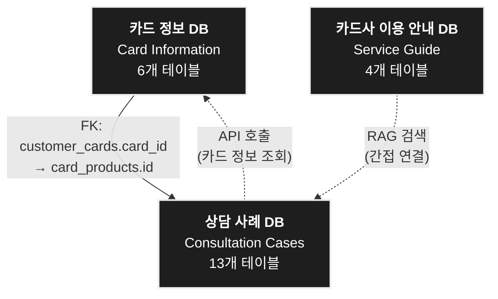
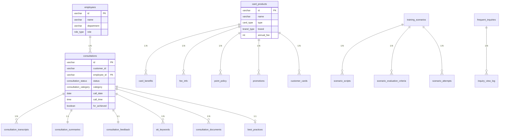
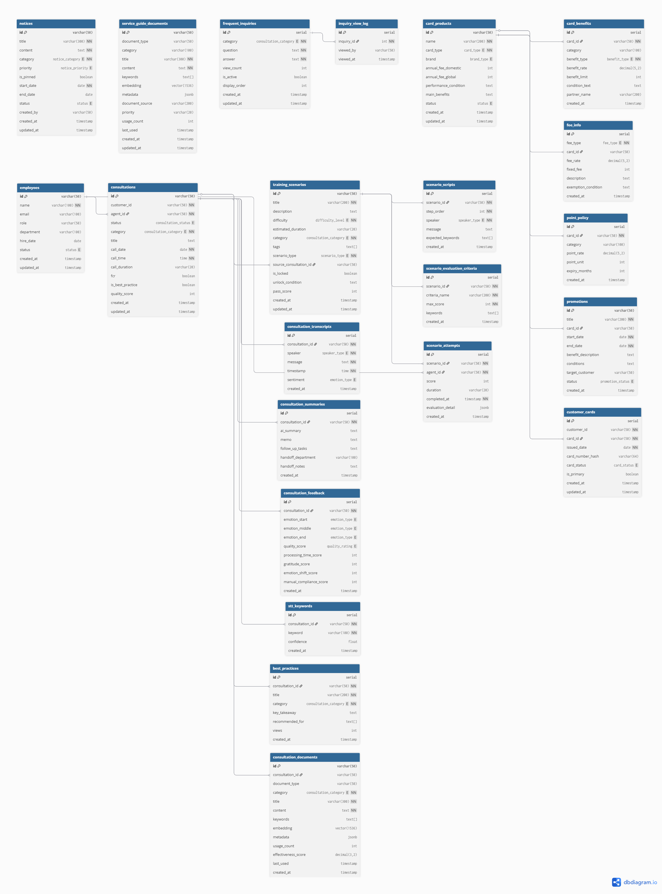

# CALL:ACT 데이터베이스 설계 문서 (요약)

**작성일**: 2026-01-09  
**작성자**: CALL:ACT Team  
**버전**: v1.0 (요약본)

---

## 목차

1. [목적 및 배경](#1-목적-및-배경)
2. [프로젝트 개요](#2-프로젝트-개요)
3. [데이터베이스 전체 개요](#3-데이터베이스-전체-개요)
4. [ERD 다이어그램](#4-erd-다이어그램)
5. [핵심 설계 결정](#5-핵심-설계-결정)
6. [주요 테이블 정의](#6-주요-테이블-정의)
7. [결론](#7-결론)

---

## 1. 목적 및 배경

### 1.1 문서 목적

본 문서는 **CALL:ACT (카드사 상담 지원 시스템)** 데이터베이스의 ERD 스키마 설계를 요약한 보고서입니다. 상세한 설계 내용은 [전체 설계 문서](./데이터베이스_설계문서.md)를 참조하시기 바랍니다.

### 1.2 설계 배경

CALL:ACT는 카드사 상담사를 지원하는 AI 기반 실시간 상담 시스템으로, 다음과 같은 핵심 요구사항을 충족합니다:

1. **실시간 상담 지원**: STT 기반 키워드 추출과 RAG 검색을 통한 즉각적인 정보 제공
2. **상담 후처리 자동화**: AI를 활용한 상담 요약, 유사 사례 참고, 품질 평가
3. **교육 시스템 통합**: 신입 상담사 교육을 위한 시뮬레이션 및 평가 기능
4. **개인정보 보호**: 고객 개인정보에 대한 엄격한 보안 및 법적 compliance

---

## 2. 프로젝트 개요

### 2.1 서비스명
**CALL:ACT** (Call + Correct + Collect = Act)

### 2.2 시스템 아키텍처
- **Frontend**: React + TypeScript, Tailwind CSS
- **Backend**: FastAPI + Python
- **Database**: PostgreSQL 16+ with pgvector extension
- **AI**: OpenAI GPT-4 (상담 요약), OpenAI Embedding API (RAG 검색)
- **STT**: Speech-to-Text 시스템 (음성 인식 및 키워드 추출)
- **Cache**: Redis (자주 조회되는 데이터 캐싱)

---

## 3. 데이터베이스 전체 개요

### 3.1 전체 구조

본 ERD 스키마는 **23개의 테이블**과 **16개의 Enum 타입**으로 구성되며, 3개의 논리적 데이터베이스로 분리됩니다.

| 데이터베이스 | 설명 | 테이블 수 | 주요 역할 |
|--------------|------|-----------|-----------|
| **카드 정보 DB** | 카드 상품, 혜택, 수수료 정보 | 6개 | 카드 정보 관리 및 RAG 검색 지원 |
| **카드사 이용 안내 DB** | 공지사항, 자주 찾는 문의, 가이드 문서 | 4개 | 서비스 안내 관리 및 RAG 검색 지원 |
| **상담 사례 DB** | 상담 내역, 교육 시나리오, 직원 정보 | 13개 | 상담 및 교육 관리, RAG 검색 지원 |

### 3.2 주요 통계
- **DBMS**: PostgreSQL 16+ with pgvector extension
- **전체 테이블 수**: 23개
- **Enum 타입**: 16개
- **Foreign Key 관계**: 22개
- **VectorDB 통합**: pgvector (OpenAI embedding 1536차원)

### 3.3 설계 원칙

1. **개인정보 보호 우선**: customers 테이블 제외, customer_id를 외부 참조로만 사용
2. **도메인 주도 설계 (DDD)**: 3개 논리적 DB로 명확한 경계 설정
3. **정규화 수준**: 제3정규형(3NF) 기본, 선택적 비정규화 허용
4. **VectorDB 통합**: pgvector 확장 사용 (RAG 시스템 구축)
5. **성능 최적화**: 인덱스 전략, 벡터 검색 인덱스 (IVFFlat, HNSW)

### 3.4 아키텍처 다이어그램

#### 3.4.1 3개 논리적 데이터베이스 구조

```mermaid
graph TB
    subgraph CardDB["<b>카드 정보 DB</b>"]
        direction TB
        CardMeta["(6개 테이블)"]
        CP[card_products<br/>카드 상품]
        CB[card_benefits<br/>카드 혜택]
        FI[fee_info<br/>수수료 정보]
        PP[point_policy<br/>포인트 정책]
        PR[promotions<br/>프로모션]
        CC[customer_cards<br/>고객-카드 연결]
    end

    subgraph GuideDB["<b>카드사 이용 안내 DB</b>"]
        direction TB
        GuideMeta["(4개 테이블)"]
        NT[notices<br/>공지사항]
        FQ[frequent_inquiries<br/>자주 찾는 문의]
        IL[inquiry_view_log<br/>문의 조회 로그]
        SG[service_guide_documents<br/>서비스 가이드 문서 + VectorDB]
    end

    subgraph ConsultDB["<b>상담 사례 DB</b>"]
        direction TB
        ConsultMeta["(13개 테이블)"]
        EMP[employees<br/>직원]
        CONS[consultations<br/>상담 마스터]
        CT[consultation_transcripts<br/>상담 전문]
        CS[consultation_summaries<br/>상담 요약]
        CF[consultation_feedback<br/>상담 피드백]
        SK[stt_keywords<br/>STT 키워드]
        TS[training_scenarios<br/>교육 시나리오]
        SS[scenario_scripts<br/>시나리오 스크립트]
        SEC[scenario_evaluation_criteria<br/>시나리오 평가 기준]
        SA[scenario_attempts<br/>시나리오 시도 기록]
        BP[best_practices<br/>우수 사례]
        CD[consultation_documents<br/>상담 문서 + VectorDB]
    end

    CP -->|1:N| CB
    CP -->|1:N| FI
    CP -->|1:N| PP
    CP -->|1:N| PR
    CP -->|1:N| CC

    FQ -->|1:N| IL

    EMP -->|1:N| CONS
    CONS -->|1:N| CT
    CONS -->|1:1| CS
    CONS -->|1:1| CF
    CONS -->|1:N| SK
    CONS -->|1:N| CD
    CONS -->|1:1| BP
    TS -->|1:N| SS
    TS -->|1:N| SEC
    TS -->|1:N| SA

    %% ===== 공통 노드 스타일(다크모드) =====
    classDef darkNode fill:#2A2A2A,stroke:#E0E0E0,stroke-width:1.8px,color:#F5F5F5;
    classDef metaNode fill:#1E1E1E,stroke:#1E1E1E,color:#CFCFCF;

    %% ===== DB 영역 스타일(다크모드) =====
    style CardDB fill:#1E1E1E,stroke:#E0E0E0,stroke-width:2.5px,color:#F5F5F5
    style GuideDB fill:#1E1E1E,stroke:#E0E0E0,stroke-width:2.5px,color:#F5F5F5
    style ConsultDB fill:#1E1E1E,stroke:#E0E0E0,stroke-width:2.5px,color:#F5F5F5

    class CP,CB,FI,PP,PR,CC darkNode
    class NT,FQ,IL,SG darkNode
    class EMP,CONS,CT,CS,CF,SK,TS,SS,SEC,SA,BP,CD darkNode

    class CardMeta,GuideMeta,ConsultMeta metaNode
```



#### 3.4.2 데이터베이스 간 관계

세 데이터베이스는 **느슨한 결합(Loose Coupling)**을 유지합니다:



**관계 설명**:
- **실선 (→)**: Foreign Key 관계 (직접 연결)
- **점선 (-.->)**: API 호출 또는 RAG 검색 (간접 연결)

#### 3.4.3 주요 테이블 관계도



---

## 4. ERD 다이어그램

### 4.1 ERD 다이어그램



### 4.2 DBML 스키마

전체 DBML 스키마는 별도 파일(`CALL_ACT_ERD_Schema.dbml`)에 저장되어 있으며, https://dbdiagram.io/d 에서 시각화할 수 있습니다.

**주요 구성**:
- **23개 테이블**: 카드 정보(6), 서비스 가이드(4), 상담 사례(13)
- **16개 Enum 타입**: consultation_status, card_type, brand_type 등
- **22개 Foreign Key 관계**: 테이블 간 참조 무결성 보장
- **VectorDB 통합**: pgvector 확장을 통한 RAG 검색 지원

**핵심 테이블 예시**:

```dbml
// 상담 마스터 테이블
Table consultations {
  id varchar(50) [pk]
  customer_id varchar(50) [not null]
  agent_id varchar(50) [ref: > employees.id]
  status consultation_status [default: 'in_progress']
  category consultation_category [not null]
  call_date date [not null]
  call_time time [not null]
  ...
}

// VectorDB 메타데이터 테이블
Table consultation_documents {
  id varchar(50) [pk]
  consultation_id varchar(50) [ref: > consultations.id]
  title varchar(300) [not null]
  content text [not null]
  embedding vector(1536) [note: 'OpenAI embedding']
  ...
}
```

---

## 5. 핵심 설계 결정

### 5.1 개인정보 보호 우선 원칙

**원칙**: 고객 개인정보는 데이터베이스에 직접 저장하지 않는다.

**구현**:
- `customers` 테이블을 생성하지 않음
- `customer_id`를 외부 시스템 참조용 VARCHAR로만 사용 (Foreign Key 없음)
- 프로젝트에서는 Mock data를 활용하여 고객 정보를 관리

**근거**:
- 보안 위험 최소화: 상담 시스템이 해킹당하더라도 개인정보 노출 방지
- 법적 책임 분리: 개인정보보호법 compliance 책임을 별도 CRM 시스템에 위임
- 아키텍처 단순화: 암호화/복호화 로직 제거, 개인정보 접근 로그 관리 간소화

### 5.2 도메인 주도 설계 원칙

**원칙**: 3개의 논리적 데이터베이스로 명확한 도메인 경계를 설정한다.

**근거**:

1. **변경 주기의 차이**
   - 카드 정보 DB: 월 1-2회 (신규 카드 출시, 혜택 변경)
   - 카드사 이용 안내 DB: 주 1-2회 (공지사항, FAQ 업데이트)
   - 상담 사례 DB: 실시간 (매 상담마다 데이터 생성)

2. **접근 권한 분리**
   - 카드 상품 기획팀: 카드 정보 DB 수정 권한
   - 고객센터 관리자: 카드사 이용 안내 DB 수정 권한
   - 상담사: 상담 사례 DB 읽기/쓰기 권한 (자신의 상담만)

3. **유지보수성**
   - 도메인별 명확한 경계로 인한 충돌 방지
   - 각 도메인별로 독립적인 개발 및 관리 가능

### 5.3 VectorDB 통합 원칙

**원칙**: RDB와 VectorDB를 하나의 PostgreSQL 데이터베이스에서 관리한다.

**근거**:
1. **데이터 일관성**: RDB와 VectorDB가 동일한 PostgreSQL에 있어 트랜잭션 보장
2. **운영 복잡도 감소**: 별도 VectorDB 인프라 불필요, 백업/복구 절차 간소화
3. **적정 규모**: 초기 단계에서는 수만~수십만 건의 문서로 pgvector 성능 충분
4. **비용 효율**: 추가 라이선스 비용 없음

**구현**:
- pgvector 확장 사용
- `embedding vector(1536)` 컬럼 추가 (OpenAI embedding 1536차원)
- IVFFlat 또는 HNSW 인덱스로 유사도 검색 최적화

---

## 6. 주요 테이블 정의

### 6.1 카드 정보 DB

#### card_products (카드 상품)
- **역할**: 카드 상품 마스터 정보 관리
- **주요 컬럼**: id, name, card_type, brand, annual_fee_domestic, annual_fee_global
- **관련 테이블**: card_benefits, fee_info, point_policy, promotions, customer_cards

### 6.2 카드사 이용 안내 DB

#### service_guide_documents (서비스 가이드 문서)
- **역할**: 카드사 이용 안내 문서 + VectorDB 메타데이터
- **주요 컬럼**: id, title, content, keywords, embedding, metadata
- **특징**: RAG 검색을 위한 벡터 임베딩 저장

### 6.3 상담 사례 DB

#### consultations (상담 마스터)
- **역할**: 상담 마스터 테이블
- **주요 컬럼**: id, customer_id, agent_id, status, category, call_date, call_time, fcr, quality_score
- **관련 테이블**: consultation_transcripts, consultation_summaries, consultation_feedback, stt_keywords, consultation_documents

#### consultation_documents (상담 사례 문서)
- **역할**: 상담 사례 문서 + VectorDB 메타데이터
- **주요 컬럼**: id, consultation_id, title, content, keywords, embedding, metadata
- **특징**: RAG 검색을 위한 벡터 임베딩 저장

---

## 7. 결론

본 문서는 CALL:ACT 시스템의 데이터베이스 설계를 요약한 보고서입니다. 3개의 논리적 데이터베이스, 23개의 테이블, 16개의 Enum 타입으로 구성된 ERD 스키마는 개인정보 보호, 도메인 주도 설계, VectorDB 통합, 성능 최적화라는 4가지 핵심 원칙을 기반으로 설계되었습니다.

**주요 특징**:
- ✅ **개인정보 보호**: customers 테이블 제외, 외부 시스템 참조만 사용
- ✅ **도메인 분리**: 3개 논리적 DB로 명확한 경계 설정
- ✅ **VectorDB 통합**: pgvector 확장을 통한 RAG 검색 지원
- ✅ **성능 최적화**: 인덱스 전략, 벡터 검색 인덱스 (HNSW)

**상세 설계 내용**은 [전체 설계 문서](./데이터베이스_설계문서.md)를 참조하시기 바랍니다.

**다음 단계**: [데이터 활용 가이드](../최종%20산출물/데이터_활용_가이드.md)에서 화면별 데이터 활용 방식, API 엔드포인트, 전처리 데이터 스키마를 확인하실 수 있습니다.

