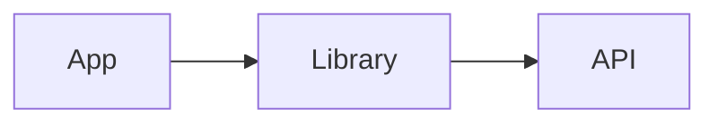
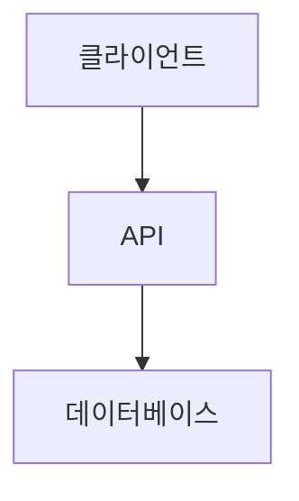
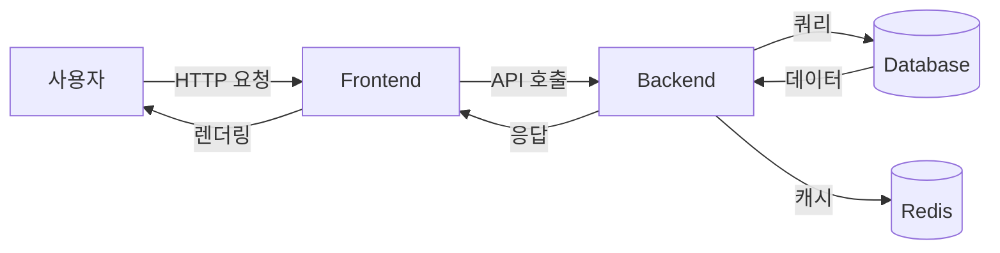
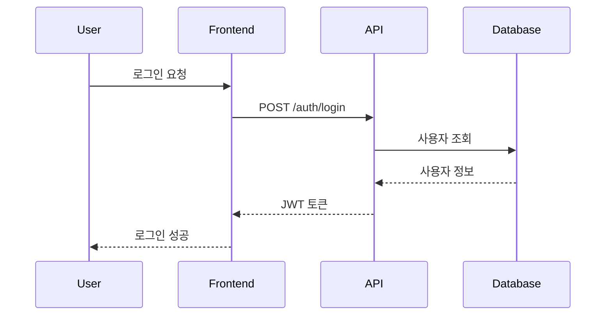
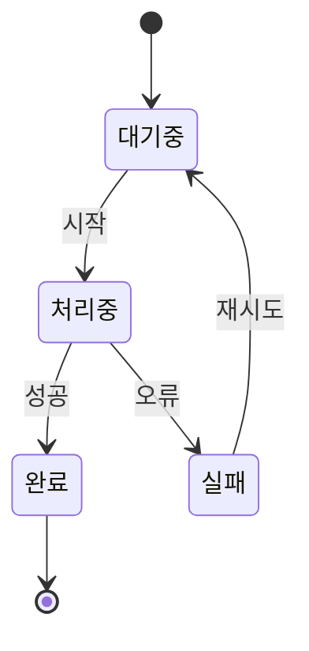
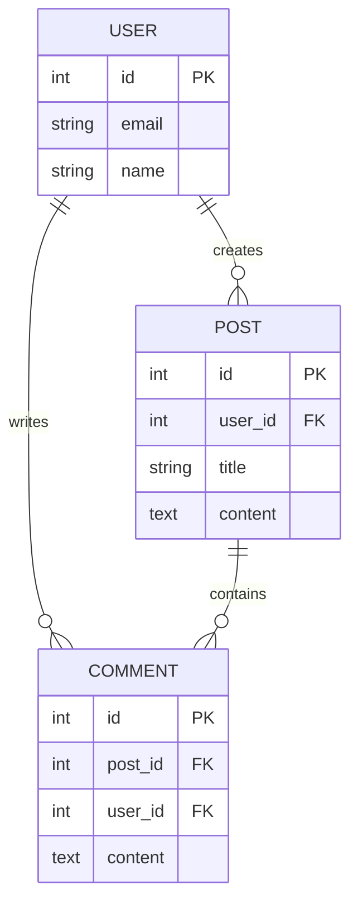

# 우수한 README.md 작성 가이드

> GitHub 프로젝트에서 README는 프로젝트의 첫인상입니다.
> 통계에 따르면 우수한 README를 가진 프로젝트는 4배 많은 스타와 6배 많은 기여자를 확보합니다.

## 목차
- [기본 구조](#기본-구조)
- [필수 섹션](#필수-섹션)
- [선택적 섹션](#선택적-섹션)
- [작성 베스트 프랙티스](#작성-베스트-프랙티스)
- [문서 분리 전략](#문서-분리-전략)
- [시각 자료 가이드](#시각-자료-가이드)
- [한국어 프로젝트 특별 고려사항](#한국어-프로젝트-특별-고려사항)
- [체크리스트](#체크리스트)

---

## 기본 구조

### 1. 상단 영역 (Hero Section)

```markdown
# 프로젝트 이름


<!-- 배지들 -->


> 프로젝트에 대한 간결한 설명 (1-2줄)
> 핵심 가치를 명확하게 전달

[Demo](링크) | [Documentation](링크) | [Report Bug](링크) | [Request Feature](링크)
```

**배지 가이드라인**:
- **권장 개수**: 4-7개
- **필수 배지**: Build Status, Version, License
- **선택 배지**: Coverage, Downloads, Bundle Size, TypeScript Support
- **주의**: 7개 초과 시 산만해 보임

---

## 필수 섹션

### 1. About / 프로젝트 소개

프로젝트 시작 후 **5초 안에 이해 가능**해야 합니다.

```markdown
## About The Project


### 문제 정의
[프로젝트가 해결하는 문제를 명확히 설명]

### 해결 방법
[어떻게 문제를 해결하는지 설명]

### 주요 특징
- 특징 1: 구체적인 설명
- 특징 2: 구체적인 설명
- 특징 3: 구체적인 설명

### Built With
주요 프레임워크/라이브러리를 명시:
- [React](https://reactjs.org/)
- [Node.js](https://nodejs.org/)
- [PostgreSQL](https://www.postgresql.org/)
```

### 2. Getting Started / 시작하기

**복사-붙여넣기 가능한 명령어**를 제공해야 합니다.

```markdown
## Getting Started

프로젝트를 로컬에서 실행하기 위한 단계입니다.

### Prerequisites

프로젝트 실행에 필요한 소프트웨어:

```bash
# Node.js 18 이상
node --version

# npm 9 이상
npm --version
```

### Installation

1. 저장소 클론
   ```bash
   git clone https://github.com/username/project.git
   ```

2. 디렉토리 이동
   ```bash
   cd project
   ```

3. 의존성 설치
   ```bash
   npm install
   ```

4. 환경 변수 설정
   ```bash
   cp .env.example .env
   # .env 파일을 편집하여 필요한 값 입력
   ```

5. 개발 서버 실행
   ```bash
   npm run dev
   ```

6. 브라우저에서 확인
   ```
   http://localhost:3000
   ```
```

**플랫폼별 설치 가이드**:
- Windows, macOS, Linux별 차이점이 있다면 명시
- Docker를 지원한다면 Docker 설치 방법도 추가

### 3. Usage / 사용법

```markdown
## Usage

### 기본 사용 예제

```javascript
import { SomeFunction } from 'project-name';

// 간단한 사용 예제
const result = SomeFunction({
  option1: 'value1',
  option2: 'value2'
});

console.log(result);
```

### 고급 사용 예제

```javascript
// 더 복잡한 시나리오
const advanced = SomeFunction({
  option1: 'value1',
  option2: 'value2',
  callbacks: {
    onSuccess: (data) => console.log(data),
    onError: (error) => console.error(error)
  }
});
```

### 실제 사용 케이스

**케이스 1: [시나리오 이름]**
```javascript
// 실제 상황에서의 사용 예제
```

**케이스 2: [시나리오 이름]**
```javascript
// 또 다른 실제 상황 예제
```

_더 많은 예제와 사용법은 [Documentation](링크)을 참고하세요._
```

### 4. Contributing / 기여 가이드

```markdown
## Contributing

기여는 오픈소스 커뮤니티를 훌륭하게 만드는 핵심입니다.
모든 기여에 **진심으로 감사드립니다**.

### 기여 방법

1. 프로젝트를 Fork 합니다
2. Feature 브랜치를 생성합니다 (`git checkout -b feature/AmazingFeature`)
3. 변경사항을 커밋합니다 (`git commit -m 'Add some AmazingFeature'`)
4. 브랜치에 Push 합니다 (`git push origin feature/AmazingFeature`)
5. Pull Request를 생성합니다

### 코드 스타일

- ESLint/Prettier 설정을 따릅니다
- 커밋 메시지는 [Conventional Commits](https://www.conventionalcommits.org/) 규칙을 따릅니다
- 모든 테스트가 통과해야 합니다

_자세한 내용은 [CONTRIBUTING.md](CONTRIBUTING.md)를 참고하세요._
```

### 5. License / 라이선스

```markdown
## License

이 프로젝트는 MIT 라이선스를 따릅니다. 자세한 내용은 [LICENSE](LICENSE) 파일을 참고하세요.
```

### 6. Contact / 연락처

```markdown
## Contact

프로젝트 관리자 - [@twitter_handle](https://twitter.com/handle) - email@example.com

프로젝트 링크: [https://github.com/username/project](https://github.com/username/project)

이슈 및 버그 리포트: [Issues](https://github.com/username/project/issues)
```

---

## 선택적 섹션

### 1. Table of Contents / 목차

**사용 시점**: README가 2000단어를 초과할 때 필수

```markdown
## 목차
- [About](#about)
- [Getting Started](#getting-started)
  - [Prerequisites](#prerequisites)
  - [Installation](#installation)
- [Usage](#usage)
- [API Reference](#api-reference)
- [Roadmap](#roadmap)
- [Contributing](#contributing)
- [License](#license)
- [Contact](#contact)
```

### 2. Demo / 데모

```markdown
## Demo

### 라이브 데모
[https://project-demo.com](https://project-demo.com)

### 데모 영상


### 스크린샷
<div align="center">
  
  
</div>
```

### 3. Roadmap / 로드맵

```markdown
## Roadmap

- [x] 기능 1 구현
- [x] 기능 2 구현
- [ ] 기능 3 구현 예정
    - [ ] 세부 작업 1
    - [ ] 세부 작업 2
- [ ] 다국어 지원
    - [ ] 한국어
    - [ ] 영어
    - [ ] 일본어

전체 로드맵과 제안된 기능들은 [open issues](https://github.com/username/project/issues)에서 확인하세요.
```

### 4. API Documentation / API 문서

**주의**: API 문서가 길다면 `/docs/api.md`로 분리하세요.

```markdown
## API Reference

### `functionName(options)`

함수에 대한 간단한 설명.

#### Parameters

| Parameter | Type     | Description                |
| --------- | -------- | -------------------------- |
| `option1` | `string` | **Required**. 설명         |
| `option2` | `number` | **Optional**. 설명 (기본값: 0) |

#### Returns

| Type     | Description                |
| -------- | -------------------------- |
| `Promise<Object>` | 반환값에 대한 설명 |

#### Example

```javascript
const result = await functionName({
  option1: 'value',
  option2: 42
});
```

_전체 API 문서는 [API Documentation](docs/api.md)을 참고하세요._
```

### 5. FAQ / 자주 묻는 질문

```markdown
## FAQ

### Q: [자주 묻는 질문 1]
A: 답변 내용...

### Q: [자주 묻는 질문 2]
A: 답변 내용...

### Q: 문제가 발생했을 때 어디에 문의하나요?
A: [Issues](링크) 페이지에 문제를 등록해주세요.
```

### 6. Tests / 테스트

```markdown
## Running Tests

### 전체 테스트 실행
```bash
npm test
```

### 특정 테스트 실행
```bash
npm test -- path/to/test
```

### 커버리지 확인
```bash
npm run test:coverage
```

### E2E 테스트
```bash
npm run test:e2e
```
```

### 7. Deployment / 배포

```markdown
## Deployment

### 프로덕션 빌드
```bash
npm run build
```

### Docker를 사용한 배포
```bash
docker build -t project-name .
docker run -p 3000:3000 project-name
```

### 클라우드 배포 (예: Vercel)
```bash
vercel deploy --prod
```
```

### 8. Acknowledgments / 감사 인사

```markdown
## Acknowledgments

프로젝트에 영감을 주거나 도움이 된 리소스들:

- [Awesome README](https://github.com/matiassingers/awesome-readme)
- [Best-README-Template](https://github.com/othneildrew/Best-README-Template)
- [Choose an Open Source License](https://choosealicense.com)
- [GitHub Pages](https://pages.github.com)
- [Font Awesome](https://fontawesome.com)
```

### 9. Architecture / 아키텍처

**복잡한 프로젝트에서만 사용**, 또는 `ARCHITECTURE.md`로 분리

```markdown
## Architecture

### 시스템 개요
```
┌─────────────┐     ┌─────────────┐     ┌─────────────┐
│   Frontend  │────▶│   Backend   │────▶│  Database   │
└─────────────┘     └─────────────┘     └─────────────┘
```

### 디렉토리 구조
```
project/
├── src/
│   ├── components/    # React 컴포넌트
│   ├── pages/         # 페이지 컴포넌트
│   ├── services/      # API 서비스
│   ├── utils/         # 유틸리티 함수
│   └── hooks/         # 커스텀 훅
├── public/            # 정적 파일
├── tests/             # 테스트 파일
└── docs/              # 문서
```

_자세한 아키텍처 설명은 [ARCHITECTURE.md](ARCHITECTURE.md)를 참고하세요._
```

### 10. Changelog / 변경 이력

**주의**: 별도의 `CHANGELOG.md` 파일 사용 권장

```markdown
## Changelog

### [1.2.0] - 2026-01-14
#### Added
- 새로운 기능 추가

#### Changed
- 기존 기능 개선

#### Fixed
- 버그 수정

_전체 변경 이력은 [CHANGELOG.md](CHANGELOG.md)를 참고하세요._
```

---

## 작성 베스트 프랙티스

### 1. 첫 5초의 법칙
- 사용자가 5초 안에 프로젝트를 이해할 수 있어야 함
- 명확한 프로젝트 이름과 한 줄 설명
- 시각 자료로 즉각적인 이해 제공

### 2. 복사-붙여넣기 가능성
- 모든 명령어는 그대로 복사해서 실행 가능해야 함
- 플레이스홀더는 명확히 표시: `<YOUR_API_KEY>`
- 실제로 동작하는 예제 코드 제공

### 3. 시각 자료의 전략적 사용
- **통계**: 스크린샷이 있는 프로젝트는 42% 더 많은 스타 획득
- **GIF 사용 시점**: 인터랙티브 기능, 사용 흐름 설명
- **스크린샷 사용 시점**: UI/UX, 결과물 표시
- **다이어그램 사용 시점**: 아키텍처, 데이터 흐름

### 4. 문제 중심 작성
```markdown
❌ 나쁜 예: "이 프로젝트는 React를 사용합니다."
✅ 좋은 예: "React를 사용하여 빠른 렌더링과 재사용 가능한 컴포넌트를 제공합니다."

❌ 나쁜 예: "로그인 기능이 있습니다."
✅ 좋은 예: "OAuth 2.0 기반 소셜 로그인으로 회원가입 없이 즉시 사용할 수 있습니다."
```

### 5. 계층적 정보 구조
- **상단**: 핵심 정보 (무엇을, 왜)
- **중간**: 실용적 정보 (어떻게 사용하는가)
- **하단**: 상세 정보 (API, 기여 가이드, 라이선스)

### 6. 명확한 언어 사용
- 전문 용어는 필요할 때만 사용하고 설명 추가
- 능동태 사용: "이 기능은 ~합니다" (수동태 X)
- 구체적인 숫자: "빠른 성능" → "10배 빠른 성능"

---

## 문서 분리 전략

### 2000단어 기준
README가 2000단어를 초과하면 다음과 같이 분리:

```
project/
├── README.md              # 메인 README (빠른 시작 가이드)
├── CONTRIBUTING.md        # 기여 가이드
├── CHANGELOG.md           # 변경 이력
├── LICENSE               # 라이선스
├── CODE_OF_CONDUCT.md    # 행동 강령
├── SECURITY.md           # 보안 정책
└── docs/
    ├── api.md            # API 문서
    ├── architecture.md   # 아키텍처 설명
    ├── deployment.md     # 배포 가이드
    ├── troubleshooting.md # 문제 해결
    └── examples/         # 상세 예제들
```

### README의 역할
- **허브 역할**: 모든 문서로의 링크 제공
- **빠른 시작**: 5분 안에 프로젝트 시작 가능
- **핵심 정보**: 프로젝트의 가치 제안

### 분리 기준
- **CONTRIBUTING.md**: 기여 프로세스가 10줄 이상
- **API.md**: API 엔드포인트가 5개 이상
- **ARCHITECTURE.md**: 아키텍처 설명이 복잡함
- **CHANGELOG.md**: 버전 히스토리가 길어짐

---

## 시각 자료 가이드

> **중요**: 시각 자료는 선택이 아닌 필수입니다!
>
> 스크린샷이 있는 프로젝트는 **42% 더 많은 스타**를 획득하며,
> 사용자는 텍스트보다 시각 자료를 **60,000배 빠르게** 처리합니다.

### 시각 자료의 효과

**통계적 증거**:
- 스크린샷이 있는 프로젝트 → 42% 더 많은 스타 획득
- 첫 5초 안에 프로젝트 이해 가능 → 사용자 유지율 결정
- 시각 자료로 프로젝트 설명 시 이해도 3배 증가

**필수 수준**:
- **최소 요구사항**: 메인 스크린샷 1개
- **권장사항**: 메인 스크린샷 + 주요 기능 GIF 2-3개
- **최적**: 스크린샷 + GIF + 시연 영상 + 다이어그램

---

### 프로젝트 유형별 권장 시각 자료

#### 1. 웹/모바일 UI 프로젝트
```markdown
✅ 필수: 스크린샷 (메인 화면, 주요 기능)
✅ 강력 권장: GIF (인터랙션 시연)
✅ 선택: 시연 영상 (복잡한 사용자 플로우)

예시:


```

#### 2. CLI 도구 / 터미널 애플리케이션
```markdown
✅ 필수: 터미널 GIF (명령어 실행 과정)
✅ 권장: 결과 스크린샷

예시:

```

#### 3. 라이브러리 / API / SDK
```markdown
✅ 권장: 코드 예제 스크린샷
✅ 필수: 아키텍처 다이어그램
✅ 선택: 사용 결과 스크린샷

예시:

```

#### 4. 데이터 시각화 / 대시보드
```markdown
✅ 필수: 결과물 스크린샷 (여러 각도)
✅ 필수: 인터랙티브 GIF
✅ 강력 권장: 라이브 데모 링크
```

#### 5. 게임 / 인터랙티브 애플리케이션
```markdown
✅ 필수: 게임플레이 GIF
✅ 필수: 주요 기능 스크린샷
✅ 강력 권장: YouTube 시연 영상 (2-3분)
```

---

### 시각 자료 배치 전략

**권장 배치 순서**:

```markdown
# 프로젝트 이름


> 한 줄 설명

<!-- 1. 메인 히어로 이미지: 프로젝트의 "와우" 순간 -->
<div align="center">
  
</div>

## About The Project

<!-- 2. 문제-해결 시각화 (Before/After 비교) -->
| Before | After |
|--------|-------|
|  |  |

## Features

<!-- 3. 주요 기능별 GIF 시연 -->
### 실시간 업데이트


### 드래그 앤 드롭


## Demo

<!-- 4. 전체 플로우 시연 영상 -->
[](https://youtube.com/watch?v=xxx)

## Architecture

<!-- 5. 아키텍처 다이어그램 -->

```

---

### 시각 자료 유형별 상세 가이드

#### 📸 스크린샷 (Screenshots)

**언제 사용**:
- 정적인 UI/결과물 표시
- 여러 화면 비교
- 최종 결과 강조

**제작 도구**:
- **Windows**: Snipping Tool, ShareX, Greenshot
- **macOS**: Cmd+Shift+4, CleanShot X
- **Linux**: Flameshot, GNOME Screenshot
- **크로스 플랫폼**: Lightshot

**마ーク다운 예시**:

```markdown
<!-- 기본 스크린샷 -->


<!-- 중앙 정렬 + 크기 지정 -->
<div align="center">
  
</div>

<!-- 여러 스크린샷 나란히 배치 -->
<div align="center">
  
  
</div>

<!-- 캡션 추가 -->
<div align="center">
  
  <p><em>모바일 반응형 디자인</em></p>
</div>

<!-- 테이블로 비교 -->
| 데스크톱 | 모바일 | 태블릿 |
|---------|--------|--------|
|  |  |  |
```

**최적화 팁**:
```markdown
✅ 권장 사항:
- 해상도: 800-1200px 폭
- 파일 크기: 최대 1MB
- 포맷: PNG (UI), JPG (사진)
- 압축: TinyPNG, ImageOptim 사용

❌ 피해야 할 것:
- 4K 이상 초고해상도 (로딩 느림)
- 흐릿한 저화질 이미지
- 개인정보/민감정보 노출
```

---

#### 🎬 GIF 애니메이션

**언제 사용**:
- 인터랙티브 기능 시연
- 단계별 프로세스 표시
- 빠른 사용법 설명 (5-15초)
- 사용자 플로우 시연

**제작 도구**:

**UI 녹화**:
- **Windows**: [ScreenToGif](https://www.screentogif.com/) (무료, 강력 추천)
- **macOS**: [Kap](https://getkap.co/) (무료), [Gifski](https://gif.ski/)
- **Linux**: [Peek](https://github.com/phw/peek) (무료)
- **웹 기반**: [Gifcap](https://gifcap.dev/)

**터미널 녹화**:
- [terminalizer](https://github.com/faressoft/terminalizer) - 터미널 세션 녹화
- [asciinema](https://asciinema.org/) - 텍스트 기반 녹화
- [vhs](https://github.com/charmbracelet/vhs) - 코드로 터미널 GIF 생성

**GIF 최적화**:
- [ezgif.com](https://ezgif.com/) - 온라인 압축/편집
- [gifski](https://gif.ski/) - 고품질 변환
- [gifsicle](https://www.lcdf.org/gifsicle/) - CLI 최적화

**마크다운 예시**:

```markdown
<!-- 기본 GIF 삽입 -->


<!-- 설명과 함께 -->
### 드래그 앤 드롭 기능
사용자는 직관적으로 항목을 드래그하여 재정렬할 수 있습니다.


<!-- 접기/펼치기로 선택 제공 (큰 GIF용) -->
<details>
<summary>📺 데모 보기 (클릭하여 펼치기)</summary>


</details>

<!-- 여러 GIF를 탭처럼 배치 -->
| 기능 1 | 기능 2 | 기능 3 |
|--------|--------|--------|
|  |  |  |
```

**GIF 품질 가이드**:

```markdown
✅ 좋은 GIF:
- 길이: 5-15초
- 파일 크기: 3-5MB 이하
- 프레임률: 15-20 FPS
- 해상도: 800-1000px 폭
- 루프: 무한 반복 또는 3회
- 속도: 실제 속도 또는 1.5배 빠르게
- 초점: 하나의 기능에만 집중

❌ 나쁜 GIF:
- 30초 이상 (너무 김)
- 10MB 이상 (로딩 느림)
- 흐릿한 화질
- 너무 빠른 속도 (1초 미만)
- 여러 기능을 한꺼번에
- 불필요한 부분 포함
```

**GIF 제작 워크플로우**:

```markdown
1. 녹화 (ScreenToGif, Kap 등)
   - 창 크기 고정 (800-1000px)
   - 불필요한 부분 제거
   - 중요한 부분에 포커스

2. 편집
   - 불필요한 프레임 삭제
   - 시작/끝 부분 정리
   - 속도 조절 (1.5x 권장)

3. 최적화
   - 프레임 수 줄이기 (15-20 FPS)
   - 색상 팔레트 최적화
   - 파일 크기 5MB 이하로 압축

4. 테스트
   - GitHub에 업로드하여 로딩 속도 확인
   - 모바일에서 확인
```

---

#### 🎥 시연 영상 (YouTube/Vimeo)

**언제 사용**:
- 복잡한 사용자 플로우 (1-5분)
- 튜토리얼 (5-10분)
- 프로젝트 소개 프레젠테이션
- GIF로 표현하기 어려운 긴 시연

**영상 제작 팁**:
```markdown
✅ 효과적인 시연 영상:
- 길이: 2-5분 (집중력 유지)
- 해상도: 1080p (Full HD)
- 음성: 명확한 나레이션 또는 자막
- 편집: 불필요한 부분 제거
- 썸네일: 눈에 띄는 커스텀 썸네일
```

**마크다운 예시**:

```markdown
<!-- YouTube 썸네일 클릭 시 재생 -->
[](https://www.youtube.com/watch?v=VIDEO_ID)

<!-- 또는 0.jpg (작은 썸네일) -->
[](https://www.youtube.com/watch?v=VIDEO_ID)

<!-- HTML로 중앙 정렬 -->
<div align="center">
  <a href="https://www.youtube.com/watch?v=VIDEO_ID">
    
  </a>
  <p><em>▶️ 클릭하여 2분 데모 영상 보기</em></p>
</div>

<!-- 여러 영상 섹션별로 -->
### 📺 비디오 튜토리얼

| 시작하기 (2분) | 고급 기능 (5분) | 배포 가이드 (3분) |
|---------------|----------------|------------------|
| [](link1) | [](link2) | [](link3) |
```

---

#### 📊 다이어그램

**언제 사용**:
- 시스템 아키텍처 설명
- 데이터 플로우 표현
- 컴포넌트 관계 설명
- 프로세스 흐름도

**제작 도구**:
- **Mermaid** (GitHub 네이티브 지원) - 권장!
- [draw.io](https://draw.io/) - 무료 다이어그램 도구
- [Excalidraw](https://excalidraw.com/) - 손그림 스타일
- [Figma](https://figma.com/) - 프로페셔널 디자인

**Mermaid 예시** (GitHub에서 자동 렌더링):

```markdown
### 시스템 아키텍처



### 데이터 플로우



### 상태 다이어그램



### ERD (Entity Relationship Diagram)


```

**외부 이미지 다이어그램**:

```markdown
<!-- PNG/SVG 다이어그램 -->


<!-- 설명과 함께 -->
### 시스템 구조
아래는 전체 시스템의 계층 구조를 보여줍니다:

<div align="center">
  
</div>
```

---

#### 🏆 배지 (Badges)

**배지 종류**:

```markdown
<!-- 빌드 상태 -->


<!-- 코드 커버리지 -->


<!-- 버전 -->


<!-- 라이선스 -->


<!-- 다운로드 -->


<!-- 기여자 -->


<!-- 스타 -->


<!-- 언어 -->


<!-- 이슈 -->


<!-- 마지막 커밋 -->


<!-- 커스텀 배지 -->

```

**배지 스타일**:

```markdown
<!-- 기본 스타일 -->


<!-- Flat -->


<!-- Flat Square -->


<!-- For the Badge -->


<!-- Social -->

```

**배지 정렬 예시**:

```markdown
<!-- 가로 나열 -->
  

<!-- 줄바꿈 -->


<!-- 중앙 정렬 -->
<div align="center">


</div>
```

---

### 주의사항 및 베스트 프랙티스

#### ✅ DO (해야 할 것)

```markdown
1. 파일 크기 최적화
   - 이미지: 최대 1MB (TinyPNG로 압축)
   - GIF: 최대 5MB (ezgif.com으로 최적화)
   - 해상도: 800-1200px 폭 권장

2. Alt 텍스트 추가 (접근성)
   

3. 로딩 속도 고려
   - 첫 스크린샷은 빠르게 로드
   - 큰 파일은 접기/펼치기 사용
   - GitHub의 자동 이미지 최적화 활용

4. 일관된 스타일 유지
   - 같은 테마/배경색
   - 일관된 창 크기
   - 동일한 폰트/UI 요소

5. 정보 보안
   - API 키, 토큰 제거
   - 이메일 주소 가리기
   - 실제 사용자 데이터 삭제
   - 내부 IP/호스트명 제거

6. 다크모드 고려
   - 투명 배경 사용 (PNG)
   - 또는 밝은/어두운 버전 각각 제공
```

#### ❌ DON'T (피해야 할 것)

```markdown
1. 개인정보 노출
   - 실제 API 키/토큰
   - 개인 이메일 주소
   - 내부 시스템 정보
   - 실제 사용자 데이터

2. 너무 많은 시각 자료
   - README 전체를 이미지로 채우지 말 것
   - 핵심 기능만 선별하여 시각화
   - 텍스트와 시각 자료의 균형

3. 저품질 콘텐츠
   - 흐릿한 스크린샷
   - 픽셀화된 이미지
   - 너무 작은 텍스트
   - 잘린 UI 요소

4. 깨진 링크
   - 정기적으로 이미지 링크 확인
   - 상대 경로 사용 권장
   - 외부 이미지 호스팅 주의

5. 관련 없는 콘텐츠
   - 프로젝트와 무관한 이미지
   - 불필요한 장식용 이미지
   - 중복된 스크린샷
```

---

### 파일 구조 권장사항

```
project/
├── README.md
├── docs/
│   ├── images/                 # README용 이미지
│   │   ├── logo.png           # 프로젝트 로고
│   │   ├── hero.png           # 메인 히어로 이미지
│   │   ├── demo.gif           # 데모 GIF
│   │   ├── features/          # 기능별 이미지
│   │   │   ├── feature-1.gif
│   │   │   ├── feature-2.gif
│   │   │   └── feature-3.png
│   │   ├── screenshots/       # 상세 스크린샷
│   │   │   ├── desktop.png
│   │   │   ├── mobile.png
│   │   │   └── tablet.png
│   │   └── architecture/      # 아키텍처 다이어그램
│   │       ├── overview.png
│   │       ├── data-flow.svg
│   │       └── component-diagram.png
│   └── videos/                # 긴 시연 영상 링크 모음
│       └── demo-links.md
├── .github/
│   └── assets/               # GitHub 전용 자산
│       └── banner.png        # 소셜 미디어 배너
└── .gitattributes           # LFS 설정 (대용량 파일용)
```

**Git LFS 사용 (대용량 파일)**:

```bash
# Git LFS 설치
git lfs install

# GIF/PNG 파일을 LFS로 관리
git lfs track "*.gif"
git lfs track "*.png"

# .gitattributes 커밋
git add .gitattributes
git commit -m "Add Git LFS tracking"
```

---

### 실제 우수 사례

#### 예시 1: [Fiber](https://github.com/gofiber/fiber)
```markdown
✅ 장점:
- 깔끔한 로고
- 성능 비교 차트 (벤치마크)
- 코드 예제와 결과 함께 표시
- 배지를 효과적으로 사용
```

#### 예시 2: [ScreenToGif](https://github.com/NickeManarin/ScreenToGif)
```markdown
✅ 장점:
- 프로그램 실행 스크린샷 다수
- 주요 기능별 GIF 시연
- 편집 과정을 GIF로 표현
```

#### 예시 3: [VSCode](https://github.com/microsoft/vscode)
```markdown
✅ 장점:
- 에디터 스크린샷 (여러 테마)
- 확장 기능 시연 GIF
- 테마 비교 이미지
```

#### 예시 4: [Next.js](https://github.com/vercel/next.js)
```markdown
✅ 장점:
- 간결한 배지 사용
- 코드 예제 중심
- 라이브 데모 링크
```

---

### 시각 자료 체크리스트

프로젝트 공개 전 확인:

```markdown
시각 자료 필수 점검:
- [ ] 메인 스크린샷/GIF 1개 이상 포함
- [ ] 파일 크기 최적화 (이미지 1MB, GIF 5MB 이하)
- [ ] 모든 이미지에 Alt 텍스트 추가
- [ ] 개인정보/민감정보 제거
- [ ] 이미지 링크 정상 작동 확인
- [ ] 모바일에서도 잘 보이는지 확인
- [ ] 다크모드에서 확인

GIF 전용 체크리스트:
- [ ] 길이 5-15초 유지
- [ ] 무한 루프 또는 3회 반복
- [ ] 핵심 기능만 집중하여 촬영
- [ ] 불필요한 부분 편집으로 제거
- [ ] 속도 적절히 조절 (너무 빠르지 않게)

배지 체크리스트:
- [ ] 4-7개 배지 사용
- [ ] 필수 배지 포함 (Build, Version, License)
- [ ] 모든 배지가 최신 정보 반영
- [ ] 깨진 배지 링크 없음
```

---

### 요약: 시각 자료 우선순위

**프로젝트 첫 공개 시**:
1. 메인 스크린샷 1개 (필수)
2. 주요 기능 GIF 2-3개 (강력 권장)
3. 아키텍처 다이어그램 (선택)

**프로젝트 성숙 단계**:
1. 여러 각도의 스크린샷
2. 기능별 상세 GIF
3. YouTube 튜토리얼 영상
4. 상세 아키텍처 다이어그램

**프로젝트의 "와우" 순간을 5초 안에 보여주세요!**

---

## 한국어 프로젝트 특별 고려사항

### 1. 언어 전략

#### 옵션 A: 한국어 우선 (국내 타겟)
```markdown
# 프로젝트 이름

> 한국어로 프로젝트 설명

[English Version](README_EN.md)
```

#### 옵션 B: 영어 우선 (글로벌 타겟)
```markdown
# Project Name

> English description

[한국어 버전](README_KO.md)
```

#### 옵션 C: 혼합 (기술 용어는 영어)
```markdown
# 프로젝트 이름 (Project Name)

이 프로젝트는 React와 TypeScript를 사용하여
실시간 채팅 애플리케이션을 구현합니다.
```

### 2. 기술 용어 처리
```markdown
✅ 권장: "이 API는 RESTful 방식으로 설계되었습니다."
❌ 비권장: "이 에이피아이는 레스트풀 방식으로 설계되었습니다."

✅ 권장: "React hooks를 사용합니다."
❌ 비권장: "리액트 훅스를 사용합니다."
```

### 3. 파일 구조
```
project/
├── README.md           # 한국어 (국내 프로젝트) 또는 영어 (글로벌)
├── README_EN.md        # 영어 버전
├── README_KO.md        # 한국어 버전
└── docs/
    ├── ko/            # 한국어 문서
    └── en/            # 영어 문서
```

---

## 체크리스트

프로젝트 공개 전 README 점검:

### 필수 항목
- [ ] 프로젝트 이름과 로고
- [ ] 한 줄 설명 (5초 이해 가능)
- [ ] 주요 배지 (Build, License, Version)
- [ ] 프로젝트 소개 (문제, 해결, 특징)
- [ ] 기술 스택 (Built With)
- [ ] 설치 방법 (복사-붙여넣기 가능)
- [ ] 기본 사용 예제
- [ ] 라이선스 정보
- [ ] 연락처/이슈 링크

### 강력 권장
- [ ] 스크린샷 또는 GIF (시각 자료)
- [ ] 실제 동작하는 코드 예제
- [ ] 기여 가이드
- [ ] 목차 (긴 README의 경우)
- [ ] 데모 링크 (가능한 경우)

### 선택 항목
- [ ] Roadmap
- [ ] FAQ
- [ ] 테스트 실행 방법
- [ ] 배포 가이드
- [ ] 아키텍처 설명
- [ ] Changelog
- [ ] Acknowledgments

### 품질 점검
- [ ] 모든 링크가 작동하는가?
- [ ] 모든 이미지가 표시되는가?
- [ ] 코드 예제가 실제로 실행되는가?
- [ ] 맞춤법과 문법 확인
- [ ] 명령어가 복사-붙여넣기 가능한가?
- [ ] 2000단어 초과 시 문서 분리했는가?
- [ ] 배지가 7개 이하인가?

---

## 템플릿 및 도구

### README 템플릿
- [Best-README-Template](https://github.com/othneildrew/Best-README-Template) - 포괄적인 템플릿
- [Standard Readme](https://github.com/RichardLitt/standard-readme) - 표준화된 스타일
- [Awesome README](https://github.com/matiassingers/awesome-readme) - 우수 사례 모음

### 생성 도구
- [readme.so](https://readme.so/) - 온라인 에디터
- [readme-md-generator](https://github.com/kefranabg/readme-md-generator) - CLI 생성기
- [Make a README](https://www.makeareadme.com/) - 가이드 및 생성기

### 배지 생성
- [Shields.io](https://shields.io/) - 배지 생성
- [Badge Generator](https://badge.fury.io/) - NPM 배지

### GIF/스크린샷 도구
- [ScreenToGif](https://www.screentogif.com/) - Windows
- [Gifski](https://gif.ski/) - macOS
- [Peek](https://github.com/phw/peek) - Linux
- [terminalizer](https://github.com/faressoft/terminalizer) - 터미널 레코딩

---

## 참고 자료

### 우수한 README 예시
- [ai/size-limit](https://github.com/ai/size-limit) - 간결하고 명확
- [gofiber/fiber](https://github.com/gofiber/fiber) - 완벽한 구조
- [choojs/choo](https://github.com/choojs/choo) - 친절한 FAQ
- [facebook/react](https://github.com/facebook/react) - 대형 프로젝트 사례

### 가이드 문서
- [GitHub Docs - About READMEs](https://docs.github.com/en/repositories/managing-your-repositorys-settings-and-features/customizing-your-repository/about-readmes)
- [Make a README](https://www.makeareadme.com/)
- [Awesome README Guide](https://github.com/matiassingers/awesome-readme)

### 통계 출처
- 스크린샷 효과: GitHub 트렌딩 저장소 500개 분석 (2026)
- 배지 최적 개수: 오픈소스 프로젝트 1000개 분석
- 2000단어 기준: README 가독성 연구

---

**마지막 업데이트**: 2026-01-14
**작성자**: CALL-ACT 개발팀
**버전**: 1.0

---

## 이 가이드의 적용

이 가이드는 CALL-ACT 프로젝트의 README.md 작성 시 참고 자료로 사용됩니다.
프로젝트 특성에 맞게 섹션을 선택하고 커스터마이즈하여 사용하세요.
