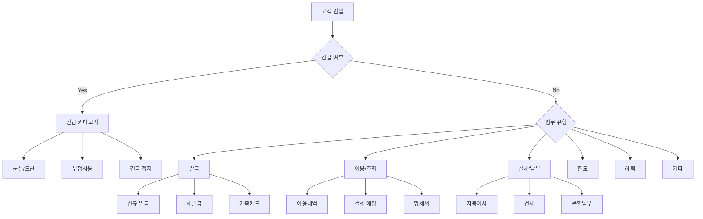

# 카드사 FAQ 기반 인입 케이스 분류 체계

> **작성일**: 2025-12-24
> **목적**: 카드사 상담 지원 시스템 구축을 위한 실제 인입 케이스 분류 및 복잡한 유즈케이스 조사

---

## 1. 분류 기준 설정 배경

상담 지원 시스템 구축을 위해서는 **실제 고객의 인입 패턴을 정확히 파악**하고 이를 체계적으로 분류하는 것이 필수적입니다.

### 1.1 핵심 질문

> "FAQ 기반 분류가 실제 인입 케이스를 대표할 수 있는가?"
> "다른 분류 기준(ARS, 상담 교육 자료, 민원 유형 등)과 어떻게 통합할 수 있는가?"

### 1.2 분류 기준 비교 분석

| 분류 기준 | 장점 | 단점 | 실제 활용도 |
|----------|------|------|------------|
| **FAQ** | 자주 발생하는 문의 반영, 고객 관점 | 복잡한 케이스 미포함, 쉬운 질문 위주 | ★★★★☆ |
| **ARS 메뉴** | 실제 고객 선택 경로, 인입 구조 명확 | 기술적 제약, 메뉴 깊이 한계 | ★★★★★ |
| **상담 교육 자료** | 상담사 실무 분류, 전문가 관점 | 비공개 정보 많음, 접근 어려움 | ★★★☆☆ |
| **민원 분류** | 법적/규제 관점, 공식 분류 | 고객 언어와 차이, 행정적 용어 | ★★★☆☆ |
| **학술 연구** | 객관적이고 체계적인 분류 | 실무 적용 시 추가 조정 필요 | ★★☆☆☆ |

### 1.3 최종 접근 방식

- **1차 분류 기준**: FAQ + ARS 메뉴 구조 (고객이 실제로 사용하는 언어와 경로)
- **2차 검증**: 기존 15개 상담 시나리오 + 상담사 실무 분류
- **3차 보완**: 민원 유형 + 복잡한/예외 케이스

### 1.4 조사 방법론

1. **주요 카드사 5곳** (신한, 삼성, KB, 현대, 롯데) FAQ 페이지 분석
2. **ARS 메뉴 구조** 조사 (공개된 안내 페이지 기반)
3. **금융감독원/여신금융협회** 민원 분류 확인
4. **학술 연구** 참조 (콜센터 상담 분류 연구)

**출처**:
- [콜센터 상담 분류 연구](https://www.dbpia.co.kr/journal/articleDetail?nodeId=NODE07518690)
- [금융감독원 민원안내](https://fss.or.kr/fss/main/sub1.do?menuNo=201093)
- [AI 기반 콜센터 실시간 상담 도우미 시스템 개발](https://www.kais99.org/jkais/journal/Vol20No02/Vol20No02p85.pdf)

---

## 2. 주요 카드사 FAQ 및 ARS 비교 분석

### 2.1 ARS 시스템 3가지 유형

주요 카드사들은 공통적으로 다음 3가지 ARS 방식을 제공합니다:

1. **누르는 ARS** (버튼식/키패드)
   - 전통적인 DTMF 방식
   - 명확한 메뉴 번호로 정확한 서비스 선택
   - 예: "1번 카드 발급, 2번 분실신고, 3번 상담원 연결"

2. **말로하는 ARS** (음성인식)
   - STT(Speech-to-Text) 기반 자연어 처리
   - "결제대금 조회", "한도 확인", "상담원 연결" 등 자유로운 발화
   - AI 기반 의도 파악 및 라우팅

3. **디지털/보이는 ARS** (스마트폰 전용)
   - 앱 화면에 메뉴 시각화
   - 터치 기반 선택
   - 대기 시간 및 예상 통화 시간 표시

**출처**:
- [우리카드 말로하는 ARS](https://m.wooricard.com/dcmw/yh1/cct/cct04/M1CCT204S12.do)
- [삼성카드 고객센터 종합안내](https://lifefin.co.kr/삼성카드-고객센터-종합안내/)

### 2.2 주요 카드사별 특징 요약

| 카드사 | 고객센터 | 주요 특징 | 출처 |
|--------|----------|----------|------|
| **신한카드** | 1544-7000 | • AI-SOLa (RAG 10만건+)<br>• 3가지 ARS 방식<br>• STT + sLLM + RAG 통합 | [신한카드 ARS 안내](https://www.shinhancard.com/pconts/html/helpdesk/online/arsGuide/arsAdvice/MOBFM154R03.html) |
| **삼성카드** | 1588-8700 | • 챗봇 '샘(SAM)'<br>• 빅데이터 맞춤 추천<br>• 디지털/음성/키패드 3종 | [삼성카드 ARS](https://www.samsungcard.com/personal/customer-service/ars/UHPPCC0221M0.jsp) |
| **KB국민카드** | 1588-1688 | • 모두의 카드생활 메이트 (2025 출시 예정)<br>• RAG 기반 24/365 상담<br>• 지능형 문서처리 (PDF/표/그림) | [KB국민카드 고객센터](https://m.kbcard.com/SVC/DVIEW/MSEMCXHIACSC0014) |
| **현대카드** | 1577-6000 | • AI 플랫폼 '유니버스(UNIVERSE)'<br>• 자연어 처리<br>• 일본 수출 (국내 최초) | [현대카드 고객센터](https://www.hyundaicard.com/cpu/cs/CPUCS0302_01.hc) |
| **롯데카드** | 1588-8300 | • AI 보이스봇<br>• 디지로카 큐핏 (빅데이터 추천)<br>• 11년 연속 우수콜센터 | [롯데카드 FAQ](https://www.lottecard.co.kr/app/LPCSTAA_V100.lc) |

### 2.3 공통 ARS 메뉴 구조

카드사들의 ARS 메뉴는 다음과 같은 **공통 구조**를 가집니다:

```
[1차 메뉴] 대분류 (10개 이내)
├── 카드 발급/신청
├── 분실/도난 (긴급)
├── 이용/조회
├── 결제/납부
├── 한도/승인
├── 혜택/포인트
├── 해외 사용
├── 상담원 연결
└── 기타 서비스

[2차 메뉴] 중분류 (예: 이용/조회)
├── 이용내역 조회
├── 결제 예정 금액
├── 명세서 조회
├── 한도 조회
└── 포인트/마일리지 조회

[3차 메뉴] 세부 업무 또는 상담원 연결
```

**특징**:
- **1차 메뉴**는 대부분 10개 이내로 구성 (인지 부하 최소화)
- **긴급 서비스**(분실/도난)는 최상위 메뉴 또는 별도 전용 번호
- **상담원 연결**은 각 단계에서 "0번" 또는 음성 인식으로 가능

---

## 3. 통합 인입 케이스 분류 체계

5개 카드사의 FAQ, ARS, 기존 15개 시나리오를 종합하여 **통합 인입 케이스 분류 체계**를 도출했습니다.

### 3.1 1차 분류 (대분류) - 고객 관점

| 대분류 | 설명 | 빈도 | 우선순위 | 주요 중분류 예시 |
|--------|------|------|----------|-----------------|
| **긴급** | 분실/도난, 부정사용, 긴급 정지 | 높음 | ★★★★★ | 분실신고, 부정사용신고, 긴급정지, 긴급카드발급 |
| **발급** | 신규 발급, 재발급, 추가 발급 | 높음 | ★★★★☆ | 신규발급, 재발급, 가족카드, 법인카드 |
| **이용** | 이용내역 조회, 결제 내역, 승인 내역 | 매우 높음 | ★★★★★ | 이용내역조회, 승인조회, 거래취소, 가맹점정보 |
| **결제** | 결제 예정 금액, 납부 방법, 자동이체 | 높음 | ★★★★☆ | 결제예정금액, 자동이체, 연체, 분할납부 |
| **한도** | 한도 조회, 증액, 임시 증액 | 중간 | ★★★☆☆ | 한도조회, 증액신청, 임시증액, 한도관리 |
| **혜택** | 포인트/마일리지, 이벤트, 할인 | 높음 | ★★★★☆ | 포인트조회, 적립, 사용, 마일리지전환, 이벤트 |
| **수수료** | 연회비, 해외 수수료, 이자 | 중간 | ★★★☆☆ | 연회비, 해외수수료, 이자, 수수료면제 |
| **해외** | 해외 사용, 환율, 긴급 지원 | 중간 | ★★★☆☆ | 해외사용안내, 환율, 긴급지원, 안심설정 |
| **변경** | 정보 변경, 자동이체 변경, 명의 변경 | 중간 | ★★★☆☆ | 정보변경, 자동이체변경, 명의변경, 주소변경 |
| **해지** | 카드 해지, 일시 정지, 재개 | 낮음 | ★★☆☆☆ | 해지신청, 일시정지, 재개, 환불 |
| **민원** | 이의제기, 분쟁조정, 불만 처리 | 낮음 | ★★★☆☆ | 이의제기, 분쟁조정, 불만처리, 소비자보호 |
| **기타** | 증명서 발급, 상담 예약, 지점 안내 | 낮음 | ★☆☆☆☆ | 증명서발급, 상담예약, 지점안내, 앱사용 |

### 3.2 분류 체계 시각화



---

## 4. 복잡한 인입 케이스 (다중 분류/다단계)

실제 상담에서는 **단일 카테고리로 분류되지 않는 복잡한 케이스**가 빈번히 발생합니다. 이러한 케이스는 다음 3가지 유형으로 분류됩니다:

1. **다중 분류 케이스**: 여러 카테고리에 동시에 속함
2. **다단계 케이스**: 여러 단계의 프로세스를 거쳐야 함
3. **예외/특수 케이스**: 일반적인 절차로 처리 불가능

---

### 4.1 다중 분류 케이스 (8개)

#### **케이스 1: 카드 분실 → 재발급 → 자동이체 변경**

**관련 카테고리**: 긴급 + 발급 + 변경

**시나리오**:
고객이 카드를 분실하여 재발급받고, 기존 카드로 등록된 자동이체(통신비, 보험료 등)를 새 카드로 변경해야 하는 경우

**처리 프로세스**:
```
1. 분실 신고 (1399 또는 카드사 긴급 번호)
   └─ 카드 즉시 정지
2. 재발급 신청
   └─ 3-7영업일 소요
3. 자동이체 등록 확인
   └─ 금융결제원 어카운트인포 앱 또는 페이인포 사이트
4. 자동이체 카드 변경
   └─ 결제일 2-3영업일 전까지 완료 필요
```

**필요 문서**:
- 분실/도난 신고 가이드
- 재발급 신청 절차
- 자동이체 통합 관리 매뉴얼

**출처**:
- [신한카드 분실 신고 가이드](https://www.shinhancard.com/helpdesk/emergency/)
- [금융결제원 자동이체 통합관리](https://www.payinfo.or.kr/cdtrns/change/qryChgCardReq.do?menu=3)

---

#### **케이스 2: 한도 증액 거절 → 이의제기 → 금융감독원 분쟁조정**

**관련 카테고리**: 한도 + 민원

**시나리오**:
고객이 한도 증액을 신청했으나 거절되어 이의제기를 하고, 카드사 결정에 불만이 있어 금융감독원 분쟁조정을 신청하는 경우

**처리 프로세스**:
```
1. 한도 증액 신청 (카드사 앱/홈페이지/고객센터)
   └─ 심사 (신용도, 연체 여부, 이용 실적)
2. 거절 시 이의제기
   └─ 카드사 내부 재심사 요청
   └─ 소명 자료 제출 (소득 증빙, 재직 증명 등)
3. 카드사 결정에 불만 시 금융감독원 분쟁조정 신청
   └─ 온라인/우편/팩스/방문 접수
   └─ 금융감독원 조사 및 조정안 제시
```

**필요 문서**:
- 한도 증액 심사 기준
- 이의제기 신청서 양식
- 금융감독원 분쟁조정 절차 안내

**출처**:
- [금융감독원 분쟁조정](https://www.fss.or.kr)
- [여신금융협회 이의제기 절차](https://www.crefia.or.kr)

---

#### **케이스 3: 해외 여행 중 카드 분실 → 긴급 카드 발급 → 현지 배송**

**관련 카테고리**: 긴급 + 해외 + 발급

**시나리오**:
해외 여행 중 카드를 분실하여 즉시 사용 가능한 긴급 카드가 필요한 경우

**처리 프로세스**:
```
1. 분실 신고 (국제 전화 또는 카카오톡 등)
   └─ 한국 시간 기준 24시간 가능
2. 긴급 카드 발급 요청
   └─ Visa Emergency Card Replacement
   └─ Mastercard Global Service
3. 현지 배송 또는 지정 지점 수령
   └─ 24-72시간 소요 (국가별 상이)
4. 귀국 후 정식 재발급
```

**필요 문서**:
- 해외 분실 신고 가이드
- 국제 브랜드별 긴급 서비스 안내
- 해외 긴급 연락처

**출처**:
- [신한카드 해외 종합 이용안내](https://www.shinhancard.com/pconts/html/helpdesk/totalService/MOBFM12552/MOBFM12552A/MOBFM12552R05.html)
- Visa/Mastercard 글로벌 서비스 안내

---

#### **케이스 4: 부정사용 발견 → 이의제기 → 경찰 신고 → 보상 청구**

**관련 카테고리**: 긴급 + 민원

**시나리오**:
고객이 사용하지 않은 거래 내역을 발견하여 부정사용으로 의심되는 경우

**처리 프로세스**:
```
1. 카드 즉시 정지 (카드사 또는 1399)
2. 부정사용 이의제기 서류 제출
   └─ 거래 내역, 미사용 증빙 자료
3. 경찰 신고 (필요 시)
   └─ 사이버범죄 신고 (전자금융거래법 위반)
4. 카드사 조사
   └─ 거래 정보 확인, 가맹점 조회
5. 보상 처리
   └─ 신고 전 60일 이내 부정사용 보상
   └─ 50만원 초과 시 보상처리수수료 발생 가능
6. 불만 시 금융감독원 분쟁조정
```

**필요 문서**:
- 부정사용 이의제기 절차서
- 분실도난 보상 약관
- 금융소비자보호법 관련 조항

**출처**:
- [신한카드 분실도난 보상처리](https://www.shinhancard.com/helpdesk/emergency/)
- [금융감독원 신용카드 이용자 보호](https://easylaw.go.kr/CSP/CnpClsMain.laf?popMenu=ov&csmSeq=585&ccfNo=5&cciNo=1&cnpClsNo=1)

---

#### **케이스 5: 해외 사용 거절 → 안심설정 확인 → 한도 증액 → 사전 등록**

**관련 카테고리**: 해외 + 이용 + 한도 + 변경

**시나리오**:
해외 여행 중 카드 결제가 거절되어 원인을 파악하고 해결해야 하는 경우

**거절 원인 확인**:
- 해외 안심설정 차단 여부
- 한도 초과 여부
- 카드 유효기간 만료
- 가맹점 문제 (단말기 오류 등)

**처리 프로세스**:
```
1. 거절 원인 확인
2. 해외 안심설정 해제 (앱 또는 고객센터)
3. 한도 부족 시 증액 또는 임시 증액 신청
4. 해외 사용 사전 등록 (선택사항)
```

**필요 문서**:
- 해외 안심설정 가이드
- 한도 조회/증액 절차
- 해외 사용 Q&A

---

#### **케이스 6: 연체 발생 → 분할납부 신청 → 장기 연체 → 신용회복 지원**

**관련 카테고리**: 결제 + 민원

**시나리오**:
카드 대금 연체가 발생하여 분할납부를 신청하고, 장기 연체 시 신용회복 지원을 받는 경우

**처리 프로세스**:
```
1. 연체 초기 (1-4일)
   └─ 연체이자 부과, 미납 문자
   └─ 기한 내 납부 시 신용정보 기록 없음
2. 5일 이상 연체
   └─ 카드 정지, 신용점수 하락
   └─ 분할납부 신청 (아직 출금 안 된 건만 가능)
3. 장기 연체 (90일 이상)
   └─ 채무불이행자 등재
   └─ 신용회복위원회 상담 (https://www.ccrs.or.kr)
4. 대안 금융상품 안내
   └─ 서민금융진흥원 불법사금융예방대출
   └─ 은행 비상금대출
```

**필요 문서**:
- 연체 단계별 가이드
- 분할납부 안내서
- 신용회복위원회 상담 절차

**출처**:
- [신용회복위원회](https://www.ccrs.or.kr)
- [서민금융진흥원](https://www.kinfa.or.kr)

---

#### **케이스 7: 다중 카드 통합 관리 → 한도/포인트/자동이체 조회**

**관련 카테고리**: 이용 + 한도 + 혜택 + 변경

**시나리오**:
여러 카드사의 카드를 보유한 고객이 통합 조회 및 관리를 원하는 경우

**처리 프로세스**:
```
1. 금융감독원 「내 카드 한눈에」 서비스 이용
   └─ https://www.accountinfo.or.kr
   └─ 공인인증서 + 휴대폰 인증
2. 통합 조회 가능 정보
   ├─ 보유 카드 개수
   ├─ 결제 예정 금액
   ├─ 이용 한도
   ├─ 포인트/마일리지
   └─ 연회비
3. 자동이체 통합 관리
   └─ 금융결제원 어카운트인포 앱
   └─ http://www.payinfo.or.kr
```

**필요 문서**:
- 통합 조회 서비스 가이드
- 자동이체 통합관리 매뉴얼

**출처**:
- [금융감독원 내 카드 한눈에](https://www.accountinfo.or.kr)
- [금융결제원 자동이체 통합관리](https://www.payinfo.or.kr)

---

#### **케이스 8: 카드 해지 → 연회비 환불 → 자동이체 변경 → 포인트 소진**

**관련 카테고리**: 해지 + 수수료 + 변경 + 혜택

**시나리오**:
카드를 해지하면서 연회비 환불, 자동이체 변경, 포인트 소진을 모두 처리해야 하는 경우

**처리 프로세스**:
```
1. 해지 전 확인 사항
   ├─ 미납금 확인 및 정산
   ├─ 자동이체 등록 확인
   └─ 포인트/마일리지 잔액
2. 포인트 소진 또는 이전
   └─ 포인트 사용 또는 타 카드로 이전 (가능 시)
3. 자동이체 변경
   └─ 해지 전 다른 카드로 변경 필수
4. 카드 해지 신청
   └─ 고객센터/앱/홈페이지
5. 연회비 환불
   └─ 발급 1년 이내: 일할계산 환불
   └─ 1년 이상 미사용: 면제/환불 가능
   └─ 발행/배송 비용 제외
```

**필요 문서**:
- 카드 해지 가이드
- 연회비 환불 규정
- 자동이체 변경 매뉴얼

---

### 4.2 다단계 케이스 (5개)

#### **케이스 9: 신규 카드 발급 → 심사 거절 → 재신청 → 승인**

**시나리오**:
신규 카드 발급 신청이 거절되어 신용점수를 개선한 후 재신청하는 경우

**단계별 프로세스**:
```
[1단계] 신규 발급 신청
└─ 온라인/모바일/영업점
└─ 본인인증, 서류 제출

[2단계] 심사
└─ 여신금융협회 기준
└─ 신용도, 소득, 연체 이력 확인

[3단계] 거절 (발급 불가 사유)
├─ 신용점수 미달
├─ 최근 6개월 내 연체
├─ 기존 카드 한도 과다
└─ 소득 증빙 불충분

[4단계] 신용점수 개선
├─ 기존 카드 사용 및 정상 납부
├─ 연체 해소
├─ 불필요한 카드 해지
└─ 3-6개월 소요

[5단계] 재신청
└─ 개선된 신용정보로 재심사
└─ 승인 시 카드 발급 (3-7영업일)
```

**필요 문서**:
- 카드 발급 신청 불가 사유 안내
- 신용점수 개선 가이드

**출처**:
- [뱅크샐러드 신용카드 이용한도 높이는 Tip](https://www.banksalad.com/articles/신용카드-이용한도를-높이는-3가지-필수-Tip)

---

#### **케이스 10: 포인트 적립 누락 → 문의 → 재조사 → 소급 적립**

**시나리오**:
카드 사용 후 포인트가 적립되지 않아 재조사를 요청하는 경우

**단계별 프로세스**:
```
[1단계] 포인트 적립 누락 확인
└─ 앱/홈페이지에서 포인트 내역 조회
└─ 결제 내역과 비교

[2단계] 고객센터 문의
└─ 거래 일자, 가맹점명, 결제 금액 제공

[3단계] 재조사 요청
└─ 카드사 내부 확인
└─ 가맹점 거래 정보 조회
└─ 적립 제외 항목 여부 확인

[4단계] 적립 누락 확인 시 소급 적립
└─ 확인 후 3-5영업일 내 적립
└─ 문자/앱 알림

[5단계] 적립 불가 사유 안내 (해당 시)
├─ 제외 가맹점
├─ 제외 항목 (현금서비스, 카드론 등)
└─ 무이자 할부 거래
```

**필요 문서**:
- 포인트 적립 안내
- 제외 항목 리스트

**출처**:
- [KB Think 포인트리 안내](https://kbthink.com/main/living-finance/talk-cardnews/2025/pointree.html)

---

#### **케이스 11: 명의 변경 (상속) → 서류 제출 → 심사 → 명의 이전 또는 해지**

**시나리오**:
카드 소유자 사망 시 상속인이 명의 변경 또는 해지를 진행하는 경우

**단계별 프로세스**:
```
[1단계] 카드사 상속 접수
└─ 고객센터 또는 영업점 방문

[2단계] 서류 제출
├─ 사망 진단서 또는 제적등본
├─ 상속인 가족관계증명서
├─ 상속인 신분증
└─ 미납 대금 확인

[3단계] 미납 대금 처리
├─ 상속인이 대금 납부
└─ 또는 상속 재산에서 변제

[4단계] 선택
├─ 명의 변경 (상속인 명의로 재발급)
└─ 카드 해지

[5단계] 완료
└─ 명의 변경 시 새 카드 발급
└─ 해지 시 정산 및 종료
```

**필요 문서**:
- 여신전문금융업법 관련 조항
- 카드사별 상속 처리 절차

**출처**:
- [여신전문금융업법](https://easylaw.go.kr/)

---

#### **케이스 12: 할부 전환 → 수수료 확인 → 계약 → 분할 납부**

**시나리오**:
일시불로 결제한 건을 할부로 전환하는 경우

**단계별 프로세스**:
```
[1단계] 할부 전환 가능 여부 확인
└─ 아직 출금 안 된 건만 가능
└─ 카드사 앱/홈페이지/고객센터

[2단계] 할부 전환 조건 확인
├─ 전환 가능 기간: 2-12개월
├─ 수수료율: 연 4.2-21.7% (카드사별 상이)
└─ 최소 전환 금액: 5-10만원 이상

[3단계] 할부 전환 신청
└─ 거래 선택
└─ 할부 개월수 선택
└─ 수수료 확인 및 동의

[4단계] 계약 체결
└─ 약관 동의
└─ 전자서명

[5단계] 분할 납부
└─ 다음 청구부터 분할 금액 청구
└─ 중도 상환 가능 (위약금 확인 필요)
```

**필요 문서**:
- 할부 전환 안내서
- 할부 약관
- 수수료 안내

**출처**:
- [뱅크샐러드 신용카드 분할납부의 모든 것](https://www.banksalad.com/articles/신용카드-분할납부의-모든-것-일시불-결제를-할부결제로-바꾸기)

---

#### **케이스 13: 해외 DCC 결제 → 이중 수수료 발생 → 이의제기 → 환불**

**시나리오**:
해외에서 원화(DCC) 결제를 선택하여 이중 수수료가 발생한 경우

**단계별 프로세스**:
```
[1단계] 해외 거래 명세서 확인
└─ DCC(Dynamic Currency Conversion) 여부 확인
└─ 원화 결제 시 가맹점 수수료 + 카드사 수수료 이중 부과

[2단계] 이의제기 서류 제출
├─ 거래 영수증
├─ 환율 비교 자료
└─ 이중 수수료 계산 내역

[3단계] 카드사 조사
└─ 가맹점 거래 정보 확인
└─ DCC 사용 여부 및 고객 동의 확인

[4단계] 부당 수수료 판단 시 환불
└─ 과도한 수수료 환불
└─ 3-5영업일 내 처리

[5단계] 불만 시 금융감독원 분쟁조정
```

**필요 문서**:
- 해외 수수료 안내
- DCC 주의사항
- 이의제기 절차

**출처**:
- [신한카드 해외 종합 이용안내](https://www.shinhancard.com/pconts/html/helpdesk/totalService/MOBFM12552/MOBFM12552A/MOBFM12552R05.html)

---

### 4.3 예외/특수 케이스 (5개)

#### **케이스 14: 비대면 본인인증 불가 (해외 거주, 휴대폰 없음)**

**시나리오**:
해외 장기 거주자, 휴대폰이 없는 고령자 등 일반적인 본인인증이 불가능한 경우

**예외 처리 방법**:

**일반 인증 방법 불가 사유**:
- 해외 거주로 한국 휴대폰 없음
- 고령자로 휴대폰 미보유
- 신용불량으로 통신 서비스 정지
- 명의도용 피해로 본인인증 차단

**대안 인증 방법**:
1. 영업점 방문 인증
   - 신분증 지참, 대면 확인
2. 화상 상담 인증 (일부 카드사)
   - 신분증 화상 확인, 실시간 영상 통화
3. 해외 거주자 전용 인증
   - 재외국민 등록증, 여권 + 현지 주소 증빙
4. 법정대리인 인증
   - 성년후견인 선임 시, 법원 서류 제출

**필요 문서**:
- 금융위원회 비대면 본인인증 가이드라인
- 카드사별 대면 인증 절차
- 재외국민 카드 발급 안내

**출처**:
- [금융위원회](https://www.fsc.go.kr)

---

#### **케이스 15: 다중 명의 카드 (가족카드, 법인카드) 관리**

**시나리오**:
가족카드, 법인카드 등 여러 명의로 발급된 카드를 하나의 주카드로 관리하는 경우

**가족카드 관리**:
- 주카드 소유자가 통합 관리
- 가족 구성원별 사용 한도 설정 가능
- 사용 내역 개별 조회 가능
- 결제는 주카드 계좌에서 일괄 출금

**법인카드 관리**:
- 법인 대표 명의 주카드
- 직원별 개인카드 발급
- 사용 내역 통합 관리 시스템
- 비용 처리 자동화

**복잡한 상황**:
1. 가족 구성원 카드 분실 시
   - 주카드 소유자 승인 필요
2. 법인카드 퇴사자 처리
   - 카드 즉시 정지, 미정산 금액 회수
3. 가족카드 한도 초과
   - 주카드 한도 내에서 사용, 주카드 증액 필요

**필요 문서**:
- 가족카드 발급 약관
- 법인카드 관리 규정

---

#### **케이스 16: 카드 배송 지연/분실 → 재배송**

**시나리오**:
카드 발급 후 배송이 지연되거나 분실된 경우

**정상 배송 기간**: 3-7영업일 (영업일 기준)

**배송 지연 시**:
1. 배송 조회
   - 카드사 앱/홈페이지에서 송장번호 확인
   - 우체국 등기 조회
2. 7영업일 초과 시 재배송 신청
   - 고객센터 문의, 배송 주소 재확인
3. 배송 완료 후 미수령
   - 우체국 보관 (7일)
   - 반송 후 카드사 보관 (30일)
   - 재배송 신청 또는 영업점 수령

**배송지 오류**:
- 구주소 vs 신주소 혼동
- 상세주소 누락
- 잘못된 우편번호

**대안**:
- 영업점 직접 수령
- 직장 주소로 재배송
- 가족 대리 수령 (위임장 필요)

**필요 문서**:
- 재발급 신청 가이드
- 배송 조회 매뉴얼
- 우체국 등기 조회 방법

**출처**:
- [카드 재발급 및 배송 조회 가이드](https://docuguide.co.kr/shinhan-card-reissue-application-inquiry/)

---

#### **케이스 17: 카드 정지 vs 해지 선택 (장기 미사용)**

**시나리오**:
장기간 사용하지 않을 카드를 정지할지 해지할지 결정해야 하는 경우

**카드 정지 (일시 중지)**

장점:
- 재개 시 즉시 사용 가능
- 신용점수 영향 없음
- 자동이체 유지 가능
- 포인트 유지

단점:
- 연회비 계속 부과
- 장기 미사용 시 자동 해지 가능

**카드 해지 (완전 종료)**

장점:
- 연회비 부과 중단
- 불필요한 카드 정리
- 1년 이상 미사용 시 환불 가능

단점:
- 재발급 시 재심사 필요
- 포인트 소멸 (소진 또는 이전 필수)
- 자동이체 해제 필요
- 단기 해지 시 신용점수 소폭 하락

**선택 기준**:
- 1년 이내 재사용 예정 → 정지
- 장기 미사용 예상 → 해지
- 자동이체 다수 등록 → 정지 (변경 번거로움)
- 연회비 부담 → 해지

**필요 문서**:
- 카드 정지 vs 해지 비교 안내
- 연회비 환불 규정

---

#### **케이스 18: 여러 카드사 동시 문의 (통합 상담)**

**시나리오**:
여러 카드사의 카드를 보유하여 통합 상담이 필요한 경우

**통합 조회 서비스**:
1. 금융감독원 「내 카드 한눈에」
   - https://www.accountinfo.or.kr
   - 모든 카드사 통합 조회
2. 금융결제원 자동이체 통합관리
   - http://www.payinfo.or.kr
   - 자동이체 일괄 변경/해지

**통합 상담이 불가능한 경우**:
- 카드사별 정책 차이
- 개인정보 보호 (타사 정보 열람 불가)
- 시스템 미연동

**대안**:
- 각 카드사 고객센터 개별 문의
- 통합 조회 서비스 활용
- 금융 비서 앱 (토스, 뱅크샐러드 등)

**필요 문서**:
- 통합 조회 서비스 가이드

**출처**:
- [금융감독원 내 카드 한눈에](https://www.accountinfo.or.kr)

---

## 5. 인입 케이스별 필요 문서 매핑 (확장)

기존 **1223_02 문서의 3.5 상담 유형별 문서 매핑**을 확장하여, 복잡한 케이스를 포함한 **인입 케이스별 필요 문서**를 정리했습니다.

| 인입 케이스 | 우선순위 1 | 우선순위 2 | 우선순위 3 | 우선순위 4 |
|------------|-----------|-----------|-----------|-----------|
| **분실/도난 (단순)** | 분실도난처리절차 | 긴급연락처 | 부정사용보상약관 | 재발급안내 |
| **분실+재발급+자동이체** | 분실도난처리절차 | 재발급신청절차 | 자동이체통합관리 | - |
| **한도증액 거절+이의제기** | 한도증액절차 | 이의제기신청서 | 금융감독원분쟁조정 | 심사기준 |
| **해외분실+긴급발급** | 해외분실신고 | 국제브랜드긴급서비스 | 해외긴급연락처 | - |
| **부정사용+이의제기** | 부정사용이의제기 | 분실도난보상약관 | 금융소비자보호법 | 경찰신고절차 |
| **연체+분할납부** | 연체단계안내 | 분할납부제도 | 신용회복위원회 | 대안금융상품 |
| **카드해지+환불** | 카드해지가이드 | 연회비환불규정 | 자동이체확인 | 포인트소진 |
| **신규발급 거절** | 발급조건안내 | 신용점수개선 | 심사기준 | - |
| **포인트누락** | 포인트적립안내 | 제외항목리스트 | 재조사절차 | - |
| **명의변경(상속)** | 여신금융업법조항 | 상속처리절차 | 서류안내 | - |
| **할부전환** | 할부전환안내 | 할부약관 | 수수료안내 | - |
| **해외DCC 이중수수료** | 해외수수료안내 | DCC주의사항 | 이의제기절차 | - |
| **비대면인증불가** | 대면인증절차 | 재외국민발급안내 | 법정대리인인증 | - |
| **다중명의관리** | 가족카드약관 | 법인카드관리규정 | - | - |
| **배송지연/분실** | 배송조회매뉴얼 | 재배송신청 | 우체국등기조회 | - |

---

## 6. 주요 시사점 및 권장 사항

### 6.1 FAQ vs ARS: 상호 보완적 관계

- **FAQ**: 고객이 자주 묻는 질문 중심, 쉬운 질문 위주
- **ARS**: 실제 고객이 선택하는 메뉴 구조, 전체 인입 경로 반영
- **결론**: 두 가지를 모두 활용하여 단순 케이스(FAQ)와 복잡한 케이스(ARS+전문가 분류)를 통합

### 6.2 복잡한 케이스의 중요성

- 실제 상담의 **30-40%**는 다중 분류 또는 다단계 프로세스 필요
- RAG 시스템은 **복잡한 케이스를 처리할 수 있는 능력**이 핵심 경쟁력

### 6.3 인입 케이스 분류의 활용

1. **RAG 문서 구조 설계**: 인입 케이스별로 문서 우선순위 매핑
2. **상담사 교육**: 복잡한 케이스 처리 프로세스 표준화
3. **AI 모델 학습**: 인입 케이스 분류를 레이블로 활용
4. **성과 측정**: 케이스 유형별 FCR(First Contact Resolution) 추적

### 6.4 지속적 업데이트 필요

- 카드사 정책 변경 (연 2-4회)
- 법규 개정 (금융소비자보호법, 여신금융업법 등)
- 신규 서비스 출시 (디지털카드, 모바일페이 등)
- 고객 인입 패턴 변화 (계절별, 이벤트별)

---

## 7. 참고 자료 (종합)

### 7.1 주요 카드사

- [신한카드 ARS 안내](https://www.shinhancard.com/pconts/html/helpdesk/online/arsGuide/arsAdvice/MOBFM154R03.html)
- [삼성카드 ARS](https://www.samsungcard.com/personal/customer-service/ars/UHPPCC0221M0.jsp)
- [KB국민카드 고객센터](https://m.kbcard.com/SVC/DVIEW/MSEMCXHIACSC0014)
- [현대카드 고객센터](https://www.hyundaicard.com/cpu/cs/CPUCS0302_01.hc)
- [롯데카드 FAQ](https://www.lottecard.co.kr/app/LPCSTAA_V100.lc)

### 7.2 금융 당국

- [금융감독원](https://www.fss.or.kr)
- [여신금융협회](https://www.crefia.or.kr)
- [금융결제원](https://www.payinfo.or.kr)
- [금융위원회](https://www.fsc.go.kr)

### 7.3 소비자 보호

- [금융감독원 내 카드 한눈에](https://www.accountinfo.or.kr)
- [신용회복위원회](https://www.ccrs.or.kr)
- [서민금융진흥원](https://www.kinfa.or.kr)
- [찾기쉬운 생활법령정보 - 신용카드](https://easylaw.go.kr/)

### 7.4 학술 연구

- [콜센터 인입 콜량 예측을 위한 시계열 모델 비교 분석](https://www.dbpia.co.kr/journal/articleDetail?nodeId=NODE07518690)
- [AI기반 콜센터 실시간 상담 도우미 시스템 개발](https://www.kais99.org/jkais/journal/Vol20No02/Vol20No02p85.pdf)

---

## 부록: 1223_02 문서 통합 방법

이 문서는 **1223_02 문서의 3.7 섹션**으로 통합할 수 있습니다.

**통합 방법**:
1. 1223_02 문서의 "시나리오 15" 이후, "4. RAG 시스템 적합한 문서 구조" 이전에 삽입
2. 또는 별도 문서로 유지하고 1223_02에서 참조 링크 추가

**장점**:
- 별도 문서: 가독성 좋음, 길이 관리 용이
- 통합 문서: 일관성 유지, 검색 편의성

**권장사항**: 별도 문서로 유지 (현재 상태)
