# CALL-ACT 프로젝트 간트 차트 (v2.0)

**작성일**: 2025-12-26
**프로젝트명**: CALL-ACT (카드사 상담 지원 시스템)
**버전**: v2.0 (전문적 재구성에 따른 간트 차트)

---

## 프로젝트 전체 일정

- **프로젝트 시작**: 2025년 12월 18일
- **프로젝트 종료**: 2026년 2월 11일
- **총 기간**: 약 8주 (56일)

---

## 주요 페이즈 (Phase)

| Phase | 명칭 | 기간 | 주요 활동 |
|-------|------|------|-----------|
| Phase 1 | 기획 및 초기 설계 | 12/18 - 12/29 (12일) | 요구사항 정의, 기술 스택 조사, 데이터 수집 기획 |
| Phase 2 | 데이터 수집 및 AI 모델 개발 | 12/30 - 1/12 (14일) | 데이터 수집/전처리, STT/RAG/감정분석 개발 |
| Phase 3 | 중간 발표 | 1/13 - 1/15 (3일) | 중간 발표 준비 및 발표 |
| Phase 4 | 시스템 설계 및 구현 | 1/16 - 1/26 (11일) | 시스템 설계, Frontend/Backend 구현 |
| Phase 5 | 통합 개발 | 1/27 - 2/4 (9일) | 통합 테스트, 배포, 보안 강화 |
| Phase 6 | 최종 발표 | 2/5 - 2/11 (7일) | 문서화, 최종 발표 준비 |

---

## 간트 차트 (Mermaid)

```mermaid
gantt
    title CALL-ACT 프로젝트 간트 차트 (v2.0)
    dateFormat YYYY-MM-DD

    section 1. 기획 및 요구사항 정의
    프로젝트 목표 및 문제 정의        :done, task1_1, 2025-12-22, 2025-12-24
    프로젝트 기획서 작성              :active, task1_2, 2025-12-22, 2025-12-26
    요구사항 정의서 작성              :active, task1_3, 2025-12-22, 2025-12-26
    WBS 작성                          :active, task1_4, 2025-12-22, 2025-12-26
    필요 기술 조사                    :active, task1_5, 2025-12-23, 2025-12-27
    기능별 구현 가능성 검토           :task1_6, 2025-12-26, 2025-12-29
    기술 스택 확정                    :crit, task1_7, 2025-12-28, 2025-12-30

    section 2. 데이터 수집 및 전처리
    데이터 수집 가능성 검토           :active, task2_1, 2025-12-23, 2025-12-27
    데이터 수집 계획 수립             :task2_2, 2025-12-24, 2025-12-28
    데이터베이스 설계 문서 작성       :task2_3, 2025-12-26, 2025-12-29
    카드사 FAQ 데이터 수집            :crit, task2_4, 2025-12-27, 2026-01-03
    약관/정책 문서 크롤링             :crit, task2_5, 2025-12-27, 2026-01-03
    상담 시나리오 데이터 수집         :task2_6, 2025-12-28, 2026-01-05
    KMS 연동 API 설계                 :task2_7, 2025-12-30, 2026-01-05
    실시간 문서 동기화 구현           :task2_8, 2026-01-06, 2026-01-12
    문서 버전 관리 시스템             :task2_9, 2026-01-08, 2026-01-15
    문서 전처리 및 청킹               :crit, task2_10, 2025-12-30, 2026-01-05
    메타데이터 설계 및 태깅           :task2_11, 2026-01-01, 2026-01-05
    데이터 전처리 문서 작성           :crit, task2_12, 2025-12-30, 2026-01-05
    인공지능 데이터 전처리 결과서 작성 :crit, task2_13, 2025-12-30, 2026-01-05

    section 3. AI 모델 개발
    STT 모델 선정                     :crit, task3_1, 2025-12-28, 2026-01-03
    STT 정확도 테스트                 :crit, task3_2, 2026-01-01, 2026-01-05
    실시간 음성-텍스트 변환 구현      :crit, task3_3, 2026-01-03, 2026-01-10
    STT 성능 최적화                   :task3_4, 2026-01-08, 2026-01-12
    화자 분리 기능 구현               :task3_5, 2026-01-06, 2026-01-12
    벡터 DB 구축                      :crit, task3_6, 2026-01-01, 2026-01-05
    임베딩 전략 설계                  :task3_7, 2025-12-28, 2026-01-03
    RAG 파이프라인 설계               :crit, task3_8, 2025-12-30, 2026-01-05
    RAG 파이프라인 구현               :crit, task3_9, 2026-01-01, 2026-01-08
    하이브리드 검색 구현              :task3_10, 2026-01-05, 2026-01-10
    RAG 성능 테스트                   :task3_11, 2026-01-08, 2026-01-12
    감정 분석 모델 선정/개발          :crit, task3_12, 2026-01-01, 2026-01-08
    음성 톤 기반 감정 인식            :task3_13, 2026-01-03, 2026-01-10
    텍스트 기반 감정 분석             :task3_14, 2026-01-03, 2026-01-10
    실시간 감정 상태 추적             :task3_15, 2026-01-06, 2026-01-12
    에이전트 로직 구성                :task3_16, 2026-01-05, 2026-01-10
    LLM 활용 소프트웨어 개발          :crit, task3_17, 2026-01-06, 2026-01-12
    프롬프트 엔지니어링               :task3_18, 2026-01-05, 2026-01-12
    파인튜닝 (선택적)                 :task3_19, 2026-01-08, 2026-01-12
    AI 모델 테스트 계획 수립          :task3_20, 2026-01-08, 2026-01-10
    통합 AI 모델 테스트               :task3_21, 2026-01-10, 2026-01-12

    section 중간 발표
    중간 발표 PT 자료 작성            :crit, milestone1, 2026-01-10, 2026-01-13
    중간 발표 리허설                  :crit, milestone2, 2026-01-14, 2026-01-14
    중간 발표                         :milestone, 2026-01-15, 0d

    section 4. 시스템 설계
    시스템 아키텍처 (초안) 작성       :crit, task4_1, 2025-12-30, 2026-01-05
    시스템 구성도 설계                :task4_2, 2026-01-20, 2026-01-26
    프로젝트 구조 설계                :task4_3, 2026-01-06, 2026-01-15
    UI 설계                           :task4_4, 2026-01-06, 2026-01-15
    화면 설계서 작성                  :task4_5, 2026-01-13, 2026-01-20
    사용자 경험 (UX) 최적화           :task4_6, 2026-01-10, 2026-01-20
    API 명세서 작성                   :task4_7, 2026-01-10, 2026-01-20
    RESTful API 설계                  :task4_8, 2026-01-08, 2026-01-15
    WebSocket 설계                    :task4_9, 2026-01-10, 2026-01-18

    section 5. 기능 구현
    Frontend UI 개발                  :crit, task5_1, 2026-01-16, 2026-01-28
    Frontend 기능 구현                :crit, task5_2, 2026-01-20, 2026-01-30
    실시간 감정 시각화 구현           :task5_3, 2026-01-22, 2026-01-30
    Backend 기능 구현                 :crit, task5_4, 2026-01-16, 2026-01-28
    API 구현                          :crit, task5_5, 2026-01-16, 2026-01-28
    데이터베이스 연동                 :crit, task5_6, 2026-01-16, 2026-01-25
    회원가입 기능 구현                :task5_7, 2026-01-16, 2026-01-22
    로그인/인증 시스템 (JWT)          :crit, task5_8, 2026-01-16, 2026-01-22
    권한 관리 시스템                  :task5_9, 2026-01-18, 2026-01-25
    프로필 관리 기능                  :task5_10, 2026-01-20, 2026-01-28
    실시간 대화 가이드 시스템         :crit, task5_11, 2026-01-18, 2026-01-28
    자동 문서 검색 기능               :crit, task5_12, 2026-01-18, 2026-01-28
    핵심 키워드 검색 기능             :task5_13, 2026-01-20, 2026-01-30
    AI 추천 답변 시스템               :crit, task5_14, 2026-01-22, 2026-02-02
    시뮬레이션 시나리오 설계          :task5_15, 2026-01-16, 2026-01-25
    페르소나 기반 교육 콘텐츠 개발    :task5_16, 2026-01-18, 2026-01-28
    실시간 피드백 시스템 구현         :task5_17, 2026-01-22, 2026-02-01
    AI 기반 평가 알고리즘             :task5_18, 2026-01-24, 2026-02-02
    실시간 상담 현황 대시보드         :task5_19, 2026-01-20, 2026-01-30
    통계 데이터 수집 시스템           :task5_20, 2026-01-22, 2026-02-01
    상담 내역 조회 기능               :task5_21, 2026-01-22, 2026-01-30
    리포트 생성 기능                  :task5_22, 2026-01-25, 2026-02-02

    section 통합 및 연결
    FE, BE 연결                       :crit, task5_23, 2026-01-28, 2026-02-04
    AI 모델 통합                      :crit, task5_24, 2026-01-28, 2026-02-04
    전체 시스템 통합 테스트           :crit, task5_25, 2026-02-01, 2026-02-04

    section 6. 인프라, 배포, 보안
    인프라 설계                       :task6_1, 2026-01-20, 2026-01-26
    클라우드 환경 구축                :task6_2, 2026-01-22, 2026-01-30
    CI/CD 파이프라인 구축             :task6_3, 2026-01-25, 2026-02-02
    배포 환경 구축                    :task6_4, 2026-01-27, 2026-02-04
    스테이징 환경 배포                :task6_5, 2026-01-28, 2026-02-02
    프로덕션 배포                     :crit, task6_6, 2026-02-03, 2026-02-04
    개인정보 보호 설계                :crit, task6_7, 2026-01-16, 2026-01-25
    데이터 암호화 구현                :crit, task6_8, 2026-01-18, 2026-01-28
    접근 권한 관리 시스템             :task6_9, 2026-01-20, 2026-01-30
    보안 취약점 점검                  :crit, task6_10, 2026-01-28, 2026-02-04
    금융권 컴플라이언스 검증          :crit, task6_11, 2026-02-01, 2026-02-04

    section 7. 테스트 및 검증
    단위 테스트                       :task7_1, 2026-01-20, 2026-01-30
    통합 테스트                       :crit, task7_2, 2026-01-28, 2026-02-04
    E2E 테스트                        :task7_3, 2026-02-01, 2026-02-04
    STT 성능 테스트 (WER, RTF)        :crit, task7_4, 2026-01-28, 2026-02-02
    RAG 응답 시간 테스트              :crit, task7_5, 2026-01-28, 2026-02-02
    동시 접속자 부하 테스트           :task7_6, 2026-01-30, 2026-02-04
    데이터베이스 쿼리 최적화          :task7_7, 2026-01-28, 2026-02-04
    감정 분석 정확도 검증             :task7_8, 2026-01-30, 2026-02-04
    사용자 시나리오 테스트            :task7_9, 2026-02-01, 2026-02-04
    테스트 결과 보고서 작성           :task7_10, 2026-02-02, 2026-02-04

    section 8. 최종 산출물 및 발표
    사용자 매뉴얼 작성                :task8_1, 2026-01-25, 2026-02-05
    관리자 가이드 작성                :task8_2, 2026-01-28, 2026-02-05
    API 문서화                        :task8_3, 2026-01-25, 2026-02-02
    운영 매뉴얼 작성                  :task8_4, 2026-02-01, 2026-02-06
    최종 발표 PT 자료 작성            :crit, milestone3, 2026-02-05, 2026-02-09
    최종 발표 리허설                  :crit, milestone4, 2026-02-10, 2026-02-10
    데모 시연 준비                    :crit, milestone5, 2026-02-05, 2026-02-10
    최종 발표                         :milestone, 2026-02-11, 0d
```

---

## Critical Path (주요 경로)

다음은 프로젝트의 Critical Path로, 이들 작업이 지연되면 전체 프로젝트가 지연됩니다:

### Phase 1 (기획 및 초기 설계)
1. **기술 스택 확정** (12/28-12/30) - 모든 개발 작업의 전제 조건
2. **데이터 수집 기획** (12/23-12/28) - AI 모델 개발의 전제 조건

### Phase 2 (데이터 수집 및 AI 모델 개발)
3. **카드사 FAQ/약관 데이터 수집** (12/27-1/3) - RAG 시스템의 핵심
4. **문서 전처리 및 청킹** (12/30-1/5) - RAG 구현의 전제 조건
5. **벡터 DB 구축** (1/1-1/5) - RAG 파이프라인의 기반
6. **RAG 파이프라인 구현** (1/1-1/8) - 핵심 기능
7. **STT 모델 선정 및 구현** (12/28-1/10) - 실시간 상담 지원의 기반
8. **감정 분석 모델 개발** (1/1-1/8) - 상담 품질 향상의 핵심
9. **LLM 활용 소프트웨어 개발** (1/6-1/12) - AI 추천 답변 시스템의 기반

### Phase 3 (중간 발표)
10. **중간 발표 준비 및 발표** (1/10-1/15) - 프로젝트 진행 상황 점검

### Phase 4 (시스템 설계 및 구현)
11. **시스템 아키텍처 설계** (12/30-1/5) - 시스템 구현의 청사진
12. **Frontend/Backend 구현** (1/16-1/28) - 핵심 기능 구현
13. **로그인/인증 시스템** (1/16-1/22) - 보안의 기반
14. **실시간 대화 가이드 시스템** (1/18-1/28) - 핵심 기능
15. **자동 문서 검색 기능** (1/18-1/28) - 핵심 기능
16. **AI 추천 답변 시스템** (1/22-2/2) - 핵심 기능

### Phase 5 (통합 개발)
17. **FE, BE 연결** (1/28-2/4) - 시스템 통합
18. **AI 모델 통합** (1/28-2/4) - 시스템 통합
19. **전체 시스템 통합 테스트** (2/1-2/4) - 품질 보증
20. **프로덕션 배포** (2/3-2/4) - 서비스 출시
21. **보안 취약점 점검** (1/28-2/4) - 금융권 보안 요구사항
22. **금융권 컴플라이언스 검증** (2/1-2/4) - 규제 준수
23. **STT 성능 테스트** (1/28-2/2) - 품질 보증
24. **RAG 응답 시간 테스트** (1/28-2/2) - 품질 보증

### Phase 6 (최종 발표)
25. **최종 발표 준비 및 발표** (2/5-2/11) - 프로젝트 완료

---

## 주요 마일스톤

| 마일스톤 | 일자 | 주요 산출물 |
|----------|------|-------------|
| **프로젝트 기획서 제출** | 2025-12-26 | 기획서, 요구사항 정의서, WBS |
| **기술 스택 확정** | 2025-12-30 | 기술 스택 문서 |
| **데이터 수집 완료** | 2026-01-05 | 수집 데이터, 전처리 문서, 벡터 DB |
| **AI 모델 개발 완료** | 2026-01-12 | STT, RAG, 감정 분석 모델, 테스트 보고서 |
| **중간 발표** | 2026-01-15 | 중간 발표 PT 자료 |
| **시스템 설계 완료** | 2026-01-20 | 시스템 구성도, 화면 설계서, API 명세서 |
| **핵심 기능 구현 완료** | 2026-02-02 | Frontend/Backend, MBM, CSU, EDU, DASH |
| **통합 테스트 완료** | 2026-02-04 | 테스트 결과서, 성능 보고서 |
| **배포 완료** | 2026-02-04 | 프로덕션 환경 |
| **최종 발표** | 2026-02-11 | 최종 발표 PT 자료, 데모 |

---

## 의존성 관계 (Dependencies)

### 선행 작업 → 후행 작업

1. **데이터 수집 → AI 모델 개발**
   - 카드사 FAQ/약관 수집 → 문서 전처리 → 벡터 DB 구축 → RAG 파이프라인 구현

2. **AI 모델 개발 → 기능 구현**
   - STT 구현 → 실시간 대화 가이드 시스템
   - RAG 구현 → 자동 문서 검색 기능
   - 감정 분석 구현 → 실시간 감정 시각화
   - LLM 개발 → AI 추천 답변 시스템

3. **시스템 설계 → 기능 구현**
   - 아키텍처 설계 → Frontend/Backend 개발
   - API 설계 → API 구현
   - UI/UX 설계 → Frontend UI 개발

4. **기능 구현 → 통합 및 테스트**
   - Frontend/Backend 구현 → FE, BE 연결
   - AI 모델 구현 → AI 모델 통합
   - 통합 완료 → 전체 시스템 통합 테스트

5. **통합 테스트 → 배포**
   - 통합 테스트 완료 → 스테이징 환경 배포 → 프로덕션 배포

---

## 리스크 관리

### 높은 리스크 영역

1. **데이터 수집 지연** (12/27-1/3)
   - 리스크: 카드사 FAQ/약관 수집 어려움
   - 완화 방안: 공개 데이터 우선 수집, 크롤링 자동화

2. **AI 모델 성능 미달** (1/1-1/12)
   - 리스크: STT WER > 0.1, RAG Recall@3 < 90%
   - 완화 방안: 상용 API 대안 준비, 하이브리드 검색 적용

3. **통합 테스트 실패** (2/1-2/4)
   - 리스크: FE-BE-AI 통합 시 오류 발생
   - 완화 방안: 단위/통합 테스트 병행, 조기 통합 시작

4. **보안 검증 실패** (1/28-2/4)
   - 리스크: 금융권 컴플라이언스 미충족
   - 완화 방안: 개인정보 보호 설계 조기 착수, 보안 전문가 자문

---

## v2.0 간트 차트 특징

### v1.0 대비 개선사항

1. **8개 섹션 구조**: AI 프로젝트 특성 반영
2. **Critical Path 명시**: 핵심 작업에 `crit` 태그 적용
3. **의존성 명확화**: 데이터 → AI → 구현 흐름 명확
4. **마일스톤 강조**: 중간 발표, 최종 발표 등 주요 일정 강조
5. **병렬 작업 시각화**: Frontend/Backend/AI 병렬 개발 표현

### 차트 활용 방법

- **Mermaid Live Editor**에서 시각화 가능: https://mermaid.live
- GitHub, Notion 등 Mermaid 지원 플랫폼에서 자동 렌더링
- 프로젝트 관리 도구 (Jira, Notion)에 연동 가능

---

**문서 끝**
