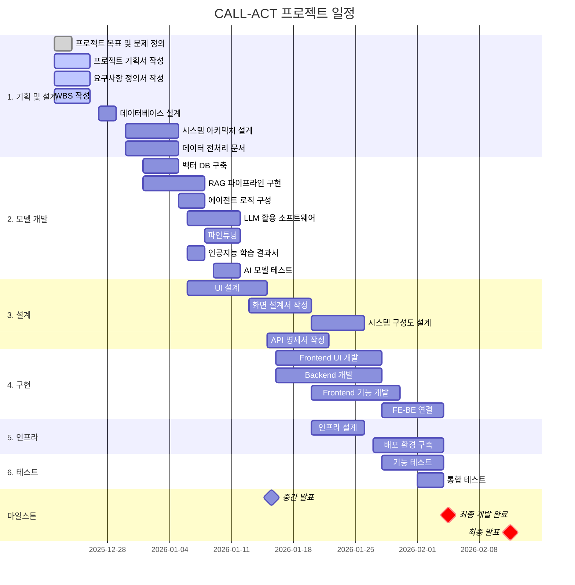

# CALL-ACT 프로젝트 간트 차트

**작성일**: 2025-12-26
**버전**: v1.0
**프로젝트명**: CALL-ACT (카드사 상담 지원 시스템)

---

## Mermaid Gantt Chart

아래 Mermaid 차트는 GitHub, VS Code, Notion 등에서 렌더링됩니다.

---

## 주요 산출물 타임라인

### Phase 1: 초기 기획 (12/22 - 12/26)
- ✅ 프로젝트 목표 및 문제 정의 (12/24 완료)
- 📝 요구사항 정의서 초안 (12/26)
- 📝 WBS (12/26)
- 📝 프로젝트 기획서 (12/26)
- 📝 수집 데이터 (12/26)

### Phase 2: 데이터 및 시스템 설계 (12/27 - 1/5)
- 📋 데이터베이스 설계 문서 (12/29)
- 📋 데이터 전처리 문서 (1/5)
- 📋 인공지능 데이터 전처리 결과서 (1/5)
- 🏗️ 시스템 아키텍처 (1/5)

### Phase 3: AI 모델 개발 (1/1 - 1/12)
- 🤖 벡터 DB 구축
- 🤖 RAG 파이프라인 구현
- 🤖 인공지능 학습 결과서 (1/8)
- 🤖 학습된 인공지능 모델 (1/8)
- 💻 LLM 활용 소프트웨어 (1/12)
- 🔧 자체 LLM 파인튜닝 (1/12)
- 📊 테스트 계획 및 결과 보고서 (1/12)

### Phase 4: 중간 발표 (1/13 - 1/15)
- 📊 중간 발표 PT 자료 (1/13)
- 🎯 중간 발표 리허설 (1/14)
- **🎤 중간 발표 (1/15)** ⭐

### Phase 5: 상세 설계 및 구현 시작 (1/16 - 1/26)
- 📄 요구사항 정의서 최종본 (1/20)
- 🎨 화면설계서 (1/20)
- 🏗️ 시스템 구성도 (1/26)
- 💻 Frontend/Backend 개발 진행

### Phase 6: 통합 및 완성 (1/27 - 2/4)
- 🔗 FE-BE 연결
- ⚙️ 인프라 및 배포
- 🧪 기능/통합 테스트
- **✅ 개발된 LLM 연동 웹 애플리케이션 (2/4)** ⭐

### Phase 7: 최종 발표 준비 (2/5 - 2/11)
- 📊 최종 발표 자료 준비
- 🎯 리허설
- **🎤 최종 발표 (2/11)** ⭐

---

## 주요 마일스톤 요약

| 날짜 | 마일스톤 | 주요 산출물 |
|------|----------|-------------|
| **2025-12-26** | 초기 기획 완료 | 요구사항 정의서, WBS, 기획서 |
| **2026-01-05** | 설계 완료 | 시스템 아키텍처, 데이터 전처리 문서 |
| **2026-01-12** | AI 모델 개발 완료 | LLM 소프트웨어, 파인튜닝, 테스트 보고서 |
| **2026-01-15** | **중간 발표** | PT 자료, 현재까지 개발 결과 |
| **2026-01-26** | 상세 설계 완료 | 화면설계서, 시스템 구성도 |
| **2026-02-04** | **개발 완료** | LLM 연동 웹 애플리케이션 |
| **2026-02-11** | **최종 발표** | 최종 발표 자료, 완성된 프로젝트 |

---

## 크리티컬 패스 (Critical Path)

프로젝트의 성공을 위해 반드시 지켜야 할 핵심 경로:

1. **기획 → 시스템 설계** (12/22 - 1/5)
   - 요구사항 정의 → 시스템 아키텍처 설계

2. **AI 모델 개발** (1/1 - 1/12)
   - 벡터 DB → RAG 파이프라인 → LLM 통합 → 파인튜닝

3. **중간 발표** (1/15) ⚠️ 고정 일정

4. **구현 및 통합** (1/16 - 2/4)
   - UI/Backend 개발 → FE-BE 연결 → 테스트

5. **최종 발표** (2/11) ⚠️ 고정 일정

---

## 리스크 및 버퍼

### 잠재적 리스크
- ⚠️ AI 모델 개발 지연 (파인튜닝 시간 초과 가능)
- ⚠️ FE-BE 통합 이슈 (API 불일치 등)
- ⚠️ 테스트 단계에서 버그 발견

### 버퍼 계획
- 중간 발표 이후 1주일 (1/16-1/22): 설계 보완 가능
- 최종 개발 완료 후 1주일 (2/5-2/11): 발표 준비 및 최종 점검

---

**문서 끝**
