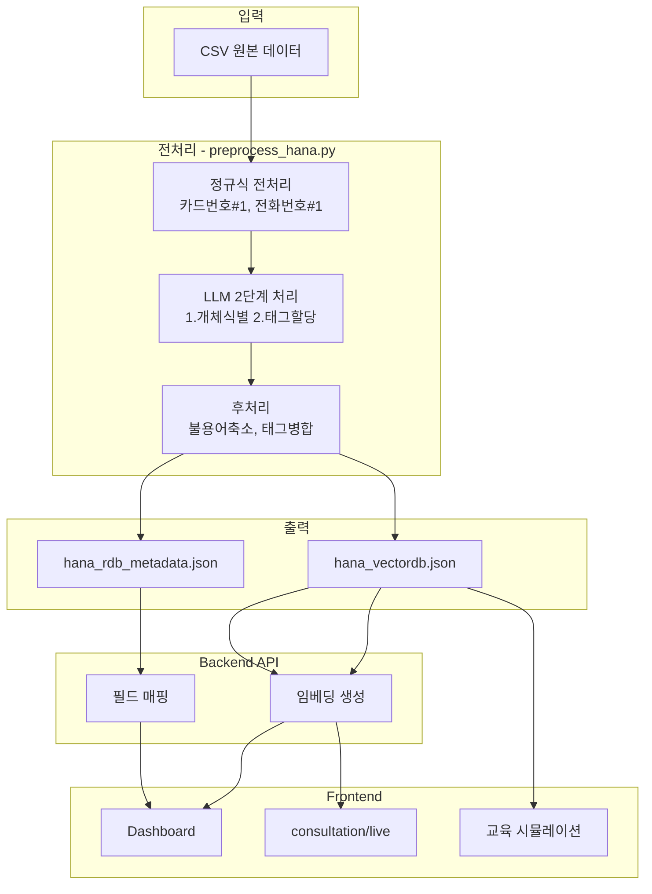
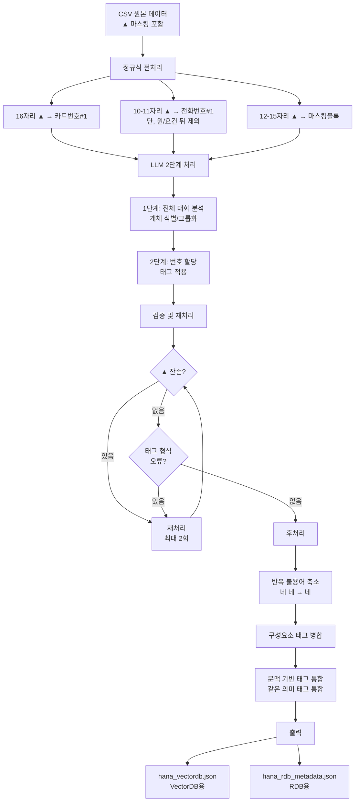
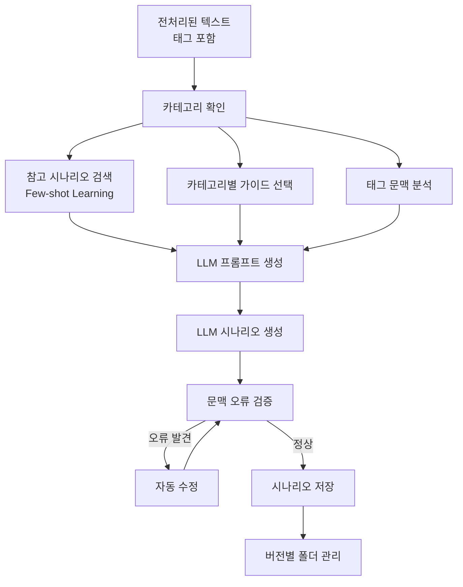

# 하나카드 상담 데이터 스키마 명세서

**작성일**: 2025-01-05
**최종 수정일**: 2026-01-07
**버전**: v1.6
**목적**: VectorDB, RDB, 프론트엔드 간 데이터 구조 통일

---

## 1. 데이터 흐름 개요



### 1.1 전처리 흐름 상세



**처리 단계 설명:**

1. **정규식 전처리**: 고정 길이 패턴을 먼저 처리하여 LLM 부하 감소
2. **LLM 2단계 처리**: 문맥 분석을 통한 정확한 태깅
3. **검증 및 재처리**: 품질 보장을 위한 자동 검증
4. **후처리**: 불용어 제거 및 태그 통합으로 최종 정제

---

## 2. VectorDB 스키마

### 2.1 저장 형식 (Frontend 구조 정렬)
```json
{
  "id": "hana_consultation_{source_id}",
  "consultation_id": "CS-HANA-{source_id}",
  "document_type": "consultation_transcript",
  "title": "{category} 상담",
  "content": "정제된 대화 내용 전문 ([타입#번호] 형식 태그로 마스킹)",
  "embedding": [0.123, 0.456, ...],
  "metadata": {
    "source_id": "21749",
    "category": "교육비자동납부",
    "keywords": ["카드", "교육비", "자동납부"],
    "slot_types": ["상담원명", "고객명", "초등학교명", "학생명"],
    "scenario_tags": ["자동납부신청", "본인확인", "교육비납부"],
    "summary": null,
    "created_at": "2025-01-06T23:45:00.000Z"
  }
}
```

**주요 필드 설명:**
| 필드명 | 설명 | 비고 |
|--------|------|------|
| `id` | 고유 식별자 | `hana_consultation_{source_id}` 형식 |
| `consultation_id` | Frontend API 호환 ID | `CS-HANA-{source_id}` 형식 |
| `document_type` | 문서 타입 | `consultation_transcript` 고정 |
| `title` | 상담 제목 | 카테고리 기반 자동 생성 |
| `content` | 상담 대화 내용 | 기존 `text` → `content`로 변경 |
| `created_at` | 생성 시점 | ISO 8601 형식 |

### 2.2 태그 형식 규칙

모든 개인정보 태그는 `[타입#번호]` 형식을 따릅니다.

#### 정규식 기반 태그 (고정 길이)
| 태그 타입 | 예시 | 설명 |
|-----------|------|------|
| `카드번호#1` | `[카드번호#1]` | 16자리 카드번호 |
| `전화번호#1` | `[전화번호#1]` | 10-11자리 전화번호 |

#### 인물 관련
| 태그 타입 | 예시 | 설명 |
|-----------|------|------|
| `상담원명#N` | `[상담원명#1]` | 상담원 이름 |
| `고객명#N` | `[고객명#1]` | 고객 이름 |
| `학생명#N` | `[학생명#1]` | 학생 이름 |
| `영문명#N` | `[영문명#1]` | 영문 이름 |

#### 기관/회사명
| 태그 타입 | 예시 | 설명 |
|-----------|------|------|
| `초등학교명#N` | `[초등학교명#1]` | 초등학교 전체 이름 |
| `중학교명#N` | `[중학교명#1]` | 중학교 전체 이름 |
| `고등학교명#N` | `[고등학교명#1]` | 고등학교 전체 이름 |
| `대학교명#N` | `[대학교명#1]` | 대학교 전체 이름 |
| `교육청명#N` | `[교육청명#1]` | 교육청 전체 이름 |
| `카드사명#N` | `[카드사명#1]` | 카드사 명칭 |
| `은행명#N` | `[은행명#1]` | 은행 명칭 (나열 시 각각 다른 번호) |
| `보험사명#N` | `[보험사명#1]` | 보험사 명칭 |
| `증권사명#N` | `[증권사명#1]` | 증권사 명칭 |
| `병원명#N` | `[병원명#1]` | 병원/의원 명칭 |
| `서비스업체명#N` | `[서비스업체명#1]` | 도시가스, 통신사 등 |

#### 장소 관련
| 태그 타입 | 예시 | 설명 |
|-----------|------|------|
| `장소명#N` | `[장소명#1]` | 편의점, 커피숍 등 장소 명칭 |
| `지점명#N` | `[지점명#1]` | 은행/카드사 지점명 |
| `부서명#N` | `[부서명#1]` | 회사/기관 부서 명칭 |

#### 개인정보 (전체)
| 태그 타입 | 예시 | 설명 |
|-----------|------|------|
| `계좌번호#N` | `[계좌번호#1]` | 전체 계좌번호 |
| `생년월일#N` | `[생년월일#1]` | 생년월일 |
| `이메일아이디#N` | `[이메일아이디#1]` | 이메일 ID |

#### 개인정보 (구성요소 - 분절 시)
| 태그 타입 | 예시 | 설명 |
|-----------|------|------|
| `계좌번호_구성요소#N` | `[계좌번호_구성요소#1]` | 계좌번호 분절 |
| `전화번호_구성요소#N` | `[전화번호_구성요소#1]` | 전화번호 분절 |
| `카드번호_구성요소#N` | `[카드번호_구성요소#1]` | 카드번호 끝 4자리 등 |
| `팩스번호_구성요소#N` | `[팩스번호_구성요소#1]` | 팩스번호 분절 |
| `식별번호_구성요소#N` | `[식별번호_구성요소#1]` | 학생식별번호 분절 |
| `인증번호#N` | `[인증번호#1]` | SMS/OTP 인증번호 |

#### 금융정보
| 태그 타입 | 예시 | 설명 |
|-----------|------|------|
| `금액#N` | `[금액#1]` | 금액 정보 (같은 금액 = 같은 번호) |
| `비율#N` | `[비율#1]` | 금리, 할인율 |
| `카드상품명#N` | `[카드상품명#1]` | 카드 상품명 |
| `한도금액#N` | `[한도금액#1]` | 카드 한도 금액 |

#### 시간정보
| 태그 타입 | 예시 | 설명 |
|-----------|------|------|
| `날짜#N` | `[날짜#1]` | 날짜 정보 (마스킹 안된 것도 포함) |
| `시간#N` | `[시간#1]` | 시간 정보 |

#### 상품/서비스 관련
| 태그 타입 | 예시 | 설명 |
|-----------|------|------|
| `자동차정보#N` | `[자동차정보#1]` | 자동차 회사명, 차종 |

### 2.2 검색 시나리오

#### 시나리오 1: 유사 케이스 검색 (consultation/live)
```python
# 현재 상담 중인 고객이 "카드 갱신"에 대해 문의
query_text = "카드 갱신 문의"
filters = {
    "category": "도난/분실 신청/해제",
    "client_age": "50대"
}
results = vector_db.similarity_search(query_text, filter=filters, top_k=3)
```

#### 시나리오 2: 키워드 기반 검색 (Dashboard)
```python
# "재발급" 키워드로 검색
results = vector_db.search(
    query="재발급",
    filter={"keywords": {"$contains": "재발급"}},
    top_k=10
)
```

---

## 3. RDB 스키마

### 3.1 테이블 구조

#### Table: `consultations`
```sql
CREATE TABLE consultations (
    -- 기본 정보
    id VARCHAR(50) PRIMARY KEY,
    source_id VARCHAR(20) NOT NULL,
    source VARCHAR(20) DEFAULT '하나카드',

    -- 상담 분류
    consulting_category VARCHAR(50),
    status VARCHAR(20) CHECK (status IN ('완료', '진행중', '미완료')),

    -- 고객 정보 (마스킹됨)
    client_id VARCHAR(50),
    client_name VARCHAR(50) DEFAULT '[고객명#1]',
    client_phone VARCHAR(50) DEFAULT '[전화번호#1]',
    client_gender VARCHAR(10),
    client_age VARCHAR(10),

    -- 통화 정보
    call_start_time TIMESTAMP,
    call_end_time TIMESTAMP,
    call_duration INT,
    consulting_turns INT,

    -- 파일
    recording_file_path VARCHAR(255),

    -- AI 생성 데이터
    summary TEXT,
    keywords TEXT,
    next_steps TEXT,
    timeline JSONB,

    -- 참조 문서
    referenced_doc_ids TEXT,

    -- 메타
    created_at TIMESTAMP DEFAULT NOW(),
    updated_at TIMESTAMP DEFAULT NOW(),

    INDEX idx_category (consulting_category),
    INDEX idx_status (status),
    INDEX idx_date (call_start_time)
);
```

### 3.2 필드 상세 설명

| 필드명 | 타입 | 설명 | 예시 | 비고 |
|--------|------|------|------|------|
| **id** | VARCHAR(50) | 고유 ID | `hana_consultation_20593` | Primary Key |
| **source_id** | VARCHAR(20) | 원본 CSV ID | `20593` | CSV의 source_id 컬럼 |
| **source** | VARCHAR(20) | 카드사명 | `하나카드` | 고정값 |
| **consulting_category** | VARCHAR(50) | 상담 분류 | `도난/분실 신청/해제` | CSV 컬럼 |
| **status** | VARCHAR(20) | 상담 상태 | `완료` | `완료`, `진행중`, `미완료` |
| **client_id** | VARCHAR(50) | 가상 고객 ID | `HANA_CLT_a3f5b2c1` | 해시 기반 생성 |
| **client_name** | VARCHAR(50) | 고객 이름 (마스킹) | `[고객명#1]` | 개인정보 보호 |
| **client_phone** | VARCHAR(50) | 연락처 (마스킹) | `[전화번호#1]` | 개인정보 보호 |
| **client_gender** | VARCHAR(10) | 성별 | `여자` | CSV 컬럼 |
| **client_age** | VARCHAR(10) | 연령대 | `50대` | CSV 컬럼 |
| **call_start_time** | TIMESTAMP | 통화 시작 시간 | `2025-01-01 14:30:00` | CSV에 없음, 추론 필요 |
| **call_end_time** | TIMESTAMP | 통화 종료 시간 | `2025-01-01 14:32:46` | start + duration |
| **call_duration** | INT | 통화 시간 (초) | `166` | CSV의 consulting_length |
| **consulting_turns** | INT | 대화 턴 수 | `37` | CSV 컬럼 |
| **recording_file_path** | VARCHAR(255) | 녹음 파일 경로 | `s3://bucket/20593.wav` | CSV에 없음 |
| **summary** | TEXT | AI 요약 | `카드 갱신 관련 문의. 기존 카드 유효기간 만료로 신규 카드 사용 안내` | LLM 생성 |
| **keywords** | TEXT | 키워드 (JSON) | `["카드", "갱신", "유효기간"]` | 전처리 시 추출 |
| **next_steps** | TEXT | 다음 단계 예상 | `신규 카드 활성화 확인` | LLM 생성 |
| **timeline** | JSONB | 타임테이블 | 아래 참조 | LLM 생성 |
| **referenced_doc_ids** | TEXT | 참조 문서 ID (JSON) | `["doc_001", "doc_002"]` | RAG 매칭 |
| **created_at** | TIMESTAMP | 생성 시간 | `2025-01-05 15:00:00` | 자동 생성 |
| **updated_at** | TIMESTAMP | 수정 시간 | `2025-01-05 15:30:00` | 자동 업데이트 |

### 3.3 timeline (JSONB) 구조

```json
{
  "timeline": [
    {
      "time": "00:00:15",
      "speaker": "상담사",
      "action": "인사 및 본인 확인",
      "summary": "고객 성함과 생년월일 확인 요청"
    },
    {
      "time": "00:00:45",
      "speaker": "고객",
      "action": "문의 사항 설명",
      "summary": "카드 2개가 모두 사용 가능한지 확인 요청"
    },
    {
      "time": "00:01:30",
      "speaker": "상담사",
      "action": "조회 및 안내",
      "summary": "기존 카드 유효기간 만료, 신규 카드 사용 안내"
    },
    {
      "time": "00:02:30",
      "speaker": "상담사",
      "action": "상담 종료",
      "summary": "감사 인사 및 종료"
    }
  ]
}
```

**타임라인 생성 방법:**
- Phase 1: 규칙 기반 (화자 전환 기준)
- Phase 2: LLM 기반 (의미 단위 분할)

---

## 4. 프론트엔드 API 명세

### 4.1 API Endpoint 목록

| 용도 | Endpoint | Method | 설명 |
|------|----------|--------|------|
| 상담 목록 조회 | `/api/consultations` | GET | Dashboard 상담 내역 배너 |
| 상담 상세 조회 | `/api/consultations/{id}` | GET | 상담 상세 모달 |
| 유사 케이스 검색 | `/api/consultations/similar` | POST | consultation/live 유사 케이스 |
| 최근 상담 내역 | `/api/consultations/recent` | GET | consultation/live 최근 내역 |

### 4.2 API 응답 예시

#### GET `/api/consultations` (상담 목록)

**Query Parameters:**
```
?page=1&limit=20&status=완료&category=도난/분실
```

**Response:**
```json
{
  "total": 150,
  "page": 1,
  "limit": 20,
  "consultations": [
    {
      "id": "hana_consultation_20593",
      "source_id": "20593",
      "status": "완료",
      "category": "도난/분실 신청/해제",
      "summary": "카드 갱신 및 유효기간 만료 관련 문의",
      "client_name": "[고객명]",
      "client_age": "50대",
      "call_start_time": "2025-01-01T14:30:00Z",
      "call_duration": 166
    },
    ...
  ]
}
```

#### GET `/api/consultations/{id}` (상담 상세)

**Response:**
```json
{
  "id": "hana_consultation_20593",
  "source_id": "20593",
  "source": "하나카드",
  "status": "완료",
  "category": "도난/분실 신청/해제",

  "client": {
    "id": "CLIENT_ABC123",
    "name": "[고객명]",
    "phone": "[전화번호]",
    "gender": "여자",
    "age": "50대"
  },

  "call": {
    "start_time": "2025-01-01T14:30:00Z",
    "end_time": "2025-01-01T14:32:46Z",
    "duration": 166,
    "turns": 37,
    "recording_file": {
      "url": "https://s3.../20593.wav",
      "exists": false
    }
  },

  "content": {
    "summary": "카드 갱신 및 유효기간 만료 관련 문의. 기존 카드는 유효기간이 만료되어 신규 카드로 사용 안내",
    "keywords": ["카드", "갱신", "유효기간", "재발급"],
    "timeline": [
      {
        "time": "00:00:15",
        "speaker": "상담사",
        "action": "인사 및 본인 확인",
        "summary": "고객 성함과 생년월일 확인 요청"
      },
      ...
    ],
    "full_text": "상담사: 상담원 [개인정보]입니다.\n손님: 네, 저 [개인정보]카드 문의좀...",
    "next_steps": "신규 카드 활성화 확인"
  },

  "referenced_docs": [
    {
      "id": "doc_001",
      "title": "카드 갱신 안내",
      "url": "/docs/card-renewal"
    },
    {
      "id": "doc_002",
      "title": "유효기간 만료 카드 처리",
      "url": "/docs/expired-card"
    }
  ],

  "meta": {
    "created_at": "2025-01-05T15:00:00Z",
    "updated_at": "2025-01-05T15:30:00Z"
  }
}
```

#### POST `/api/consultations/similar` (유사 케이스 검색)

**Request Body:**
```json
{
  "query": "카드 갱신 문의",
  "category": "도난/분실 신청/해제",
  "client_age": "50대",
  "top_k": 3
}
```

**Response:**
```json
{
  "similar_cases": [
    {
      "id": "hana_consultation_20593",
      "similarity_score": 0.92,
      "summary": "카드 갱신 및 유효기간 만료 관련 문의",
      "category": "도난/분실 신청/해제",
      "next_steps": "신규 카드 활성화 확인",
      "timeline": [...]
    },
    ...
  ]
}
```

---

## 5. 프론트엔드 컴포넌트별 필요 데이터

### 5.1 Dashboard - 상담 내역 배너

**UI 요소 → API 필드 매핑:**

| UI 요소 | API 필드 | 타입 | 예시 |
|---------|----------|------|------|
| 상태 뱃지 | `status` | string | `완료` |
| 카테고리 | `category` | string | `도난/분실 신청/해제` |
| 요약 | `summary` | string | `카드 갱신 문의` |
| 고객명 | `client.name` | string | `[고객명]` |
| 통화 시간 | `call.start_time` | ISO 8601 | `2025-01-01T14:30:00Z` |
| 통화 길이 | `call.duration` | int (초) | `166` |

**Figma 변수명 제안:**
```typescript
// TypeScript 인터페이스
interface ConsultationListItem {
  id: string;
  status: '완료' | '진행중' | '미완료';
  category: string;
  summary: string;
  clientName: string;
  callStartTime: string;  // ISO 8601
  callDuration: number;   // seconds
}
```

### 5.2 Dashboard - 상담 상세 모달

**UI 섹션 → API 필드 매핑:**

#### 기본 정보
| UI 요소 | API 필드 | 타입 |
|---------|----------|------|
| 상담 ID | `source_id` | string |
| 상태 | `status` | string |

#### 고객 정보
| UI 요소 | API 필드 | 타입 |
|---------|----------|------|
| 이름 | `client.name` | string |
| 고객 ID | `client.id` | string |
| 연락처 | `client.phone` | string |
| 성별/연령 | `client.gender`, `client.age` | string |

#### 통화 정보
| UI 요소 | API 필드 | 타입 | 표시 형식 |
|---------|----------|------|----------|
| 전체 통화시간 | `call.duration` | int | `02:46` (MM:SS) |
| 시작 시간 | `call.start_time` | ISO 8601 | `2025-01-01 14:30` |
| 종료 시간 | `call.end_time` | ISO 8601 | `2025-01-01 14:32` |

#### 녹음 파일
| UI 요소 | API 필드 | 타입 |
|---------|----------|------|
| 재생 URL | `call.recording_file.url` | string (URL) |
| 파일 존재 여부 | `call.recording_file.exists` | boolean |

#### AI 요약
| UI 요소 | API 필드 | 타입 |
|---------|----------|------|
| 요약 텍스트 | `content.summary` | string (markdown) |

#### 상담 진행 내역 (타임테이블)
| UI 요소 | API 필드 | 타입 |
|---------|----------|------|
| 타임라인 | `content.timeline[]` | array |
| └ 시간 | `timeline[].time` | string (`MM:SS`) |
| └ 화자 | `timeline[].speaker` | string |
| └ 행동 | `timeline[].action` | string |
| └ 요약 | `timeline[].summary` | string |

#### 참조 문서
| UI 요소 | API 필드 | 타입 |
|---------|----------|------|
| 문서 목록 | `referenced_docs[]` | array |
| └ 제목 | `referenced_docs[].title` | string |
| └ URL | `referenced_docs[].url` | string |

**Figma 변수명 제안:**
```typescript
interface ConsultationDetail {
  id: string;
  sourceId: string;
  status: string;
  category: string;

  client: {
    id: string;
    name: string;
    phone: string;
    gender: string;
    age: string;
  };

  call: {
    startTime: string;
    endTime: string;
    duration: number;
    turns: number;
    recordingFile: {
      url: string | null;
      exists: boolean;
    };
  };

  content: {
    summary: string;
    keywords: string[];
    timeline: Array<{
      time: string;
      speaker: string;
      action: string;
      summary: string;
    }>;
    fullText: string;
    nextSteps: string;
  };

  referencedDocs: Array<{
    id: string;
    title: string;
    url: string;
  }>;
}
```

### 5.3 consultation/live - 유사 케이스 표시

| UI 요소 | API 필드 | 타입 |
|---------|----------|------|
| 유사도 점수 | `similarity_score` | float (0~1) |
| 요약 | `summary` | string |
| 다음 단계 예상 | `next_steps` | string |
| 타임라인 (간략) | `timeline[]` (처음 3개) | array |

---

## 6. 데이터 생성 계획

### 6.1 전처리 단계에서 생성 가능한 필드

| 필드 | 생성 방법 | 우선순위 |
|------|-----------|----------|
| `id` | 규칙 기반 생성 (`hana_consultation_{source_id}`) | P0 (즉시) |
| `source_id` | CSV 직접 읽기 | P0 (즉시) |
| `consulting_category` | CSV 직접 읽기 | P0 (즉시) |
| `client_gender`, `client_age` | CSV 직접 읽기 | P0 (즉시) |
| `consulting_turns`, `call_duration` | CSV 직접 읽기 | P0 (즉시) |
| `client_id` | 가상 ID 생성 (해시 기반) | P0 (즉시) |
| `keywords` | 규칙 기반 추출 | P0 (즉시) |
| `status` | `완료`로 고정 (과거 데이터) | P0 (즉시) |

### 6.2 LLM으로 생성할 필드

| 필드 | 생성 방법 | 우선순위 |
|------|-----------|----------|
| `summary` | GPT-4o-mini로 요약 | P1 (MVP 이후) |
| `timeline` | GPT-4o-mini로 타임라인 생성 | P1 (MVP 이후) |
| `next_steps` | GPT-4o-mini로 예상 단계 생성 | P2 (선택) |

### 6.3 RAG로 매칭할 필드

| 필드 | 생성 방법 | 우선순위 |
|------|-----------|----------|
| `referenced_docs` | VectorDB 검색으로 관련 문서 찾기 | P1 (MVP 이후) |

### 6.4 CSV에 없어서 추론이 필요한 필드

| 필드 | 해결 방법 | 우선순위 |
|------|-----------|----------|
| `call_start_time`, `call_end_time` | null 또는 임의 날짜 설정 | P3 (선택) |
| `recording_file_path` | null (녹음 파일 없음) | P3 (선택) |
| `consulting_date` | null 또는 2025-01-01로 고정 | P0 (즉시) |

---

## 7. MVP 이미지 확인 후 업데이트 예정

**TODO:**
- [ ] MVP Figma 화면 확인
- [ ] UI 요소별 필요 데이터 재검증
- [ ] 누락된 필드 추가
- [ ] TypeScript 인터페이스 최종 확정

---

## 8. 시나리오 생성 (상담사 교육용)

### 8.1 개요

전처리된 상담 데이터의 태그를 가상 데이터로 치환하여 **상담사 교육용 시나리오**를 생성합니다.

### 8.2 스크립트

**파일**: `preprocess/hana/generate_scenarios.py`

**기능**:
- `[태그#번호]` 형식을 실제 가상 데이터로 치환 (LLM 기반)
- 동일 번호는 동일 값 유지 (Entity Tracking 보존)
- 카테고리별 특화 가이드 적용
- 완성된 시나리오 예시 참고 (Few-shot Learning)
- 문맥 오류 자동 감지 및 수정
- 출력 경로: `test_results/scenarios_llm_v{NN}/test_scenario_{source_id}.txt`
- 버전 관리: 자동 버전 번호 증가

### 8.3 태그 치환 예시

| 태그 | 치환 예시 |
|------|-----------|
| `[상담원명#1]` | 김민정 |
| `[고객명#1]` | 홍길동 |
| `[은행명#1]` | 하나은행 |
| `[전화번호#1]` | 010-1234-5678 |
| `[금액#1]` | 100만원 |
| `[날짜#1]` | 15일 |

### 8.4 실행 방법

```bash
cd data-preprocessing
python preprocess/hana/generate_scenarios.py
```

### 8.5 생성 결과

- 57개 카테고리별 시나리오 생성 (테스트: 각 1개씩)
- 전체 데이터 처리 시: 카테고리별 2개씩 생성 가능
- 총 치환된 태그 수: 시나리오당 평균 15-30개
- 요약: `test_results/scenarios_llm_v{NN}/generation_summary.json`

### 8.6 시나리오 생성 흐름



---

**다음 단계:**
1. MVP 화면 이미지 공유 받기
2. 위 스키마 수정
3. 전처리 스크립트 구현
4. 샘플 JSON 생성 및 검증
