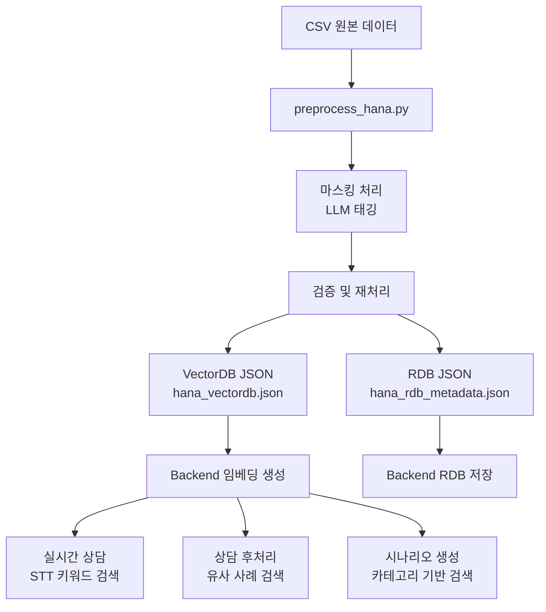

# Hana Card 전처리 스크립트 설명서

## 메타데이터
- **작성일**: 2025-01-05
- **최종 수정일**: 2026-01-08
- **작성자**: Project Team
- **버전**: v3.2 (문서화 개선)
- **상태**: 완료
- **관련 파일**: `data-preprocessing/preprocess/hana/preprocess_hana.py`
- **관련 문서**: [Hana 데이터 스키마](./00_hana_data_schema.md)

## 목적
이 문서는 하나카드 상담 데이터를 VectorDB 및 RDB에 적재 가능한 JSON으로 변환하는 전처리 스크립트(`preprocess_hana.py`)의 사용법과 구현 상세를 설명합니다.

---

## 1. 목적

하나카드 상담 CSV 데이터(`TS_하나카드_통합 - 시트1.csv`)를 전처리하여:
1. 개인정보 마스킹 통일화 (`▲` → `[타입#번호]` 형식 태그)
2. LLM 기반 문맥 슬롯 태깅 (Entity Tracking 강화)
3. 검증 및 재처리 (▲ 잔존, 태그 형식, Entity 일관성)
4. VectorDB용 JSON 생성 (`{id, text, metadata}`)
5. RDB용 메타데이터 생성

---

## 2. 주요 함수

### 2.1 개인정보 마스킹 정규화 (정규식 기반)

#### `normalize_phone_masking(text: str) -> str`
- 입력: 원본 텍스트
- 출력: 전화번호 마스킹 정규화된 텍스트
- 동작: 정확히 10-11자리 `▲` → `[전화번호#1]` (앞뒤로 ▲가 없고, "원"이 뒤에 없는 경우)
- 예시: `▲▲▲▲▲▲▲▲▲▲▲` → `[전화번호#1]`

#### `normalize_card_masking(text: str) -> str`
- 입력: 원본 텍스트
- 출력: 카드번호 마스킹 정규화된 텍스트
- 동작: 정확히 16자리 `▲` → `[카드번호#1]` (앞뒤로 ▲가 없는 경우)
- 예시: `▲▲▲▲▲▲▲▲▲▲▲▲▲▲▲▲` → `[카드번호#1]`

### 2.2 LLM 기반 슬롯 태깅

#### `classify_slots_with_llm(text: str, model: str) -> Dict`
- 입력: ▲ 포함 텍스트 (카드번호/전화번호는 이미 처리됨)
- 출력: `{text, slot_types, entity_mapping}`
- 동작: OpenAI API를 사용하여 ▲를 문맥 기반 `[타입#번호]` 태그로 치환

#### `normalize_all_masking_v2(text: str, use_llm: bool, validate: bool, merge_semantic_tags: bool, semantic_use_llm: bool) -> tuple`
- 입력: 원본 대화 텍스트 (▲ 포함)
- 출력: `(태그가 적용된 텍스트, slot_types 목록)`
- 파라미터:
  - `use_llm`: LLM 사용 여부 (기본값 True)
  - `validate`: 검증 수행 여부 (기본값 True)
  - `merge_semantic_tags`: 문맥 기반 태그 통합 수행 여부 (기본값 True, v2.5 추가)
  - `semantic_use_llm`: 태그 통합 시 LLM 사용 여부 (기본값 False, 빠른 규칙 기반)
- 동작:
  1. 정규식으로 고정 길이 패턴 처리 (카드번호, 전화번호)
  2. LLM으로 나머지 ▲ 문맥 기반 태깅
  3. 검증 수행 (▲ 잔존, 태그 형식, Entity 일관성)
  4. 검증 실패 시 최대 2회 재처리
  5. 구성요소 태그 병합
  6. **문맥 기반 태그 통합 (v2.5 추가)**: 같은 의미의 태그를 같은 번호로 통합
  7. 반복 불용어 축소 ("네, 네, 네." → "네.")
- 예시:
  ```
  입력: "상담사: ▲▲▲초등학교 ▲▲▲학생 맞으실까요?"
  출력: "상담사: [초등학교명#1] [학생명#1] 맞으실까요?"
  
  입력: "기본 연회비가 [금액#1]이고 ... 기본 연회비를 이미 [금액#4]에서"
  출력: "기본 연회비가 [금액#1]이고 ... 기본 연회비를 이미 [금액#1]에서"
  (문맥 통합: [금액#1]과 [금액#4]가 같은 의미이므로 통합)
  ```

### 2.2.1 검증 함수

#### `validate_mask_remaining(text: str) -> Dict`
- 동작: 태깅 후 남은 ▲가 있는지 확인
- 출력: `{valid, remaining_count, remaining_positions}`

#### `validate_tag_format(text: str) -> Dict`
- 동작: 모든 태그가 `[타입#번호]` 형식인지 확인
- 출력: `{valid, invalid_tags, valid_tags}`

#### `validate_entity_consistency(text: str) -> Dict`
- 동작: LLM을 통해 동일 개체가 같은 번호로 태깅되었는지 확인
- 출력: `{valid, consistency_score, issues}`

#### `validate_all(text: str, use_entity_check: bool) -> Dict`
- 동작: 전체 검증 수행 (▲ 잔존 + 태그 형식 + Entity 일관성)
- 출력: 통합 검증 결과

### 2.2.2 문맥 기반 태그 통합 (v2.5 추가)

#### `merge_semantic_duplicate_tags(text: str, use_llm: bool, model: str) -> str`
- 입력: 태그가 포함된 텍스트
- 출력: 태그가 통합된 텍스트
- 동작: 문맥상 같은 의미의 태그를 같은 번호로 통합
- 적용 범위: 모든 태그 타입 (금액, 날짜, 이름 등)
- 방법:
  - 규칙 기반 (기본, 빠름): 문맥 키워드 유사도 기반 그룹화
  - LLM 기반 (선택, 정확): LLM을 통한 정확한 문맥 분석
- 예시:
  ```
  입력: "기본 연회비가 [금액#1]이고 ... 기본 연회비를 이미 [금액#4]에서"
  출력: "기본 연회비가 [금액#1]이고 ... 기본 연회비를 이미 [금액#1]에서"
  (문맥상 같은 의미이므로 [금액#4] → [금액#1]로 통합)
  ```

### 2.2.3 반복 불용어 축소

#### `reduce_duplicate_fillers(text: str) -> str`
- 동작: 반복 불용어 축소 ("네, 네 네." → "네.")
- 패턴:
  - `네, 네, 네, 네.` → `네.`
  - `예, 예, 예.` → `예.`
  - `그 그 그` → `그`
  - `아 아 아` → `아`
  - `네.,` → `네.`

### 2.3 가상 Client ID 생성

#### `generate_client_id(source_id: str, gender: str, age: str) -> str`
- 입력: source_id, gender, age
- 출력: 가상 client_id (해시 기반)
- 동작: `HANA_CLT_{hash(source_id + gender + age)[:8]}`
- 예시: `HANA_CLT_a3f5b2c1`

### 2.4 키워드 추출

#### `extract_keywords(category: str, content: str) -> List[str]`
- 입력: 상담 카테고리, 내용
- 출력: 키워드 리스트
- 동작: 카테고리 분석 + 빈출 명사 추출 (규칙 기반)

### 2.5 JSON 변환

#### `create_vectordb_entry(row: Dict, cleaned_text: str, slot_types: List[str], scenario_tags: List[str], category: str = None) -> Dict`
- 입력: CSV row, 정제된 텍스트, 슬롯 타입 목록, 시나리오 태그 목록, 마스킹 처리된 카테고리 (선택)
- 출력: VectorDB용 JSON
- 구조:
  ```json
  {
    "id": "hana_consultation_21749",
    "consultation_id": "CS-HANA-21749",
    "document_type": "consultation_transcript",
    "title": "교육비자동납부 상담",
    "content": "상담사: 상담원 [상담원명#1]입니다...",
    "metadata": {
      "source_id": "21749",
      "category": "교육비자동납부",
      "keywords": ["카드", "교육비", "자동납부"],
      "slot_types": ["상담원명", "고객명", "초등학교명"],
      "scenario_tags": ["자동납부신청", "교육비납부"],
      "summary": null,
      "created_at": "2026-01-08T10:30:45.123456"
    }
  }
  ```
- **변경사항 (v3.2)**: `category` 파라미터 추가 (마스킹 처리된 카테고리 전달)

#### `create_rdb_metadata(row: Dict, keywords: List[str], client_id: str, category: str = None) -> Dict`
- 입력: CSV row, 키워드 리스트, 클라이언트 ID, 마스킹 처리된 카테고리 (선택)
- 출력: RDB용 메타데이터 JSON
- 주요 필드:
  - `client_name`: `[고객명#1]` (고정값)
  - `client_phone`: `[전화번호#1]` (고정값)
  - `consulting_category`: 마스킹 처리된 카테고리
  - `keywords`: 쉼표로 구분된 키워드 문자열
- 구조: `hana_data_schema.md` 참조
- **변경사항 (v3.2)**: `category` 파라미터 추가 (마스킹 처리된 카테고리 전달)

### 2.6 시나리오 태그 추출

#### `extract_scenario_tags(content: str) -> List[str]`
- 입력: 상담 대화 텍스트
- 출력: 시나리오 태그 목록
- 동작: 규칙 기반 패턴 매칭
- 필터링: 일반적 태그 제거 ('본인확인', '상담완료', '개인정보동의')
- 태그 예시: `자동납부신청`, `교육비납부`, `학교승인필요`, `가상계좌발급`
- **제한사항**: LLM 기반 추출이 아니므로 정확도 제한적
- **향후 계획**: 시나리오 생성 시 직접 키워드 추출 (LLM 기반) 또는 필드 제거 검토

### 2.7 메인 처리

#### `process_csv_row(row: Dict, idx: int) -> Dict`
- 입력: CSV 1행, 인덱스
- 출력: 통합 JSON (VectorDB + RDB 데이터)
- 동작:
  1. `normalize_all_masking_v2()`: LLM 기반 슬롯 태깅
  2. `extract_scenario_tags()`: 시나리오 태그 추출
  3. `generate_client_id()`: client_id 생성
  4. `extract_keywords()`: 키워드 추출
  5. VectorDB/RDB 엔트리 생성

#### `process_csv_file(csv_path: Path, output_dir: Path, sample_size: Optional[int] = None) -> None`
- 입력: CSV 경로, 출력 디렉토리, 샘플 크기 (선택)
- 출력: 없음 (JSON 파일 저장)
- 동작:
  1. CSV 읽기
  2. 각 행 처리
  3. JSON 저장 (전체 or 샘플)

---

## 3. 사용법

### 3.1 기본 실행 (자동 중간 저장)

**전체 데이터 처리** (자동으로 30개마다 저장):
```bash
cd C:\Users\AI-WS01\projects\call-act\data-preprocessing
python preprocess/hana/preprocess_hana.py
```

기본 동작:
- **자동 중간 저장**: 30개 처리마다 JSON 파일에 자동 저장 (약 12-15분마다, 평균 25-30초/행 기준)
- **체크포인트 자동 저장**: 처리 위치와 ID 기록
- **에러 복구**: 개별 행 에러 발생 시에도 다음 행 계속 처리
- **중단 시 저장**: Ctrl+C로 중단해도 현재까지 처리된 데이터 자동 저장

### 3.2 재시작 모드 (중단된 곳부터 이어서)

처리가 중단된 경우, 체크포인트에서 이어서 시작:
```bash
python preprocess/hana/preprocess_hana.py --resume
```

재시작 동작:
- 체크포인트 파일(`data/hana/checkpoint.json`)에서 마지막 처리 위치 확인
- 이미 처리된 ID는 건너뛰기
- 기존 JSON 파일에 추가 저장 (중복 방지)

### 3.3 저장 간격 조정

더 자주 저장 (25개마다):
```bash
python preprocess/hana/preprocess_hana.py --save-interval 25
```

덜 자주 저장 (100개마다):
```bash
python preprocess/hana/preprocess_hana.py --save-interval 100
```

재시작 + 저장 간격 변경:
```bash
python preprocess/hana/preprocess_hana.py --resume --save-interval 100
```

### 3.4 테스트 모드

**114개 샘플 테스트** (57 카테고리 × 2개):
```bash
python preprocess/hana/test_114_samples.py
```

**단일 source_id 테스트**:
```bash
python preprocess/hana/test_specific_row.py
```

### 3.5 처리 로그 예시

```
[INFO] Starting processing 6533 rows...
[INFO] 중간 저장 간격: 50개마다
[INFO] Sample txt files will be saved to: test_results/full_run
============================================================
Processing:   1%|█ | 50/6533 [21:30<46:15:32, 25.81s/row]

[SAVED] 중간 저장 완료: 50개 처리됨 (인덱스: 49)
Processing:   2%|█ | 100/6533 [43:15<45:52:18, 25.65s/row]

[SAVED] 중간 저장 완료: 100개 처리됨 (인덱스: 99)
...
```

재시작 시:
```
[RESUME] 체크포인트에서 재시작: 인덱스 189부터 시작 (이미 처리된 ID: 189개)
[INFO] Starting processing 6344 rows...
...
```

---

## 4. 출력 파일

### 4.1 최종 출력 (전체 처리)
```
data/hana/
├── hana_vectordb.json           # VectorDB용 (id, content, metadata)
├── hana_rdb_metadata.json       # RDB용 (id, source_id, client_*, call_*, ...)
├── checkpoint.json              # 체크포인트 파일 (재시작용)
├── hana_vectordb.json.backup    # 자동 백업 파일
└── hana_rdb_metadata.json.backup
```

**JSON 구조 (올바른 형식)**:
```json
{
  "id": "hana_consultation_21749",
  "consultation_id": "CS-HANA-21749",
  "document_type": "consultation_transcript",
  "title": "교육비자동납부 상담",
  "content": "상담사: 상담원 [상담원명#1]입니다...",
  "metadata": {
    "source_id": "21749",
    "category": "교육비자동납부",
    "keywords": ["카드", "교육비", "자동납부"],
    "slot_types": ["상담원명", "고객명", "초등학교명"],
    "scenario_tags": ["자동납부신청", "교육비납부"],
    "summary": null,
    "created_at": "2026-01-07T10:30:45.123456"
  }
}
```

### 4.2 테스트 출력
```
preprocess/hana/test_results/
├── samples_114/             # 114개 샘플 테스트 결과
│   ├── test_{source_id}.txt
│   └── summary.json
├── all_categories/          # 57개 카테고리 테스트 결과
│   ├── test_{source_id}.txt
│   └── summary.json
├── full_run/               # 전체 처리 중 샘플 (카테고리별 최대 2개)
│   └── sample_{source_id}.txt
└── error_logs/             # 에러 로그
    ├── json_error_{timestamp}.txt      # JSON 파싱 에러
    └── processing_error_{timestamp}_{count}.txt  # 처리 에러
```

### 4.3 체크포인트 파일 구조
```json
{
  "last_processed_index": 189,
  "processed_ids": ["20593", "20594", ...],
  "timestamp": "2026-01-07T10:30:45.123456"
}
```


---

## 5. 태그 규칙 명세

### 5.1 태그 형식
모든 태그는 `[타입#번호]` 형식을 따릅니다.

### 5.2 정규식 기반 태그 (고정 길이)

| 원본 패턴 | 태그 | 비고 |
|-----------|------|------|
| `▲{16}` (정확히) | `[카드번호#1]` | 16자리 카드번호, 앞뒤로 ▲ 없음 |
| `▲{10,11}` (정확히) | `[전화번호#1]` | 10-11자리 전화번호, 뒤에 "원" 없음 |

### 5.3 LLM 기반 태그 (문맥 분석)

#### 인물 관련
| 태그 | 설명 |
|------|------|
| `[상담원명#N]` | 상담원 이름 |
| `[고객명#N]` | 고객 이름 |
| `[학생명#N]` | 학생 이름 |
| `[영문명#N]` | 영문 이름 (예: HONG GILDONG) |

#### 기관/회사명
| 태그 | 설명 |
|------|------|
| `[초등학교명#N]` | 초등학교 전체 명칭 (▲▲▲초등학교 → 태그 하나) |
| `[중학교명#N]` | 중학교 전체 명칭 |
| `[고등학교명#N]` | 고등학교 전체 명칭 |
| `[대학교명#N]` | 대학교 전체 명칭 |
| `[교육청명#N]` | 교육청 전체 명칭 |
| `[카드사명#N]` | 카드사 명칭 |
| `[은행명#N]` | 은행 명칭 (나열 시 각각 다른 번호) |
| `[보험사명#N]` | 보험사 명칭 |
| `[증권사명#N]` | 증권사 명칭 |
| `[병원명#N]` | 병원/의원 명칭 |
| `[서비스업체명#N]` | 도시가스, 통신사 등 서비스 업체명 |

#### 장소 관련
| 태그 | 설명 |
|------|------|
| `[장소명#N]` | 편의점, 커피숍, 매장 등 장소 명칭 |
| `[지점명#N]` | 은행/카드사 지점명 (예: ▲▲점) |
| `[부서명#N]` | 회사/기관 부서 명칭 |

#### 개인정보 (전체)
| 태그 | 설명 |
|------|------|
| `[계좌번호#N]` | 은행 계좌번호 (전체를 한번에 말할 때) |
| `[생년월일#N]` | 생년월일 (6자리 등) |
| `[이메일아이디#N]` | 이메일 ID 부분 |

#### 개인정보 (구성요소 - 분절 시)
| 태그 | 설명 |
|------|------|
| `[계좌번호_구성요소#N]` | 계좌번호를 나눠서 말할 때 |
| `[전화번호_구성요소#N]` | 전화번호를 나눠서 말할 때 |
| `[카드번호_구성요소#N]` | 카드번호 끝 4자리 등 |
| `[팩스번호_구성요소#N]` | 팩스번호를 나눠서 말할 때 |
| `[식별번호_구성요소#N]` | 학생식별번호 등을 나눠서 말할 때 |
| `[인증번호#N]` | SMS/OTP 인증번호 |

#### 금융정보
| 태그 | 설명 |
|------|------|
| `[금액#N]` | 금액 정보 (같은 금액은 같은 번호) |
| `[비율#N]` | 금리, 할인율 (▲▲퍼센트, ▲▲%) |
| `[카드상품명#N]` | 카드 상품명 |
| `[한도금액#N]` | 카드 한도 관련 금액 |

#### 시간정보
| 태그 | 설명 |
|------|------|
| `[날짜#N]` | 날짜 정보 (마스킹 안된 것도 포함) |
| `[시간#N]` | 시간 정보 |

#### 상품/서비스 관련
| 태그 | 설명 |
|------|------|
| `[자동차정보#N]` | 자동차 회사명, 차종 |

### 5.4 Entity Tracking 규칙

**동일 개체는 동일 번호를 사용합니다:**

| 상황 | 예시 |
|------|------|
| 상담원명 반복 | 처음: `[상담원명#1]`, 끝: `[상담원명#1]` |
| 교육청명 확인 | 손님: `[교육청명#1]`, 상담사: `[교육청명#1]이고요` |
| 학교명/학생명 확인 | `[초등학교명#1] [학생명#1]` 반복 시 동일 번호 |
| 같은 금액 반복 | 한도 `[금액#1]` → 총 한도 `[금액#1]` |

**은행명 나열 시 각각 다른 번호:**
```
상담사: 가상 계좌는 [은행명#1], [은행명#2], [은행명#3] 가능한데 어디로 발송해드릴까요?
```

**계좌번호 구성요소 주고받기:**
```
상담사: 계좌번호 말씀해 주세요.
손님: [계좌번호_구성요소#1]
상담사: [계좌번호_구성요소#1]
손님: [계좌번호_구성요소#2]
상담사: [계좌번호_구성요소#2]
손님: [계좌번호_구성요소#3]요.
상담사: [계좌번호_구성요소#3] 맞으실까요?
```

**팩스번호 구성요소 주고받기:**
```
손님: 예 [팩스번호_구성요소#1]
상담사: [팩스번호_구성요소#1]
손님: [팩스번호_구성요소#2]
상담사: 팩스번호 다시 한번 확인하겠습니다. [팩스번호_구성요소#3]에 [팩스번호_구성요소#4] 맞습니까?
```

### 5.5 태깅 예시

```
원본: 상담사: ▲▲▲초등학교 ▲▲▲학생 맞으실까요?
결과: 상담사: [초등학교명#1] [학생명#1] 맞으실까요?

원본: 손님: 제가 확인할게요. ▲▲▲▲▲▲▲▲▲▲▲▲▲▲▲▲ 맞나요?
결과: 손님: 제가 확인할게요. [카드번호#1] 맞나요?

원본: 상담사: 상담원 ▲▲▲입니다. ... 상담사: 상담원 ▲▲▲이었습니다.
결과: 상담사: 상담원 [상담원명#1]입니다. ... 상담사: 상담원 [상담원명#1]이었습니다.
```

---

## 6. 검증 프로세스

### 6.1 검증 항목

| 검증 항목 | 방법 | 기준 |
|----------|------|------|
| ▲ 잔존 | 정규식 | 0건 |
| 태그 형식 | `\[.+#\d+\]` | 100% 일치 |
| Entity 일관성 | LLM 재검토 | 90%+ |

### 6.2 검증 흐름

```
전처리 완료 → ▲ 잔존 검사 → 태그 형식 검사 → Entity 일관성 검사 → 검증 리포트 생성
```

### 6.3 검증 실패 시 처리

| 실패 유형 | 처리 방법 |
|-----------|----------|
| ▲ 잔존 | 해당 행 재처리 (최대 2회) |
| 태그 형식 오류 | 경고 로그 + 수동 검토 목록 |
| Entity 일관성 | 재태깅 시도 (최대 2회) |
| 최종 실패 | `[개인정보]`로 강제 폴백 |

### 6.4 처리 로그 포맷

```json
{
  "source_id": "20625",
  "processing_time_ms": 1234,
  "validation": {
    "mask_remaining": 0,
    "tag_format_valid": true,
    "entity_consistency": 0.95
  },
  "retry_count": 0
}
```

---

## 7. 코드 변경 히스토리 및 문제 해결

### 7.1 버전별 주요 변경사항

#### v3.0 (2026-01-06)
- **중간 저장 및 체크포인트 기능 추가**
  - 50개마다 자동 저장 (기본값)
  - `checkpoint.json`에 처리 상태 저장
  - `--resume` 옵션으로 재시작 가능
- **자동 에러 처리 및 로깅**
  - 개별 행 에러 발생 시에도 다음 행 계속 처리
  - JSON 파싱 에러 상세 로그 저장
- **태그 파싱 에러 수정**
  - `tag.split('#')` → `tag.split('#', 1)`로 변경
  - 다중 `#` 포함 태그 처리 개선
- **성능 최적화**
  - 문맥 기반 태그 통합 조건부 실행 (3개 이상 태그만)
  - 기본값: 빠른 규칙 기반 처리

#### v3.1 (2026-01-07)
- **데이터 저장 안정성 개선**
  - 재시작 로직 인덱스 불일치 문제 수정
  - 메모리 누적 문제 해결 (중간 저장 후 리스트 초기화)
  - 저장 주기 최적화 (30개 기본값)
  - 최종 저장 시점 개선
- **로그 파일 기능 추가**
  - `TeeLogger` 클래스로 콘솔 + 파일 동시 출력
  - 타임스탬프 기반 로그 파일 생성
  - 상세한 진행 상황 로그

#### v3.2 (2026-01-08)
- **네트워크 에러 처리 개선**
  - Cloudflare DNS 에러 처리 (재시도 로직)
  - HTML 응답 감지 및 재시도
  - Entity Consistency Validation 개선
- **카테고리 마스킹 처리**
  - `consulting_category` 필드 마스킹 로직 추가
  - `title` 필드 마스킹 처리
- **시나리오 태그 필터링**
  - 일반적 태그 제거 ('본인확인', '상담완료', '개인정보동의')
- **tqdm 진행률 오류 수정**
  - 재시작 시 중복 카운팅 문제 해결

### 7.2 주요 문제점 및 해결 과정

#### 문제 1: tqdm 진행률 오류 (재시작 시)

**증상:**
- 재시작 시 진행률이 중복 카운팅됨
- 예: 1502/6533에서 시작했는데 다음 단계에서 3005/6533으로 표시

**원인:**
- `if source_id in processed_ids:` 블록에서 `pbar.update(1)` 호출
- `tqdm`의 `initial` 파라미터에 이미 `len(processed_ids)`가 포함되어 있음
- 중복 업데이트로 인한 이중 카운팅

**해결:**
- `preprocess_hana.py` 1819줄의 `pbar.update(1)` 제거
- `initial` 값에 이미 포함되어 있으므로 추가 업데이트 불필요

**코드 변경:**
```python
# 수정 전
if source_id in processed_ids:
    last_processed_index = idx
    pbar.update(1)  # 중복 카운팅 발생
    continue

# 수정 후
if source_id in processed_ids:
    last_processed_index = idx
    # initial 값에 이미 포함되어 있으므로 update 불필요
    continue
```

#### 문제 2: 네트워크 에러 (Cloudflare DNS)

**증상:**
- LLM API 호출 시 HTML 응답 수신
- `[WARNING] Entity consistency validation failed` 메시지 빈번
- `Cloudflare DNS error` 메시지

**원인:**
- 네트워크 불안정 또는 Cloudflare 차단
- 타임아웃 미설정
- 재시도 로직 부재

**해결:**
- `classify_slots_with_llm`, `validate_entity_consistency` 함수에 재시도 로직 추가
- 최대 3회 재시도, 지수 백오프 (5초, 10초, 15초)
- 타임아웃 60초 설정
- HTML 응답 감지 및 재시도

**코드 변경:**
```python
# 재시도 로직 추가
max_retries = 3
timeout = 60
for attempt in range(max_retries):
    try:
        response = openai.ChatCompletion.create(...)
        # HTML 응답 감지
        if '<html>' in str(response) or 'Cloudflare' in str(response):
            raise ValueError("HTML response received")
        break
    except Exception as e:
        if attempt < max_retries - 1:
            time.sleep(5 * (attempt + 1))  # 지수 백오프
            continue
        raise
```

#### 문제 3: 카테고리 마스킹 누락

**증상:**
- `consulting_category`에 `▲▲페이` 등 마스킹 미처리
- `title` 필드에도 마스킹 누락

**원인:**
- `category` 필드에 대한 마스킹 로직 부재
- `title` 필드 생성 시 마스킹 처리 안 함

**해결:**
- `process_csv_file`에서 카테고리 마스킹 로직 추가
- `create_vectordb_entry`, `create_rdb_metadata`에 마스킹된 `category` 전달

**코드 변경:**
```python
# 카테고리 마스킹 처리
category = row.get('consulting_category', '')
if '▲' in category:
    category = re.sub(r'▲+페이', '[서비스명#1]페이', category)
    category = re.sub(r'▲+카드', '[카드사명#1]카드', category)
    category = re.sub(r'▲+은행', '[은행명#1]은행', category)
    category = re.sub(r'▲+', '[서비스명#1]', category)
```

#### 문제 4: 시나리오 태그 부정확성

**증상:**
- '본인확인', '상담완료', '개인정보동의' 등 일반적 태그 포함
- 거의 모든 상담에 나타나므로 구분력이 낮음

**원인:**
- 규칙 기반 패턴 매칭의 한계
- LLM 기반 추출이 아니므로 문맥 이해 부족

**해결:**
- 일반적 태그 필터링 로직 추가
- 패턴 정의에서 해당 태그 주석 처리

**코드 변경:**
```python
# 일반적 태그 제거
common_tags_to_remove = {'본인확인', '상담완료', '개인정보동의'}
tags = [tag for tag in tags if tag not in common_tags_to_remove]
```

**향후 계획:**
- 시나리오 생성 시 직접 키워드 추출 (LLM 기반)
- 또는 `scenario_tags` 필드 제거 검토
- 현재는 `category`와 `keywords`로 시나리오 생성에 충분

---

## 8. 최종 데이터 해석

### 8.1 VectorDB 데이터 (`hana_vectordb.json`)

**주요 필드 해석:**

| 필드 | 의미 | 활용 방법 |
|------|------|----------|
| `content` | 마스킹 처리된 상담 대화 전문 | VectorDB 임베딩 생성, 유사도 검색 |
| `metadata.keywords` | 카테고리 기반 + 빈출 명사 추출 | STT 키워드와 매칭, 필터링 |
| `metadata.slot_types` | 개인정보 태그 타입 목록 | Entity Tracking 정보, 중복 제거된 고유 타입만 |
| `metadata.scenario_tags` | 필터링된 시나리오 태그 | 현재 제한적 활용, 향후 개선 예정 |
| `metadata.category` | 마스킹 처리된 카테고리 | 카테고리 필터링, 시나리오 검색 |

**활용 예시:**
```python
# 실시간 상담: STT 키워드 기반 검색
query = "카드 분실 신고"
results = vector_db.similarity_search(
    query=query,
    filter={"category": "도난/분실 신청/해제"},
    top_k=3
)

# 상담 후처리: 유사 사례 검색
similar_cases = vector_db.similarity_search(
    query=current_consultation_content,
    filter={"category": current_category},
    top_k=5
)
```

### 8.2 RDB 데이터 (`hana_rdb_metadata.json`)

**주요 필드 해석:**

| 필드 | 의미 | 활용 방법 |
|------|------|----------|
| `keywords` | 쉼표로 구분된 키워드 문자열 | 검색, 필터링 (VectorDB는 배열) |
| `consulting_category` | 마스킹 처리된 카테고리 | 카테고리별 통계, 필터링 |
| `client_id` | 가상 고객 ID | 고객별 상담 이력 추적 (개인정보 보호) |
| `call_duration` | 통화 시간 (초) | 통계 분석, 품질 평가 |
| `consulting_turns` | 대화 턴 수 | 상담 복잡도 분석 |

**활용 예시:**
```sql
-- 카테고리별 통계
SELECT consulting_category, COUNT(*) as count
FROM consultations
GROUP BY consulting_category
ORDER BY count DESC;

-- 고객별 상담 이력 (개인정보 보호)
SELECT client_id, COUNT(*) as consultation_count
FROM consultations
GROUP BY client_id
HAVING COUNT(*) > 1;
```

### 8.3 데이터 품질 평가

**평가 기준:**

1. **마스킹 완성도**
   - ▲ 잔존 개수: 0개 (목표)
   - 태그 형식 일치율: 100% (목표)
   - Entity 일관성 점수: 90% 이상 (목표)

2. **데이터 완성도**
   - 필수 필드 누락: 없음
   - 마스킹 처리 완료율: 100%
   - 키워드 추출 성공률: 100%

3. **데이터 활용도**
   - VectorDB 검색 정확도: 유사도 점수 0.8 이상
   - 카테고리 분류 정확도: 수동 검증 필요
   - 시나리오 태그 정확도: 제한적 (향후 개선 예정)

---

## 9. 카테고리 분석 결과

### 9.1 전체 데이터 분포

**기본 통계:**
- 총 데이터 건수: **6,533건**
- 총 카테고리 수: **57개**
- 평균 카테고리당 건수: 약 115건

**상위 10개 카테고리 (전체의 61.1%):**

| 순위 | 카테고리 | 건수 | 비율 | 주요 마스킹 패턴 |
|------|----------|------|------|------------------|
| 1 | 선결제/즉시출금 | 927건 | 14.2% | 카드사명, 금액, 은행명, 계좌번호 |
| 2 | 이용내역 안내 | 919건 | 14.1% | 카드사명, 금액, 날짜, 시간 |
| 3 | 한도상향 접수/처리 | 402건 | 6.2% | 카드사명, 금액, 은행명 |
| 4 | 도난/분실 신청/해제 | 398건 | 6.1% | 카드사명, 은행명, 날짜 |
| 5 | 결제대금 안내 | 331건 | 5.1% | 카드사명, 금액, 날짜 |
| 6 | 승인취소/매출취소 안내 | 301건 | 4.6% | 카드사명, 금액, 날짜 |
| 7 | 이벤트 안내 | 223건 | 3.4% | 카드사명, 월 |
| 8 | 정부지원 바우처 (등유, 임신 등) | 167건 | 2.6% | 카드사명, 금액, 날짜, 바우처 관련 |
| 9 | 연체대금 즉시출금 | 163건 | 2.5% | 은행명, 금액, 계좌번호 |
| 10 | 한도 안내 | 162건 | 2.5% | 카드사명, 보험사명, 할부 관련 |

### 9.2 마스킹 패턴 분석

**감지된 패턴 빈도 (57개 카테고리 중):**

| 패턴 | 발견 카테고리 수 | 비율 | 처리 방법 |
|------|------------------|------|----------|
| 카드사명 | 41개 | 71.9% | LLM 기반 |
| 월 | 34개 | 59.6% | LLM 기반 |
| 금액 | 31개 | 54.4% | LLM 기반 |
| 일 | 29개 | 50.9% | LLM 기반 |
| 은행명 | 28개 | 49.1% | LLM 기반 |
| 휴대폰번호 | 24개 | 42.1% | 정규식 (10-11자리) |
| 생년월일 | 21개 | 36.8% | LLM 기반 |
| 계좌번호 | 18개 | 31.6% | LLM 기반 |
| 년도 | 13개 | 22.8% | LLM 기반 |
| 카드번호 | 전체 | 100% | 정규식 (16자리) |

**현재 코드 커버리지:**
- ✅ 정규식 기반: 카드번호 (16자리), 전화번호 (10-11자리)
- ✅ LLM 기반: 나머지 모든 패턴 (카드사명, 은행명, 금액, 날짜 등)

### 9.3 카테고리별 특성

**고빈도 마스킹 카테고리:**
- 결제 계좌 안내/변경: 평균 37개 마스킹/건
- 결제일 안내/변경/취소: 평균 44개 마스킹/건
- 선결제/즉시출금: 평균 34개 마스킹/건

**저빈도 마스킹 카테고리:**
- 연체대금 안내: 평균 3개 마스킹/건
- 한도 안내: 평균 5개 마스킹/건

---

## 10. 전체 시스템 흐름

### 10.1 전처리 → 저장 → 활용 흐름



### 10.2 실시간 상담에서의 활용

**흐름:**
1. 고객 전화 인입
2. STT: 음성 → 텍스트 변환
3. 키워드 추출: ["카드분실", "재발급"]
4. VectorDB 검색 (3개 DB 모두):
   - 카드 정보 DB: 재발급 카드 정보
   - 카드사 이용 안내 DB: 분실 신고 가이드
   - 상담 사례 DB: 과거 유사 상담 사례 (하나카드 데이터)
5. 칸반보드 표시:
   - 현재 상황: "카드 분실 신고 처리 절차" (상담 사례 DB)
   - 다음 단계: "재발급 카드 배송 안내" (카드 정보 DB)
6. AI 어시스턴트: 상담사 질문에 즉시 답변

**하나카드 데이터 활용 필드:**
- `metadata.keywords`: STT 키워드와 매칭하여 유사 케이스 검색
- `metadata.category`: 카테고리 필터링
- `content`: 임베딩 기반 유사도 검색

### 10.3 상담 후처리에서의 활용

**흐름:**
1. 상담 종료
2. STT 전문 자동 저장 (상담 사례 DB - RDB)
3. LLM이 전문 분석 → AI 요약 생성
4. VectorDB 검색: 현재 케이스와 유사한 과거 사례 (하나카드 데이터)
5. 유사 사례 후처리 방법 표시 (우측 상단 카드)
6. 상담사가 AI 생성 문서 수정 후 저장

**하나카드 데이터 활용 필드:**
- `content`: 현재 상담 전문과 유사도 검색
- `metadata.category`: 동일 카테고리 필터링
- RDB 메타데이터: `summary`, `next_steps`, `timeline` 참고 (Phase 1에서 생성 예정)

### 10.4 시나리오 생성에서의 활용

**흐름:**
1. 관리자가 우수 상담 사례 선택
2. 해당 상담의 `content`, `metadata` 조회 (VectorDB + RDB)
3. LLM이 교육용 시나리오 생성:
   - 실제 사례 기반 시나리오
   - 어려운 상황을 추가한 변형 시나리오
4. 시나리오 저장 (training_scenarios, scenario_scripts)
5. VectorDB에 임베딩 저장

**하나카드 데이터 활용 필드:**
- `metadata.category`: 카테고리별 참고 시나리오 검색
- `content`: Few-shot Learning 예시로 활용
- `metadata.keywords`: 시나리오 태그 매칭 (현재 제한적)

**시나리오 태그 (`scenario_tags`) 현재 상태:**
- **현재 구현**: 규칙 기반 패턴 매칭
- **필터링 적용**: '본인확인', '상담완료', '개인정보동의' 제거
- **제한사항**: LLM 기반 추출이 아니므로 정확도 제한적
- **향후 계획**: 
  - 시나리오 생성 시 직접 키워드 추출 (LLM 기반)
  - 또는 `scenario_tags` 필드 제거 검토
  - 현재는 `category`와 `keywords`로 시나리오 생성에 충분

### 10.5 3개 DB 구조와의 연계

하나카드 전처리 데이터는 **상담 사례 DB**의 핵심 데이터로 활용됩니다:

| DB 이름 | 하나카드 데이터 역할 | 활용 페이지 |
|---------|---------------------|------------|
| 카드 정보 DB | - | 실시간 상담 (카드 정보/혜택 문의 시) |
| 카드사 이용 안내 DB | - | 실시간 상담 (공지/가이드 안내 시) |
| 상담 사례 DB | **과거 상담 데이터 (VectorDB + RDB)** | 실시간 상담, 상담 후처리, 교육 시뮬레이션 |

---

## 11. 주의사항

### 7.1 데이터 안전성 (v3.1 개선)

**중간 저장 기능**:
- 기본값으로 **30개마다 자동 저장** (설정 변경 가능, 최적값: 25-50)
- 평균 처리 속도 기준 약 12-15분마다 저장하여 데이터 손실 최소화
- 중단되어도 최대 29개 행만 손실 가능 (이전 49개에서 개선)
- 저장 전 기존 파일 자동 백업 (`.backup` 확장자)
- **메모리 최적화**: 중간 저장 후 메모리에서 리스트 초기화하여 메모리 사용량 최소화

**체크포인트 기능**:
- `checkpoint.json`에 처리 상태 및 마지막 처리 인덱스 저장
- 재시작 시 `--resume` 옵션 사용
- **정확한 인덱스 추적**: 원본 CSV의 정확한 행 번호 추적
- **ID 기반 중복 제거**: 이미 처리된 ID는 자동으로 건너뛰기
- 마지막 행 처리 시 자동 저장으로 누락 방지

**에러 처리**:
- 개별 행 처리 실패 시에도 다음 행 계속 처리
- 에러 발생 시에도 인덱스 추적 유지하여 재시작 안정성 향상
- 에러 로그는 `test_results/error_logs/`에 저장
- JSON 파싱 에러 발생 시 해당 행은 `[개인정보]`로 폴백 처리

**재시작 로직 개선 (v3.1)**:
- 원본 CSV rows 전체 유지하여 인덱스 정확도 향상
- `processed_ids` 기반 건너뛰기로 중복 처리 방지
- 기존 데이터와 새 데이터 병합 시 ID 기반 중복 제거 강화

### 7.2 성능 최적화 (v3.1 개선)

**문맥 기반 태그 통합**:
- 복잡한 케이스(같은 타입 태그 3개 이상)만 자동 실행
- 간단한 케이스는 스킵하여 처리 속도 향상
- 기본값: 빠른 규칙 기반 처리 (`use_llm=False`)

**처리 시간**:
- 평균 약 25-30초/행 (LLM 호출 포함)
- 6533개 전체 처리 예상 시간: 약 45-50시간
- 중간 저장으로 중단 시에도 데이터 보존

### 7.3 마스킹 처리 순서
- 반드시 **정규식 → LLM → 검증 → 후처리** 순서로 처리
- 정규식: 카드번호(16자) → 전화번호(10-11자)
- LLM: 나머지 ▲ 문맥 기반 태깅
- 검증: ▲ 잔존, 태그 형식, Entity 일관성
- 후처리: 구성요소 태그 병합 → 문맥 기반 태그 통합 (v2.5) → 반복 불용어 축소

### 7.2 LLM 태깅 주의사항
- 이미 태그된 `[카드번호#1]`, `[전화번호#1]`은 수정하지 않음
- 학교명은 "초등학교/중학교/고등학교" 포함하여 전체를 하나의 태그로 처리
- 마스킹되지 않은 개인정보(날짜, 금액 등)도 태그로 변환
- OpenAI API 키가 없으면 `[개인정보]`로 폴백

### 7.3 구성요소 방식 태깅 규칙
- 정보를 나눠서 주고받을 때는 `_구성요소` 접미사 사용
- 상담사와 손님이 같은 구성요소를 확인할 때 같은 번호 유지
- 새로운 구성요소가 등장하면 번호 증가

### 7.4 CSV 데이터 제약
- `consulting_date` 값 없음 → null 처리
- `client_id` 없음 → 가상 ID 생성
- `summary`, `timeline` 없음 → Phase 1에서 LLM 생성 예정

---

## 12. 다음 단계

1. **Phase 0 (완료)**: 규칙 기반 전처리 + LLM 슬롯 태깅 + 검증 프로세스
2. **Phase 1 (MVP 후)**: LLM 기반 summary, timeline 생성
3. **Phase 2 (선택)**: 시나리오 태그 개선 또는 제거 검토

---

## 13. 팀 협업 규칙 준수

- [x] 스켈레톤 코드 작성 완료
- [x] 팀원 컨펌 완료
- [x] 구현 완료 (LLM 기반 슬롯 태깅)
- [x] 태그 규칙 수정 완료 (`#1` 형식 통일)
- [x] Entity Tracking 강화 완료 (v2.3)
- [x] 구성요소 방식 태그 통일 완료
- [x] 검증 프로세스 추가 완료
- [x] 반복 불용어 축소 기능 추가 완료 (그 그, 아 아, 네., 포함)
- [x] 정규식 정밀화 완료 (금액/전화번호 구분)
- [x] 시간 측정 로그 추가 완료 (v2.4)
- [x] 테스트 폴더 구조 정리 완료 (preprocess/hana/test_results/)
- [x] 114개 샘플 테스트 스크립트 추가 완료
- [x] 문맥 기반 태그 통합 기능 추가 완료 (v2.5)
- [x] 모델 선택 옵션 추가 완료 (환경변수 지원)
- [x] **중간 저장 및 체크포인트 기능 추가 완료 (v3.0)**
- [x] **자동 에러 처리 및 로깅 추가 완료 (v3.0)**
- [x] **재시작 기능 추가 완료 (v3.0)**
- [x] **태그 파싱 에러 수정 완료 (v3.0)**
- [x] **성능 최적화 (조건부 실행) 추가 완료 (v3.0)**
- [x] **데이터 저장 안정성 개선 완료 (v3.1)**
  - [x] 재시작 로직 인덱스 불일치 문제 수정
  - [x] 메모리 누적 문제 해결
  - [x] 저장 주기 최적화 (30개 기본값)
  - [x] 최종 저장 시점 개선
- [ ] 다른 팀원 코드 수정 안 함 (`samsung/`, `special_card/` 폴더)

---

## 14. 문제 해결

### 14.1 처리 중단 시

**체크포인트에서 재시작**:
```bash
python preprocess/hana/preprocess_hana.py --resume
```

**수동 복구**:
1. `checkpoint.json` 확인하여 마지막 처리 위치 확인
2. `hana_vectordb.json`, `hana_rdb_metadata.json` 확인 (자동 저장된 데이터)
3. 재시작하면 이미 처리된 ID는 건너뛰기

### 14.2 JSON 파싱 에러 발생 시

**에러 로그 확인**:
```
test_results/error_logs/json_error_{timestamp}.txt
```

**해당 데이터 처리**:
- 에러 발생한 행은 `[개인정보]`로 폴백 처리됨
- 에러 로그에서 원본 LLM 응답 확인 가능
- 수동으로 재처리 필요 시 해당 source_id로 `test_specific_row.py` 사용

### 14.3 처리 속도가 느린 경우

**저장 간격 조정** (더 자주 저장 → 속도 약간 감소):
```bash
python preprocess/hana/preprocess_hana.py --save-interval 25
```

**문맥 통합 비활성화** (코드 수정 필요):
```python
normalize_all_masking_v2(content, use_llm=True, merge_semantic_tags=False)
```

### 14.4 네트워크 에러 발생 시

**증상:**
- `Cloudflare DNS error` 메시지
- `[WARNING] Entity consistency validation failed` 빈번

**해결:**
- 자동 재시도 로직 적용됨 (최대 3회)
- 네트워크 안정화 후 자동 복구
- 지속적 발생 시 네트워크 환경 점검 필요

### 14.5 로그 파일 확인

**로그 파일 위치:**
```
test_results/logs/processing_log_{timestamp}.txt
```

**로그 내용:**
- 시작 정보 (모드, 총 행 수, 처리된 ID 수)
- 중간 저장 정보 (경과 시간, 처리 완료 행 수, 저장 데이터 수)
- 중단 정보 (경과 시간, 마지막 인덱스, 재시작 명령)
- 최종 요약 (총 처리 시간, 처리 완료 행 수, 에러 수)

---

## 결론 / 다음 단계

### 핵심 요약
- **v3.0**: 중간 저장 및 체크포인트 기능 추가로 대규모 데이터 처리 안전성 향상
- **v3.1**: 데이터 저장 안정성 대폭 개선
  - 재시작 로직 인덱스 불일치 문제 해결
  - 메모리 누적 문제 해결
  - 저장 주기 최적화 (30개 기본값)
- **v3.2**: 네트워크 에러 처리, 카테고리 마스킹, 시나리오 태그 필터링
  - Cloudflare DNS 에러 재시도 로직
  - `consulting_category` 및 `title` 필드 마스킹 처리
  - 일반적 시나리오 태그 필터링
  - tqdm 진행률 오류 수정

### 데이터 활용 구조
- **실시간 상담**: STT 키워드 → VectorDB 검색 → 칸반보드 표시
- **상담 후처리**: 유사 사례 검색 (VectorDB)
- **시나리오 생성**: 카테고리 기반 참고 시나리오 검색
- **3개 DB 연계**: 상담 사례 DB의 핵심 데이터로 활용

### 후속 작업
- 실제 데이터로 전체 처리 테스트 수행 (6,533건)
- 처리 속도 모니터링 및 최적화 지속
- 에러 로그 분석 및 처리 개선
- 장기 실행 시 메모리 사용량 모니터링
- Phase 1: LLM 기반 summary, timeline 생성
- 시나리오 태그 개선 또는 제거 검토
