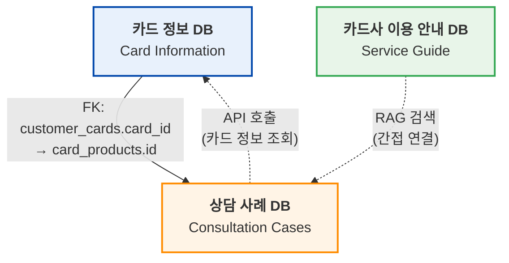
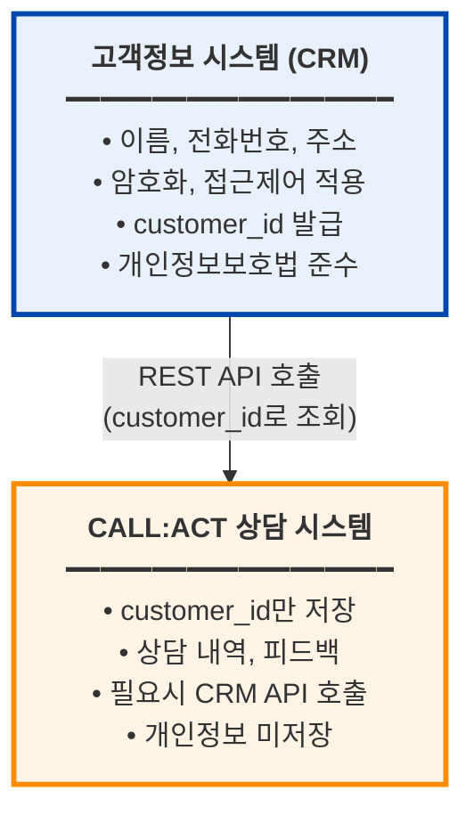

# CALL:ACT ERD 스키마 설계 문서

## 메타데이터
- **작성일**: 2026-01-07
- **작성자**: CALL:ACT Team
- **버전**: v2.0
- **상태**: 완료
- **데이터베이스**: PostgreSQL with pgvector extension
- **관련 문서**:
  - [3개 데이터베이스 구조](../../03_화면_설계/docs/CALL_ACT_3개_데이터베이스_구조.md)
  - [DBML 스키마 파일](../../03_화면_설계/docs/CALL_ACT_ERD_Schema.dbml)

---

## 1. 목적

본 문서는 CALL:ACT (카드사 상담 지원 시스템) 데이터베이스의 ERD 스키마 설계 원칙과 구조적 근거를 설명합니다. 단순히 테이블 구조를 나열하는 것을 넘어, **왜 이러한 설계를 선택했는지**, **어떤 논리적 근거로 데이터를 구조화했는지**를 체계적으로 제시합니다.

이 문서를 통해 개발팀은 데이터베이스 설계의 의도를 명확히 이해하고, 향후 확장이나 수정 시에도 일관된 설계 철학을 유지할 수 있습니다.

---

## 2. 설계 배경 및 개요

### 2.1 CALL:ACT 시스템의 특성

CALL:ACT는 카드사 상담사를 지원하는 AI 기반 실시간 상담 시스템입니다. 이 시스템은 다음과 같은 핵심 요구사항을 가지고 있습니다:

1. **실시간 상담 지원**: STT(Speech-to-Text) 기반 키워드 추출과 RAG(Retrieval-Augmented Generation) 검색을 통한 즉각적인 정보 제공
2. **상담 후처리 자동화**: AI를 활용한 상담 요약, 유사 사례 참고, 품질 평가
3. **교육 시스템 통합**: 신입 상담사 교육을 위한 시뮬레이션 및 평가 기능
4. **개인정보 보호**: 고객 개인정보에 대한 엄격한 보안 및 법적 compliance

### 2.2 데이터베이스 설계의 핵심 과제

이러한 시스템 요구사항을 충족하기 위해 데이터베이스 설계 단계에서 다음과 같은 핵심 과제를 해결해야 했습니다:

- **도메인 분리**: 카드 정보, 서비스 가이드, 상담 사례라는 서로 다른 성격의 데이터를 어떻게 논리적으로 분리할 것인가?
- **개인정보 보호**: 고객 개인정보를 어떻게 안전하게 관리하면서도 상담 업무를 지원할 것인가?
- **AI 통합**: RAG 시스템을 위한 VectorDB와 기존 RDB를 어떻게 통합할 것인가?
- **확장성**: 향후 상담 데이터가 누적되고 기능이 확장될 때도 성능을 유지할 수 있는가?

---

## 3. ERD 스키마 개요

### 3.1 전체 구조

본 ERD 스키마는 **23개의 테이블**과 **16개의 Enum 타입**으로 구성되며, 3개의 논리적 데이터베이스로 분리됩니다.

| 데이터베이스 | 설명 | 테이블 수 | 주요 역할 |
|--------------|------|-----------|-----------|
| **카드 정보 DB** | 카드 상품, 혜택, 수수료 정보 | 6개 | 카드 정보 관리 및 RAG 검색 지원 |
| **카드사 이용 안내 DB** | 공지사항, 자주 찾는 문의, 가이드 문서 | 4개 | 서비스 안내 관리 및 RAG 검색 지원 |
| **상담 사례 DB** | 상담 내역, 교육 시나리오, 직원 정보 | 13개 | 상담 및 교육 관리, RAG 검색 지원 |

### 3.2 DBML 파일 위치 및 ERD 생성 방법

- **DBML 파일**: `docs/03_화면_설계/docs/CALL_ACT_ERD_Schema.dbml`
- **ERD 생성**:
  1. DBML 파일 내용 복사
  2. https://dbdiagram.io/d 접속
  3. 좌측 에디터에 붙여넣기
  4. 자동으로 ERD 다이어그램 생성

---

## 4. 설계 원칙

본 ERD 스키마는 다음과 같은 핵심 설계 원칙을 기반으로 합니다.

### 4.1 개인정보 보호 우선 원칙

**원칙**: 고객 개인정보는 데이터베이스에 직접 저장하지 않는다.

**근거**:
- **보안 위험 최소화**: 상담 시스템이 해킹당하더라도 개인정보 노출을 방지
- **법적 책임 분리**: 개인정보보호법 compliance 책임을 별도 CRM 시스템에 위임
- **아키텍처 단순화**: 암호화/복호화 로직 제거, 개인정보 접근 로그 관리 간소화

**구현**:
- `customers` 테이블을 생성하지 않음
- `customer_id`를 외부 시스템 참조용 VARCHAR로만 사용 (Foreign Key 없음)
- 필요시 외부 CRM API를 통해 고객 정보 조회

### 4.2 정규화 및 데이터 무결성 원칙

**원칙**: 제3정규형(3NF)을 기본으로 하되, 성능 최적화가 필요한 경우 선택적 비정규화를 허용한다.

**근거**:
- **데이터 중복 최소화**: 카드 상품 정보는 `card_products`에 한 번만 저장
- **업데이트 이상 방지**: 카드 혜택 변경 시 `card_benefits` 테이블만 수정
- **참조 무결성 보장**: Foreign Key 제약을 통해 고아 레코드(orphan records) 방지

**예외 사례**:
- `consultation_summaries.ai_summary`: AI 생성 요약을 별도 컬럼으로 저장 (재생성 비용 고려)
- `service_guide_documents.embedding`: 벡터 임베딩을 RDB에 저장 (검색 성능 최적화)

### 4.3 확장성 및 유연성 원칙

**원칙**: 향후 기능 확장과 데이터 증가를 고려한 구조를 설계한다.

**근거**:
- **Enum 타입 활용**: 상태 값, 카테고리 등을 Enum으로 정의하여 일관성 보장
- **JSONB 메타데이터**: `metadata` 컬럼을 JSONB로 설계하여 유연한 확장 가능
- **파티셔닝 준비**: `consultations` 테이블은 `call_date` 기준 월별 파티셔닝 가능하도록 설계

### 4.4 성능 최적화 원칙

**원칙**: 자주 조회되는 패턴을 분석하여 인덱스를 전략적으로 배치한다.

**근거**:
- **복합 인덱스**: `(customer_id, card_id)` 등 자주 함께 조회되는 컬럼 조합
- **부분 인덱스**: `status = 'active'`인 레코드만 인덱싱하여 공간 절약
- **VectorDB 인덱스**: pgvector의 IVFFlat 또는 HNSW 인덱스로 유사도 검색 최적화

---

## 5. 데이터베이스 분리 전략

본 ERD는 물리적으로는 하나의 PostgreSQL 데이터베이스를 사용하지만, **Table Group**을 통해 3개의 논리적 데이터베이스로 분리합니다.

### 5.1 논리적 분리의 근거

**1. 도메인 주도 설계(Domain-Driven Design)**

각 데이터베이스는 명확한 도메인 경계를 가집니다:
- **카드 정보 DB**: 카드 상품 도메인 (Product Domain)
- **카드사 이용 안내 DB**: 지식 관리 도메인 (Knowledge Management Domain)
- **상담 사례 DB**: 상담 및 교육 도메인 (Consultation & Education Domain)

**2. 변경 주기의 차이**

각 데이터베이스는 서로 다른 변경 주기를 가집니다:
- **카드 정보 DB**: 월 1-2회 (신규 카드 출시, 혜택 변경)
- **카드사 이용 안내 DB**: 주 1-2회 (공지사항, FAQ 업데이트)
- **상담 사례 DB**: 실시간 (매 상담마다 데이터 생성)

**3. 접근 권한 분리**

각 도메인별로 서로 다른 접근 권한을 부여할 수 있습니다:
- 카드 상품 기획팀: 카드 정보 DB 수정 권한
- 고객센터 관리자: 카드사 이용 안내 DB 수정 권한
- 상담사: 상담 사례 DB 읽기/쓰기 권한 (자신의 상담만)

### 5.2 분리의 장점

| 장점 | 설명 |
|------|------|
| **유지보수성 향상** | 카드 정보 변경이 상담 데이터에 영향을 주지 않음 |
| **성능 최적화** | 각 도메인별로 독립적인 인덱스 및 쿼리 최적화 가능 |
| **확장성** | 향후 마이크로서비스 분리 시 데이터베이스도 물리적으로 분리 가능 |
| **보안 강화** | 도메인별 접근 제어를 통해 권한 관리 간소화 |

### 5.3 데이터베이스 간 관계

세 데이터베이스는 **느슨한 결합(Loose Coupling)**을 유지합니다:



---

## 6. 개인정보 보호 설계

### 6.1 설계 결정: customers 테이블 제외

**배경**:
초기 설계 단계에서는 `customers` 테이블을 포함하여 고객 정보를 직접 관리하는 방안을 검토했습니다. 그러나 다음과 같은 이유로 이를 제외하기로 결정했습니다.

**결정 근거**:

1. **보안 위험 최소화**
   - 상담 시스템은 인터넷에 노출된 웹 애플리케이션
   - SQL Injection, XSS 등 공격 시 개인정보 노출 위험
   - 해킹 사고 시 법적 책임 및 평판 손실 막대

2. **법적 Compliance 부담 감소**
   - 개인정보보호법: 개인정보 수집/저장/파기 의무
   - 정보통신망법: 개인정보 암호화 저장 의무
   - 신용정보법: 카드사 고객 정보 보호 의무
   - 별도 CRM 시스템에서 이미 compliance 준수 중

3. **아키텍처 단순화**
   - 암호화/복호화 로직 제거
   - 개인정보 접근 로그 관리 불필요
   - 데이터 보관 기간 관리 간소화

### 6.2 customer_id 설계 전략

**구현 방식**:

```dbml
Table consultations {
  customer_id varchar(50) [not null, note: '외부 시스템 고객 ID (FK 없음)']
  // Foreign Key 관계 없음
}

Table customer_cards {
  customer_id varchar(50) [not null, note: '외부 시스템 고객 ID (FK 없음)']
  card_id varchar(50) [ref: > card_products.id]
  // customer_id는 FK 없음, card_id만 FK 있음
}
```

**특징**:
- `customer_id`는 VARCHAR 타입 (외부 시스템 참조용 식별자)
- Foreign Key 관계 없음 (고아 레코드 허용)
- 실제 고객 정보는 외부 CRM API를 통해 조회

### 6.3 아키텍처 패턴



### 6.4 장점 및 한계

**장점**:
- 보안 위험 최소화: 상담 시스템 해킹 시에도 개인정보 노출 없음
- 법적 책임 분리: 개인정보 관리 책임은 CRM 시스템에 있음
- 아키텍처 단순화: 암호화/복호화 불필요

**한계 및 대응**:
- CRM API 의존성: CRM 시스템 장애 시 고객 정보 조회 불가 → 캐싱 전략 필요
- 네트워크 지연: API 호출 지연 시간 → Redis 캐시로 최근 조회 고객 정보 임시 저장
- 데이터 일관성: CRM 삭제 고객의 customer_id가 상담 DB에 남음 → 정기적인 정합성 체크

---

## 7. VectorDB 통합 전략

### 7.1 설계 결정: pgvector 선택

**배경**:
RAG(Retrieval-Augmented Generation) 시스템을 구현하기 위해서는 텍스트 임베딩 벡터를 저장하고 유사도 검색을 수행할 수 있는 VectorDB가 필요합니다. 다음과 같은 선택지를 검토했습니다:

| 방안 | 장점 | 단점 |
|------|------|------|
| **Pinecone (별도 VectorDB)** | 전문 VectorDB, 높은 성능 | 추가 인프라 비용, 데이터 동기화 복잡 |
| **pgvector (PostgreSQL 확장)** | RDB와 통합, 트랜잭션 보장 | 대규모 벡터 검색 시 성능 한계 |
| **Elasticsearch** | 전문 검색 엔진, 풍부한 기능 | 복잡한 설정, 러닝 커브 |

**결정**: **pgvector** 선택

**근거**:
1. **데이터 일관성**: RDB와 VectorDB가 동일한 PostgreSQL에 있어 트랜잭션 보장
2. **운영 복잡도 감소**: 별도 VectorDB 인프라 불필요, 백업/복구 절차 간소화
3. **적정 규모**: 초기 단계에서는 수만~수십만 건의 문서로 pgvector 성능 충분
4. **비용 효율**: 추가 라이선스 비용 없음

### 7.2 VectorDB 메타데이터 테이블 설계

**설계 패턴**: **Hybrid RDB + VectorDB**

VectorDB 전용 테이블을 별도로 두지 않고, RDB 테이블에 `embedding` 컬럼을 추가하는 방식:

```dbml
Table service_guide_documents {
  id varchar(50) [pk]
  title varchar(300) [not null]
  content text [not null]
  keywords text[]                    // RDB: 키워드 배열
  embedding vector(1536)             // VectorDB: OpenAI embedding
  metadata jsonb                     // RDB: 추가 메타데이터
  usage_count int [default: 0]      // RDB: 사용 횟수
  created_at timestamp
}

Table consultation_documents {
  id varchar(50) [pk]
  consultation_id varchar(50) [ref: > consultations.id]
  title varchar(300) [not null]
  content text [not null]
  keywords text[]                    // RDB: 키워드 배열
  embedding vector(1536)             // VectorDB: OpenAI embedding
  metadata jsonb                     // RDB: 추가 메타데이터
  usage_count int [default: 0]      // RDB: 사용 횟수
  effectiveness_score decimal(3,2)   // RDB: 효과성 점수
  created_at timestamp
}
```

### 7.3 RAG 검색 워크플로우

**실시간 상담 중 RAG 검색**:

```
1. STT 키워드 추출
   ↓
   입력: ["카드분실", "재발급", "해외여행"]

2. OpenAI Embedding API 호출
   ↓
   출력: [0.023, -0.156, 0.089, ..., 0.234] (1536차원 벡터)

3. VectorDB 유사도 검색 (Cosine Similarity)
   ↓
   SQL:
   SELECT id, title, content, (embedding <=> $1) AS distance
   FROM service_guide_documents
   ORDER BY distance ASC
   LIMIT 5;

4. 칸반보드에 관련 문서 표시
   ↓
   - 카드 분실 신고 처리 절차 (유사도: 0.95)
   - 재발급 카드 배송 안내 (유사도: 0.89)
   - 해외 여행 중 카드 분실 대응 (유사도: 0.87)
```

**상담 후처리 시 유사 사례 검색**:

```
1. 현재 상담 AI 요약 생성
   ↓
   "고객이 해외 여행 중 카드 분실. 긴급 재발급 요청. 익일 배송 처리 완료."

2. 요약을 OpenAI Embedding으로 벡터화
   ↓
   [0.034, -0.178, 0.102, ..., 0.267]

3. consultation_documents 유사 사례 검색
   ↓
   SQL:
   SELECT c.id, c.title, c.content, (c.embedding <=> $1) AS distance
   FROM consultation_documents c
   WHERE c.category = 'card_loss'
   ORDER BY distance ASC
   LIMIT 3;

4. 과거 후처리 방법 참고
   ↓
   유사 사례 1: "해외 여행 전 긴급 배송 요청" (유사도: 0.92)
   → 후처리: "배송 추적 번호 SMS 발송, 도착 확인 전화"
```

### 7.4 인덱스 전략

**pgvector 인덱스**:

```sql
-- IVFFlat 인덱스 (중소 규모 데이터셋)
CREATE INDEX idx_service_guide_embedding ON service_guide_documents
USING ivfflat (embedding vector_cosine_ops)
WITH (lists = 100);

-- HNSW 인덱스 (대규모 데이터셋, PostgreSQL 14+)
CREATE INDEX idx_consultation_embedding ON consultation_documents
USING hnsw (embedding vector_cosine_ops)
WITH (m = 16, ef_construction = 64);
```

**인덱스 선택 기준**:
- **IVFFlat**: 10만 건 이하, 인덱스 생성 빠름, 검색 속도 중간
- **HNSW**: 10만 건 이상, 인덱스 생성 느림, 검색 속도 매우 빠름

---

## 8. 관계 설계 및 정규화

### 8.1 Foreign Key 관계 분석

본 ERD는 **23개 테이블** 간 **22개의 Foreign Key 관계**를 정의합니다.

**카드 정보 DB 관계**:
```
card_products (1) ──< (N) card_benefits         // 1:N
card_products (1) ──< (N) fee_info              // 1:N
card_products (1) ──< (N) point_policy          // 1:N
card_products (1) ──< (N) promotions            // 1:N
card_products (1) ──< (N) customer_cards        // 1:N
```

**논리적 근거**:
- 하나의 카드 상품은 여러 개의 혜택을 가질 수 있음 (예: 커피 할인, 주유 할인)
- 하나의 카드 상품은 여러 종류의 수수료를 가질 수 있음 (예: 해외 수수료, 현금서비스 수수료)
- 하나의 카드 상품은 여러 고객에게 발급될 수 있음 (고객-카드 다대다 관계)

**카드사 이용 안내 DB 관계**:
```
frequent_inquiries (1) ──< (N) inquiry_view_log  // 1:N
```

**논리적 근거**:
- 하나의 FAQ는 여러 번 조회될 수 있음
- 조회 로그를 통해 인기 FAQ 분석 가능

**상담 사례 DB 관계**:
```
employees (1) ──< (N) consultations              // 1:N
employees (1) ──< (N) scenario_attempts          // 1:N

consultations (1) ──< (N) consultation_transcripts  // 1:N
consultations (1) ──── (1) consultation_summaries   // 1:1
consultations (1) ──── (1) consultation_feedback    // 1:1
consultations (1) ──< (N) stt_keywords              // 1:N
consultations (1) ──< (N) consultation_documents    // 1:N
consultations (1) ──── (1) best_practices           // 1:1
consultations (1) ──< (N) training_scenarios        // 1:N

training_scenarios (1) ──< (N) scenario_scripts              // 1:N
training_scenarios (1) ──< (N) scenario_evaluation_criteria  // 1:N
training_scenarios (1) ──< (N) scenario_attempts             // 1:N
```

**논리적 근거**:
- 하나의 상담은 여러 개의 전문(transcript) 메시지를 가짐 (대화 내용)
- 하나의 상담은 하나의 요약만 가짐 (1:1 관계, unique 제약)
- 하나의 상담은 하나의 피드백만 가짐 (1:1 관계, unique 제약)
- 하나의 시나리오는 여러 상담사가 여러 번 시도할 수 있음 (N:M 관계)

### 8.2 정규화 수준 결정

**제3정규형(3NF) 준수**:

모든 테이블은 기본적으로 3NF를 만족합니다:
- **제1정규형(1NF)**: 모든 속성은 원자값 (배열 타입은 PostgreSQL의 네이티브 지원)
- **제2정규형(2NF)**: 부분 함수 종속 제거 (모든 비키 속성이 기본키 전체에 종속)
- **제3정규형(3NF)**: 이행적 함수 종속 제거

**비정규화 사례 및 근거**:

1. **consultation_summaries.ai_summary**
   - 정규화 시: AI 요약을 매번 재생성
   - 비정규화: 생성된 요약을 저장
   - **근거**: AI API 호출 비용 절감, 응답 속도 향상

2. **service_guide_documents.embedding**
   - 정규화 시: embedding을 별도 테이블에 저장
   - 비정규화: 문서 테이블에 embedding 컬럼 추가
   - **근거**: 문서와 벡터가 항상 함께 조회됨, JOIN 비용 절감

3. **consultations.quality_score**
   - 정규화 시: consultation_feedback 테이블에서 계산
   - 비정규화: consultations 테이블에 저장
   - **근거**: 상담 목록 조회 시 품질 점수로 정렬/필터링 빈번

### 8.3 중간 테이블 설계: customer_cards

**다대다 관계 해결**:

고객과 카드는 다대다 관계입니다:
- 한 고객이 여러 카드를 보유할 수 있음
- 한 카드 상품은 여러 고객에게 발급될 수 있음

**중간 테이블 설계**:

```dbml
Table customer_cards {
  id serial [pk]
  customer_id varchar(50) [not null]  // 외부 시스템 참조 (FK 없음)
  card_id varchar(50) [ref: > card_products.id]
  issued_date date [not null]
  card_number_hash varchar(64)        // 카드번호 해시 (마지막 4자리 등)
  card_status card_status [default: 'active']
  is_primary boolean [default: false]
  created_at timestamp
  updated_at timestamp

  Indexes {
    (customer_id, card_id) [unique]  // 동일 고객-카드 중복 발급 방지
    customer_id
    card_id
  }
}
```

**설계 근거**:
- `customer_id`는 외부 참조이므로 FK 없음
- `card_id`는 내부 테이블이므로 FK 있음
- `card_number_hash`: 실제 카드번호는 저장하지 않고 해시만 저장 (보안)
- `is_primary`: 고객의 주 카드 여부 (빠른 조회용)

---

## 9. 성능 및 확장성 고려사항

### 9.1 인덱스 전략

**단일 컬럼 인덱스**:

| 테이블 | 인덱스 컬럼 | 근거 |
|--------|------------|------|
| `consultations` | `customer_id` | 고객별 상담 이력 조회 빈번 |
| `consultations` | `agent_id` | 상담사별 상담 이력 조회 |
| `consultations` | `call_date` | 날짜별 상담 통계 |
| `consultation_transcripts` | `consultation_id` | 특정 상담의 전문 조회 |
| `card_benefits` | `card_id` | 카드별 혜택 조회 |

**복합 인덱스**:

| 테이블 | 인덱스 컬럼 | 근거 |
|--------|------------|------|
| `customer_cards` | `(customer_id, card_id)` [unique] | 고객-카드 매핑 조회, 중복 방지 |
| `consultations` | `(status, call_date)` | 진행 중인 상담 날짜별 조회 |
| `promotions` | `(card_id, start_date, end_date)` | 카드별 진행 중인 프로모션 조회 |

**부분 인덱스 (Partial Index)**:

```sql
-- 활성 상담만 인덱싱 (공간 절약)
CREATE INDEX idx_consultations_active ON consultations (call_date)
WHERE status = 'in_progress';

-- 우수 사례만 인덱싱
CREATE INDEX idx_best_practices_only ON consultations (quality_score)
WHERE is_best_practice = true;
```

### 9.2 쿼리 최적화 전략

**1. 자주 사용되는 쿼리 패턴**:

```sql
-- 패턴 1: 고객의 활성 카드 조회
SELECT cp.name, cc.card_status, cc.issued_date
FROM customer_cards cc
JOIN card_products cp ON cc.card_id = cp.id
WHERE cc.customer_id = $1 AND cc.card_status = 'active';

-- 최적화: (customer_id, card_status) 복합 인덱스

-- 패턴 2: 상담사의 최근 상담 목록
SELECT id, category, call_date, quality_score
FROM consultations
WHERE agent_id = $1
ORDER BY call_date DESC
LIMIT 20;

-- 최적화: (agent_id, call_date DESC) 복합 인덱스

-- 패턴 3: RAG 검색
SELECT id, title, content, (embedding <=> $1) AS distance
FROM service_guide_documents
WHERE category = $2
ORDER BY distance ASC
LIMIT 5;

-- 최적화: category B-tree 인덱스 + embedding IVFFlat 인덱스
```

**2. N+1 쿼리 방지**:

```sql
-- ❌ N+1 쿼리 (나쁜 예)
SELECT * FROM consultations WHERE agent_id = $1;  -- 1회
-- 각 상담마다:
SELECT * FROM consultation_summaries WHERE consultation_id = $2;  -- N회

-- ✅ JOIN 사용 (좋은 예)
SELECT c.*, cs.ai_summary
FROM consultations c
LEFT JOIN consultation_summaries cs ON c.id = cs.consultation_id
WHERE c.agent_id = $1;  -- 1회
```

### 9.3 데이터 파티셔닝 전략

**상담 데이터 월별 파티셔닝**:

```sql
-- 파티션 테이블 생성
CREATE TABLE consultations (
  id varchar(50) PRIMARY KEY,
  call_date date NOT NULL,
  -- ... 기타 컬럼
) PARTITION BY RANGE (call_date);

-- 월별 파티션
CREATE TABLE consultations_2025_01 PARTITION OF consultations
FOR VALUES FROM ('2025-01-01') TO ('2025-02-01');

CREATE TABLE consultations_2025_02 PARTITION OF consultations
FOR VALUES FROM ('2025-02-01') TO ('2025-03-01');

-- ... 매월 자동 생성 (pg_cron 사용)
```

**파티셔닝 장점**:
- 최근 데이터 조회 시 오래된 파티션 스캔 불필요
- 오래된 파티션은 별도 스토리지로 이동 가능 (아카이빙)
- 파티션별 백업/복구 가능

### 9.4 아카이빙 전략

**1. 상담 데이터 아카이빙**:

```sql
-- 1년 이상 지난 상담 데이터 이동
INSERT INTO consultations_archive
SELECT * FROM consultations
WHERE call_date < CURRENT_DATE - INTERVAL '1 year';

DELETE FROM consultations
WHERE call_date < CURRENT_DATE - INTERVAL '1 year';
```

**2. VectorDB 문서 정리**:

```sql
-- 사용 빈도가 낮은 문서 비활성화
UPDATE service_guide_documents
SET status = 'inactive'
WHERE usage_count < 5
  AND created_at < CURRENT_DATE - INTERVAL '6 months';

-- 비활성 문서는 VectorDB 검색에서 제외
SELECT * FROM service_guide_documents
WHERE status = 'active'
ORDER BY embedding <=> $1 LIMIT 5;
```

### 9.5 캐싱 전략

**Redis 캐싱 레이어**:

| 캐시 대상 | TTL | 근거 |
|-----------|-----|------|
| 카드 상품 정보 | 1시간 | 변경 빈도 낮음 |
| 자주 찾는 문의 (FAQ) | 30분 | 조회 빈도 높음 |
| 고객 정보 (CRM API) | 10분 | API 호출 비용 절감 |
| RAG 검색 결과 | 5분 | 동일 키워드 반복 조회 |

---

## 10. 데이터베이스별 상세 구조

### 10.1 카드 정보 DB (Card Information Database)

#### 10.1.1 card_products (카드 상품 마스터)

```dbml
Table card_products {
  id varchar(50) [pk]
  name varchar(200) [not null]
  card_type card_type [not null]        // enum: credit, debit
  brand brand_type                      // enum: visa, mastercard, amex, unionpay
  annual_fee_domestic int
  annual_fee_global int
  performance_condition text
  main_benefits text
  status status [default: 'active']
  created_at timestamp [default: `now()`]
  updated_at timestamp

  note: '카드 상품 마스터 테이블'
}
```

**용도**: 카드 상품 기본 정보 관리
**PK**: `id` (예: 'CARD-001')
**주요 필드**:
- `card_type`: 신용카드/체크카드 구분
- `annual_fee_domestic`: 국내전용 연회비
- `annual_fee_global`: 해외겸용 연회비
- `performance_condition`: 연회비 면제 조건

#### 10.1.2 card_benefits (카드 혜택 상세)

```dbml
Table card_benefits {
  id serial [pk]
  card_id varchar(50) [ref: > card_products.id]
  category varchar(100)                 // 예: '주유', '커피', '통신비'
  benefit_type benefit_type [not null]  // enum: discount, points_accrual, cashback
  benefit_rate decimal(5,2)             // 예: 10.00 (10% 할인)
  benefit_limit int                     // 월 최대 할인 금액
  condition_text text
  partner_name varchar(200)
  created_at timestamp [default: `now()`]

  Indexes {
    card_id
    category
    benefit_type
  }

  note: '카드별 상세 혜택 정보'
}
```

**용도**: 카드별 상세 혜택 정보 (주유, 커피, 통신비 등)
**FK**: `card_id` → `card_products.id`
**인덱스**: `card_id`, `category`, `benefit_type`

#### 10.1.3 fee_info (수수료 정보)

```dbml
Table fee_info {
  id serial [pk]
  fee_type fee_type [not null]          // enum: overseas_fee, cash_service_fee, annual_fee
  card_id varchar(50) [ref: > card_products.id]
  fee_rate decimal(5,2)                 // 예: 1.50 (1.5%)
  fixed_fee int                         // 고정 수수료 (원)
  description text
  exemption_condition text              // 면제 조건
  created_at timestamp [default: `now()`]

  Indexes {
    card_id
    fee_type
  }

  note: '카드별 수수료 정책'
}
```

**용도**: 카드별 수수료 정책 관리
**FK**: `card_id` → `card_products.id`

#### 10.1.4 point_policy (포인트 정책)

```dbml
Table point_policy {
  id serial [pk]
  card_id varchar(50) [ref: > card_products.id]
  category varchar(100)                 // 예: '일반가맹점', '해외가맹점'
  point_rate decimal(5,2)               // 예: 0.50 (0.5%)
  point_unit int                        // 적립 단위 (예: 1000원당)
  expiry_months int                     // 유효기간 (개월)
  created_at timestamp [default: `now()`]

  Indexes {
    card_id
    category
  }

  note: '카드별 포인트 적립 정책'
}
```

**용도**: 카드별 포인트 적립 정책
**FK**: `card_id` → `card_products.id`

#### 10.1.5 promotions (프로모션 정보)

```dbml
Table promotions {
  id varchar(50) [pk]
  title varchar(200) [not null]
  card_id varchar(50) [ref: > card_products.id]
  start_date date [not null]
  end_date date [not null]
  benefit_description text
  conditions text
  target_customer varchar(50)           // 예: '신규고객', '전체'
  status promotion_status [default: 'ongoing']
  created_at timestamp [default: `now()`]

  Indexes {
    card_id
    (start_date, end_date)
    status
  }

  note: '카드 프로모션 관리'
}
```

**용도**: 카드 프로모션 관리
**PK**: `id` (예: 'PROMO-2025-001')
**인덱스**: `card_id`, `(start_date, end_date)`, `status`

#### 10.1.6 customer_cards (고객-카드 연결)

```dbml
Table customer_cards {
  id serial [pk]
  customer_id varchar(50) [not null, note: '외부 시스템 고객 ID (FK 없음)']
  card_id varchar(50) [ref: > card_products.id]
  issued_date date [not null]
  card_number_hash varchar(64)          // 카드번호 해시
  card_status card_status [default: 'active']
  is_primary boolean [default: false]   // 주 카드 여부
  created_at timestamp [default: `now()`]
  updated_at timestamp

  Indexes {
    customer_id
    card_id
    (customer_id, card_id) [unique]
  }

  note: '고객과 카드의 다대다 관계 관리. customer_id는 외부 시스템 참조'
}
```

**용도**: 고객과 카드의 다대다 관계 관리
**FK**: `card_id` → `card_products.id`
**중요**: `customer_id`는 외부 시스템 참조 (개인정보 보호)
**인덱스**: `customer_id`, `card_id`, `(customer_id, card_id)` [unique]

---

### 10.2 카드사 이용 안내 DB (Service Guide Database)

#### 10.2.1 notices (공지사항)

```dbml
Table notices {
  id varchar(50) [pk]
  title varchar(300) [not null]
  content text [not null]
  category notice_category              // enum: system, service, emergency
  priority notice_priority              // enum: normal, important, urgent
  is_pinned boolean [default: false]    // 상단 고정 여부
  start_date date [not null]
  end_date date
  status status [default: 'active']
  created_by varchar(50)
  created_at timestamp [default: `now()`]
  updated_at timestamp

  Indexes {
    category
    priority
    is_pinned
    (start_date, end_date)
  }

  note: '시스템/서비스 공지사항 관리'
}
```

**용도**: 시스템/서비스 공지사항 관리
**PK**: `id` (예: 'NOTICE-2025-001')
**인덱스**: `category`, `priority`, `is_pinned`, `(start_date, end_date)`

#### 10.2.2 frequent_inquiries (자주 찾는 문의)

```dbml
Table frequent_inquiries {
  id serial [pk]
  category consultation_category [not null]
  question text [not null]
  answer text [not null]
  view_count int [default: 0]
  is_active boolean [default: true]
  display_order int                     // 표시 순서
  created_at timestamp [default: `now()`]
  updated_at timestamp

  Indexes {
    category
    display_order
    view_count
  }

  note: 'FAQ 관리'
}
```

**용도**: FAQ 관리
**인덱스**: `category`, `display_order`, `view_count`

#### 10.2.3 inquiry_view_log (문의 조회 로그)

```dbml
Table inquiry_view_log {
  id serial [pk]
  inquiry_id int [ref: > frequent_inquiries.id]
  viewed_by varchar(50)                 // 조회한 상담사 ID
  viewed_at timestamp [default: `now()`]

  Indexes {
    inquiry_id
    viewed_at
  }

  note: 'FAQ 조회 이력 추적'
}
```

**용도**: FAQ 조회 이력 추적
**FK**: `inquiry_id` → `frequent_inquiries.id`

#### 10.2.4 service_guide_documents (서비스 가이드 문서)

```dbml
Table service_guide_documents {
  id varchar(50) [pk]
  document_type varchar(50)             // 예: 'manual', 'policy', 'faq'
  category varchar(100)
  title varchar(300) [not null]
  content text [not null]
  keywords text[]                       // PostgreSQL 배열 타입
  embedding vector(1536) [note: 'OpenAI embedding vector for RAG search']
  metadata jsonb [note: '추가 메타데이터 (JSON)']
  document_source varchar(200)          // 문서 출처
  priority varchar(20)                  // 우선순위
  usage_count int [default: 0]
  last_used timestamp
  created_at timestamp [default: `now()`]
  updated_at timestamp

  Indexes {
    document_type
    category
    usage_count
  }

  note: '카드사 이용 안내 문서 + RAG 검색용 VectorDB 메타데이터'
}
```

**용도**: 카드사 이용 안내 문서 + RAG 검색용 VectorDB 메타데이터
**PK**: `id` (예: 'DOC-GUIDE-001')
**VectorDB**: `embedding` 컬럼으로 RAG 검색 지원
**인덱스**: `document_type`, `category`, `usage_count`

---

### 10.3 상담 사례 DB (Consultation Cases Database)

#### 10.3.1 employees (직원 정보)

```dbml
Table employees {
  id varchar(50) [pk]
  name varchar(100) [not null]
  email varchar(100) [unique]
  role varchar(50)                      // 예: '상담사', '관리자', 'QA'
  department varchar(100)
  hire_date date
  status status [default: 'active']
  created_at timestamp [default: `now()`]
  updated_at timestamp

  Indexes {
    role
    department
    status
  }

  note: '상담사 및 직원 정보 관리'
}
```

**용도**: 상담사 및 직원 정보 관리
**PK**: `id` (예: 'EMP-001')
**인덱스**: `role`, `department`, `status`

#### 10.3.2 consultations (상담 마스터)

```dbml
Table consultations {
  id varchar(50) [pk]
  customer_id varchar(50) [not null, note: '외부 시스템 고객 ID (FK 없음)']
  agent_id varchar(50) [ref: > employees.id]
  status consultation_status [default: 'in_progress']
  category consultation_category [not null]
  title text
  call_date date [not null]
  call_time time [not null]
  call_duration varchar(20)             // 예: '00:15:32'
  fcr boolean [default: false, note: 'First Call Resolution']
  is_best_practice boolean [default: false]
  quality_score int                     // 0-100
  created_at timestamp [default: `now()`]
  updated_at timestamp

  Indexes {
    customer_id
    agent_id
    status
    category
    call_date
    fcr
    is_best_practice
  }

  note: '상담 기본 정보 관리. customer_id는 외부 시스템 참조 (개인정보 보호)'
}
```

**용도**: 상담 기본 정보 관리
**PK**: `id` (예: 'CS-20250105-1432')
**FK**: `agent_id` → `employees.id`
**중요**: `customer_id`는 외부 시스템 참조 (개인정보 보호)
**인덱스**: `customer_id`, `agent_id`, `status`, `category`, `call_date`, `fcr`, `is_best_practice`

#### 10.3.3 consultation_transcripts (상담 전문)

```dbml
Table consultation_transcripts {
  id serial [pk]
  consultation_id varchar(50) [ref: > consultations.id]
  speaker speaker_type [not null]       // enum: customer, agent
  message text [not null]
  timestamp time [not null]             // 통화 내 시간
  sentiment emotion_type                // enum: positive, neutral, negative
  created_at timestamp [default: `now()`]

  Indexes {
    consultation_id
    speaker
    timestamp
  }

  note: 'STT 결과 저장 (통화 내용)'
}
```

**용도**: STT 결과 저장 (통화 내용)
**FK**: `consultation_id` → `consultations.id`

#### 10.3.4 consultation_summaries (상담 요약)

```dbml
Table consultation_summaries {
  id serial [pk]
  consultation_id varchar(50) [unique, ref: > consultations.id]
  ai_summary text [note: 'AI 생성 요약본']
  memo text [note: '상담사 메모']
  follow_up_tasks text
  handoff_department varchar(100)       // 이관 부서
  handoff_notes text
  created_at timestamp [default: `now()`]

  note: 'AI 생성 요약 및 후처리 정보 (1:1 관계)'
}
```

**용도**: AI 생성 요약 및 후처리 정보
**FK**: `consultation_id` → `consultations.id` (1:1 관계, unique 제약)

#### 10.3.5 consultation_feedback (상담 피드백)

```dbml
Table consultation_feedback {
  id serial [pk]
  consultation_id varchar(50) [unique, ref: > consultations.id]
  emotion_start emotion_type            // 통화 초반 감정
  emotion_middle emotion_type           // 통화 중반 감정
  emotion_end emotion_type              // 통화 후반 감정
  quality_score quality_rating          // enum: high, medium, low
  processing_time_score int             // 후처리 시간 점수
  gratitude_score int                   // 감사 표현 비율 점수
  emotion_shift_score int               // 감정 전환 점수
  manual_compliance_score int           // 매뉴얼 준수 점수
  created_at timestamp [default: `now()`]

  note: '감정 분석 및 품질 평가 (1:1 관계)'
}
```

**용도**: 감정 분석 및 품질 평가
**FK**: `consultation_id` → `consultations.id` (1:1 관계, unique 제약)

#### 10.3.6 stt_keywords (STT 키워드)

```dbml
Table stt_keywords {
  id serial [pk]
  consultation_id varchar(50) [ref: > consultations.id]
  keyword varchar(100) [not null]
  confidence float [note: '키워드 추출 신뢰도 (0.0~1.0)']
  created_at timestamp [default: `now()`]

  Indexes {
    consultation_id
    keyword
  }

  note: 'STT 키워드 추출 결과 저장'
}
```

**용도**: STT 키워드 추출 결과 저장
**FK**: `consultation_id` → `consultations.id`

#### 10.3.7 training_scenarios (교육 시나리오)

```dbml
Table training_scenarios {
  id varchar(50) [pk]
  title varchar(200) [not null]
  description text
  difficulty difficulty_level            // enum: beginner, intermediate, advanced
  estimated_duration varchar(20)
  category consultation_category [not null]
  tags text[]
  scenario_type scenario_type            // enum: real_case, llm_generated
  source_consultation_id varchar(50) [ref: > consultations.id]
  is_locked boolean [default: false]
  unlock_condition text
  pass_score int [default: 80]
  created_at timestamp [default: `now()`]
  updated_at timestamp

  Indexes {
    category
    difficulty
    scenario_type
  }

  note: '교육용 시나리오 관리'
}
```

**용도**: 교육용 시나리오 관리
**PK**: `id` (예: 'SIM-001')
**FK**: `source_consultation_id` → `consultations.id` (실제 사례 기반 시나리오)

#### 10.3.8 scenario_scripts (시나리오 스크립트)

```dbml
Table scenario_scripts {
  id serial [pk]
  scenario_id varchar(50) [ref: > training_scenarios.id]
  step_order int [not null]
  speaker speaker_type [not null]
  message text
  expected_keywords text[]              // 상담사가 말해야 할 키워드
  created_at timestamp [default: `now()`]

  Indexes {
    scenario_id
    step_order
  }

  note: '시나리오별 대화 스크립트'
}
```

**용도**: 시나리오별 대화 스크립트
**FK**: `scenario_id` → `training_scenarios.id`

#### 10.3.9 scenario_evaluation_criteria (평가 기준)

```dbml
Table scenario_evaluation_criteria {
  id serial [pk]
  scenario_id varchar(50) [ref: > training_scenarios.id]
  criteria_name varchar(200) [not null]
  max_score int [not null]
  keywords text[]                       // 평가 키워드
  created_at timestamp [default: `now()`]

  Indexes {
    scenario_id
  }

  note: '시나리오 평가 기준 정의'
}
```

**용도**: 시나리오 평가 기준 정의
**FK**: `scenario_id` → `training_scenarios.id`

#### 10.3.10 scenario_attempts (시나리오 시도 기록)

```dbml
Table scenario_attempts {
  id serial [pk]
  scenario_id varchar(50) [ref: > training_scenarios.id]
  agent_id varchar(50) [ref: > employees.id]
  score int
  duration varchar(20)
  completed_at timestamp [not null]
  evaluation_detail jsonb               // 상세 평가 결과 (JSON)
  created_at timestamp [default: `now()`]

  Indexes {
    scenario_id
    agent_id
    completed_at
  }

  note: '상담사의 시나리오 시도 기록'
}
```

**용도**: 상담사의 시나리오 시도 기록
**FK**: `scenario_id` → `training_scenarios.id`, `agent_id` → `employees.id`

#### 10.3.11 best_practices (우수 상담 사례)

```dbml
Table best_practices {
  id serial [pk]
  consultation_id varchar(50) [unique, ref: > consultations.id]
  title varchar(200) [not null]
  category consultation_category [not null]
  key_takeaway text                     // 핵심 교훈
  recommended_for text[]                // 추천 대상 (예: ['신입', '중급'])
  views int [default: 0]
  created_at timestamp [default: `now()`]

  Indexes {
    category
    views
  }

  note: '우수 상담 사례 관리 (1:1 관계)'
}
```

**용도**: 우수 상담 사례 관리
**FK**: `consultation_id` → `consultations.id` (1:1 관계, unique 제약)

#### 10.3.12 consultation_documents (상담 문서)

```dbml
Table consultation_documents {
  id varchar(50) [pk]
  consultation_id varchar(50) [ref: > consultations.id]
  document_type varchar(50)
  category consultation_category [not null]
  title varchar(300) [not null]
  content text [not null]
  keywords text[]
  embedding vector(1536) [note: 'OpenAI embedding vector for RAG search']
  metadata jsonb
  usage_count int [default: 0]
  effectiveness_score decimal(3,2) [note: '효과성 점수 (0.00~1.00)']
  last_used timestamp
  created_at timestamp [default: `now()`]

  Indexes {
    consultation_id
    document_type
    category
    usage_count
  }

  note: '상담 사례 문서 + RAG 검색용 VectorDB 메타데이터'
}
```

**용도**: 상담 사례 문서 + RAG 검색용 VectorDB 메타데이터
**PK**: `id` (예: 'DOC-CONSULT-001')
**FK**: `consultation_id` → `consultations.id`
**VectorDB**: `embedding` 컬럼으로 RAG 검색 지원
**인덱스**: `consultation_id`, `document_type`, `category`, `usage_count`

---

## 11. Enum 정의 및 표준화

### 11.1 전체 Enum 목록

| Enum 이름 | 값 | 설명 |
|-----------|-----|------|
| `consultation_status` | completed, in_progress, incomplete | 상담 상태 |
| `card_type` | credit, debit | 카드 종류 |
| `brand_type` | visa, mastercard, amex, unionpay | 카드 브랜드 |
| `consultation_category` | card_loss, overseas_payment, fee_inquiry, points, limit_inquiry, other | 상담 카테고리 |
| `benefit_type` | discount, points_accrual, cashback | 혜택 종류 |
| `fee_type` | overseas_fee, cash_service_fee, annual_fee | 수수료 종류 |
| `emotion_type` | positive, neutral, negative | 감정 분석 |
| `quality_rating` | high, medium, low | 품질 평가 |
| `speaker_type` | customer, agent | 화자 구분 |
| `difficulty_level` | beginner, intermediate, advanced | 난이도 |
| `scenario_type` | real_case, llm_generated | 시나리오 종류 |
| `notice_priority` | normal, important, urgent | 공지사항 우선순위 |
| `notice_category` | system, service, emergency | 공지사항 카테고리 |
| `status` | active, inactive, suspended | 일반 상태 |
| `promotion_status` | ongoing, ended | 프로모션 상태 |
| `card_status` | active, suspended, lost, terminated | 카드 상태 |

### 11.2 Enum 사용의 장점

1. **데이터 일관성**: 허용된 값만 저장 가능 (잘못된 값 입력 방지)
2. **성능 최적화**: Enum 값은 내부적으로 정수로 저장되어 비교 연산 빠름
3. **코드 가독성**: `status = 'active'` vs `status = 1` (명확한 의미)
4. **유지보수**: Enum 정의만 수정하면 전체 시스템에 반영

---

## 12. 인덱스 전략

### 12.1 주요 인덱스 목록

| 테이블 | 인덱스 컬럼 | 목적 |
|--------|------------|------|
| `card_benefits` | `card_id`, `category`, `benefit_type` | 카드별 혜택 조회 |
| `fee_info` | `card_id`, `fee_type` | 카드별 수수료 조회 |
| `customer_cards` | `customer_id`, `card_id`, `(customer_id, card_id)` [unique] | 고객-카드 매핑 조회 |
| `consultations` | `customer_id`, `agent_id`, `status`, `category`, `call_date`, `fcr`, `is_best_practice` | 상담 검색 및 통계 |
| `consultation_transcripts` | `consultation_id`, `speaker`, `timestamp` | 전문 조회 |
| `service_guide_documents` | `document_type`, `category`, `usage_count` | 문서 검색 |
| `consultation_documents` | `consultation_id`, `document_type`, `category`, `usage_count` | 상담 사례 검색 |
| `promotions` | `card_id`, `(start_date, end_date)`, `status` | 진행 중인 프로모션 조회 |

---

## 13. PostgreSQL 특화 기능

### 13.1 사용된 PostgreSQL 확장 및 타입

| 타입/확장 | 사용 위치 | 설명 |
|-----------|----------|------|
| `vector(1536)` | `service_guide_documents.embedding`, `consultation_documents.embedding` | pgvector 확장, OpenAI embedding 저장 |
| `jsonb` | `service_guide_documents.metadata`, `consultation_documents.metadata`, `scenario_attempts.evaluation_detail` | JSON 데이터 저장 (인덱싱 가능) |
| `text[]` | 여러 테이블의 `keywords`, `tags`, `expected_keywords`, `recommended_for` 필드 | 배열 타입 |
| `timestamp` | 모든 시간 필드 | 타임존 포함 타임스탬프 |
| `enum` | 16개 Enum 타입 | 상태 값, 카테고리 등 표준화 |

### 13.2 pgvector 설치

```sql
CREATE EXTENSION IF NOT EXISTS vector;
```

### 13.3 VectorDB 인덱스 생성

```sql
-- IVFFlat 인덱스 (중소 규모)
CREATE INDEX idx_service_guide_embedding
ON service_guide_documents
USING ivfflat (embedding vector_cosine_ops)
WITH (lists = 100);

-- HNSW 인덱스 (대규모, PostgreSQL 14+)
CREATE INDEX idx_consultation_embedding
ON consultation_documents
USING hnsw (embedding vector_cosine_ops)
WITH (m = 16, ef_construction = 64);
```

---

## 14. 마이그레이션 및 초기 데이터

### 14.1 테이블 생성 순서

1. **Enum 타입 생성**: 모든 Enum 정의
2. **카드 정보 DB 테이블**: `card_products` → `card_benefits` → `fee_info` → `point_policy` → `promotions` → `customer_cards`
3. **카드사 이용 안내 DB 테이블**: `notices` → `frequent_inquiries` → `inquiry_view_log` → `service_guide_documents`
4. **상담 사례 DB 테이블**: `employees` → `consultations` → `consultation_transcripts` → `consultation_summaries` → `consultation_feedback` → `stt_keywords` → `training_scenarios` → `scenario_scripts` → `scenario_evaluation_criteria` → `scenario_attempts` → `best_practices` → `consultation_documents`

### 14.2 초기 데이터 권장사항

- **employees**: 관리자 계정 및 테스트 상담사 계정 3-5개
- **card_products**: 주요 카드 상품 3-5개 (신한카드 대표 상품)
- **frequent_inquiries**: 자주 찾는 질문 10-20개
- **service_guide_documents**: 기본 가이드 문서 (embedding 포함) 20-30개
- **training_scenarios**: 교육용 시나리오 5-10개

---

## 15. API 연동 가이드

### 15.1 고객 정보 조회

```typescript
// Frontend → Backend
GET /api/customers/{customer_id}/info

// Backend → 외부 CRM 시스템
GET https://crm.example.com/api/customers/{customer_id}

// Response
{
  "customer_id": "CUST-001",
  "name": "홍길동",
  "phone": "010-1234-5678",
  "address": "서울시 강남구..."
}
```

### 15.2 RAG 검색

```typescript
POST /api/rag/search

// Request
{
  "sttKeywords": ["카드분실", "재발급"],
  "customerId": "CUST-001"
}

// Response
{
  "currentSituation": [
    {
      "id": "DOC-GUIDE-001",
      "title": "카드 분실 신고 처리 절차",
      "content": "...",
      "relevanceScore": 0.95
    }
  ],
  "nextStep": [...]
}
```

### 15.3 상담 후처리 저장

```typescript
POST /api/consultations/{consultation_id}/complete

// Request
{
  "ai_summary": "고객이 카드 분실 신고...",
  "memo": "긴급 재발급 처리 완료",
  "follow_up_tasks": "3일 후 배송 확인 전화",
  "handoff_department": "카드발급팀",
  "handoff_notes": "익일 배송 요청"
}

// Response
{
  "status": "success",
  "consultation_id": "CS-20250105-1432"
}
```

---

## 16. 결론 및 향후 계획

### 16.1 설계의 핵심 성과

본 ERD 스키마는 다음과 같은 목표를 달성했습니다:

1. **개인정보 보호**: customers 테이블 제외, customer_id 외부 참조 방식으로 보안 위험 최소화
2. **도메인 분리**: 3개 논리적 데이터베이스로 명확한 경계 설정
3. **AI 통합**: pgvector를 활용한 RDB + VectorDB 하이브리드 아키텍처
4. **확장성**: 파티셔닝, 인덱싱, 아카이빙 전략으로 대규모 데이터 대비
5. **정규화**: 제3정규형 준수로 데이터 무결성 보장

### 16.2 향후 확장 계획

**1. 성능 모니터링 및 최적화** (1-3개월 내)
- 실제 상담 데이터 누적 후 슬로우 쿼리 분석
- 인덱스 튜닝 및 쿼리 최적화
- VectorDB 검색 성능 벤치마크

**2. 데이터 파티셔닝 적용** (3-6개월 내)
- consultations 테이블 월별 파티셔닝
- consultation_transcripts 테이블 파티셔닝
- 자동 파티션 생성 스크립트 작성

**3. 마이크로서비스 분리 검토** (6-12개월 내)
- 3개 논리적 데이터베이스를 물리적으로 분리
- 카드 정보 DB → 독립 서비스
- 상담 사례 DB → 독립 서비스
- API Gateway 도입

**4. AI 모델 고도화** (지속적)
- RAG 검색 정확도 향상 (Reranking 모델 추가)
- 감정 분석 모델 개선 (한국어 특화 모델)
- 상담 요약 품질 향상 (Few-shot Learning)

### 16.3 데이터베이스 거버넌스

**변경 관리**:
- 스키마 변경은 반드시 마이그레이션 스크립트 작성
- DBML 파일과 실제 DB 스키마 동기화 유지
- 변경 사항은 본 문서에 반영 (버전 업데이트)

**백업 및 복구**:
- 매일 자동 백업 (pg_dump)
- 주요 마일스톤 전 수동 백업
- 복구 테스트 월 1회 실시

**보안**:
- 최소 권한 원칙 (Least Privilege)
- 상담사는 자신의 상담만 수정 가능
- 관리자만 카드 정보 수정 가능

---

## 17. 업데이트 이력

| 날짜 | 버전 | 변경 내용 |
|------|------|-----------|
| 2026-01-07 | v1.0 | 초안 작성 (DBML 스키마 기반) |
| 2026-01-07 | v2.0 | 학술적 분석 스타일로 재구조화 (설계 원칙, 전략, 근거 추가) |

---

## 18. 참고 자료

### 18.1 기술 문서
- **DBML 문법**: https://dbml.dbdiagram.io/docs
- **pgvector**: https://github.com/pgvector/pgvector
- **OpenAI Embeddings**: https://platform.openai.com/docs/guides/embeddings
- **PostgreSQL 문서**: https://www.postgresql.org/docs/

### 18.2 프로젝트 내부 문서
- [3개 데이터베이스 구조](../../03_화면_설계/docs/CALL_ACT_3개_데이터베이스_구조.md)
- [카드 정보 및 혜택 데이터 활용 구조](../../03_화면_설계/docs/CALL_ACT_카드정보_혜택데이터_활용구조.md)
- [과거 상담 데이터 활용 구조](../../03_화면_설계/docs/CALL_ACT_과거상담데이터_활용구조.md)
- [DBML 스키마 파일](../../03_화면_설계/docs/CALL_ACT_ERD_Schema.dbml)

### 18.3 학술 논문 및 참고 자료
- **Domain-Driven Design**: Eric Evans, "Domain-Driven Design: Tackling Complexity in the Heart of Software" (2003)
- **Database Normalization**: E.F. Codd, "Further Normalization of the Data Base Relational Model" (1972)
- **Vector Databases**: Malkov & Yashunin, "Efficient and robust approximate nearest neighbor search using Hierarchical Navigable Small World graphs" (2018)

---

## 19. 문의 및 피드백

ERD 스키마에 대한 문의사항이나 수정 요청은 CALL:ACT 프로젝트 팀에 문의해주세요.

- **프로젝트 저장소**: [GitHub Repository URL]
- **문서 관리**: `docs/04_dev/01_data-preprocessing/ERD/`
- **DBML 파일**: `docs/03_화면_설계/docs/CALL_ACT_ERD_Schema.dbml`
