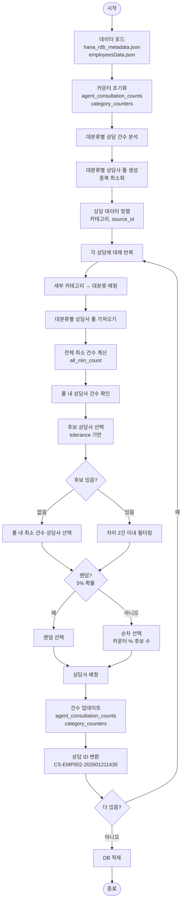

# 상담사 배정 알고리즘 문서

## 알고리즘 개요

하나카드 과거 상담 데이터(6,533건)를 60명의 상담사에게 균등하게 배정하는 알고리즘입니다.

## 알고리즘 흐름도



## 상세 알고리즘 설명

### 1. 데이터 준비 단계

#### 1.1 데이터 로드
```python
# 하나카드 상담 데이터 로드
consultations_data = load_json(HANA_RDB_METADATA_FILE)

# 상담사 데이터 로드
employees_data = load_json(EMPLOYEES_DATA_FILE)
active_employees = [emp for emp in employees_data 
                    if emp['id'] != 'EMP-TEDDY-DEFAULT' 
                    and emp['status'] == 'active']
```

#### 1.2 데이터 정렬
```python
# 재현성 확보를 위한 정렬
consultations_data_sorted = sorted(
    consultations_data,
    key=lambda x: (x.get('consulting_category', ''), x.get('source_id', ''))
)
```

#### 1.3 카운터 초기화
```python
agent_consultation_counts = {agent_id: 0 for agent_id in all_agents}
category_counters = {}
old_to_new_id_map = {}
```

### 2. 대분류별 풀 생성 단계

#### 2.1 대분류 매핑
```python
def map_to_main_category(category: str) -> str:
    # 정확한 매칭 시도
    if category in CATEGORY_TO_MAIN_CATEGORY:
        return CATEGORY_TO_MAIN_CATEGORY[category]
    
    # 키워드 기반 부분 매칭
    # ...
    
    return "기타"  # 기본값
```

#### 2.2 풀 생성 (중복 최소화)
```python
# 상담 건수가 많은 순으로 정렬
categories_to_process = sorted(
    category_consultation_counts.items(),
    key=lambda x: x[1],
    reverse=True
)

# 각 대분류별 풀 생성
for main_cat in categories_to_process:
    # 다른 대분류에서 사용된 상담사 제외
    agent_pool = get_agent_pool_by_main_category(
        employees_data, main_cat, used_agents_by_category
    )
    used_agents_by_category[main_cat] = set(agent_pool)
```

### 3. 배정 실행 단계

#### 3.1 후보 상담사 선택
```python
# 1. 전체 최소 건수 확인
all_min_count = min(agent_consultation_counts.values())

# 2. 풀 내 상담사 건수 확인
pool_counts = {aid: agent_consultation_counts.get(aid, 0) 
               for aid in agent_pool}

# 3. tolerance 기반 후보 선택
candidates = [
    aid for aid in agent_pool
    if abs(pool_counts[aid] - all_min_count) <= tolerance  # tolerance = 4
]

# 4. Fallback: 후보가 없으면 풀 내 최소 건수 상담사
if not candidates:
    candidates = [aid for aid in agent_pool 
                  if pool_counts[aid] == min(pool_counts.values())]

# 5. 차이 2건 이내 필터링
if len(candidates) > 1:
    min_diff = min(abs(pool_counts[aid] - all_min_count) 
                   for aid in candidates)
    candidates = [
        aid for aid in candidates
        if abs(pool_counts[aid] - all_min_count) <= min_diff + 2
    ]
```

#### 3.2 배정 실행
```python
# 하이브리드 배분 (95% 순차 + 5% 랜덤)
if random.random() < 0.05:  # 5% 랜덤
    agent_id = random.choice(candidates)
else:  # 95% 순차
    pool_index = category_counters[main_category] % len(candidates)
    agent_id = candidates[pool_index]

# 건수 업데이트
agent_consultation_counts[agent_id] += 1
category_counters[main_category] += 1
```

### 4. 상담 ID 변환 단계

```python
def convert_to_new_consultation_id(
    old_id: str,
    agent_id: str,
    call_start_time: Optional[str] = None,
    created_at: Optional[str] = None
) -> str:
    # agent_id에서 대시 제거
    clean_agent_id = agent_id.replace("-", "")
    
    # 날짜/시간 추출
    dt = extract_datetime(call_start_time, created_at)
    
    # 새 형식 ID 생성
    timestamp_str = dt.strftime("%Y%m%d%H%M")
    return f"CS-{clean_agent_id}-{timestamp_str}"
```

## 재현성 보장 방법

### 1. 랜덤 시드 고정
```python
RANDOM_SEED = 42
random.seed(RANDOM_SEED)
```

### 2. 데이터 정렬
```python
# 동일한 정렬 기준으로 항상 동일한 순서 보장
consultations_data_sorted = sorted(
    consultations_data,
    key=lambda x: (x.get('consulting_category', ''), x.get('source_id', ''))
)
```

### 3. 풀 생성 순서 고정
```python
# 상담 건수가 많은 순으로 정렬 (항상 동일한 순서)
categories_to_process = sorted(
    category_consultation_counts.items(),
    key=lambda x: x[1],
    reverse=True
)
```

## 성능 최적화

### 1. 풀 캐싱
- 대분류별 풀을 미리 생성하여 반복 조회 방지
- `agent_pools_cache` 딕셔너리 사용

### 2. 배치 처리
- 상담 데이터를 배치로 처리하여 DB 부하 감소
- `BATCH_SIZE = 100` 설정

### 3. 중복 최소화
- 다른 대분류에서 사용된 상담사 제외
- 풀 크기 최적화로 중복 최소화

## 예외 처리

### 1. 후보 부족
- 후보가 없으면 풀 내 최소 건수 상담사 선택 (fallback)

### 2. 날짜/시간 없음
- `call_start_time`이 없으면 `created_at` 사용
- 둘 다 없으면 현재 시간 사용

### 3. 상담사 풀 비어있음
- 풀이 비어있으면 에러 발생 (데이터 무결성 확인 필요)

## 검증 방법

### 1. 통계 계산
```python
def calculate_statistics(agent_counts: Dict[str, int]) -> Dict:
    counts = list(agent_counts.values())
    mean = sum(counts) / len(counts)
    variance = sum((x - mean) ** 2 for x in counts) / len(counts)
    std_dev = math.sqrt(variance)
    min_count = min(counts)
    max_count = max(counts)
    range_count = max_count - min_count
    
    return {
        'mean': mean,
        'std_dev': std_dev,
        'min': min_count,
        'max': max_count,
        'range': range_count
    }
```

### 2. 검증 기준 확인
- 표준편차 ≤ 15
- Max - Min ≤ 60
- 범위: 80~140건

## 참고사항

### 알고리즘 복잡도
- **시간 복잡도**: O(n × m)
  - n: 상담 건수 (6,533건)
  - m: 상담사 수 (60명)
- **공간 복잡도**: O(n + m)
  - n: 상담 데이터
  - m: 상담사 데이터

### 확장 가능성
- 실시간 배정: 새로운 상담 인입 시 즉시 배정
- 성과 기반 배정: FCR, 평균 상담 시간 고려
- 부하 분산: 실시간 부하를 고려한 동적 배정
