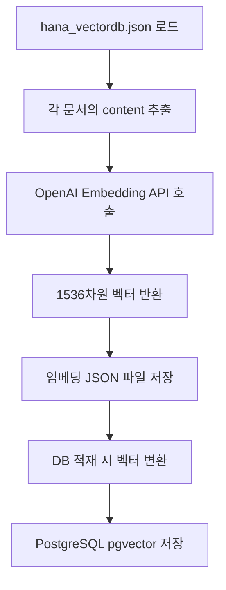
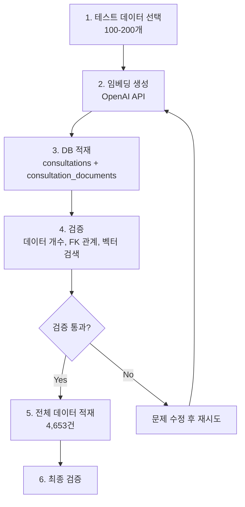

# 하나카드 데이터 DB 적재 설계 문서

**작성일**: 2026-01-08  
**작성자**: CALL:ACT Team  
**버전**: v1.0  
**상태**: 설계 완료

---

## 1. 개요

### 1.1 목적

하나카드 전처리 데이터(`hana_vectordb.json`, `hana_rdb_metadata.json`)를 PostgreSQL + pgvector 데이터베이스에 적재하여, 실시간 RAG(Retrieval-Augmented Generation) 시스템에서 활용할 수 있도록 합니다.

### 1.2 현재 데이터 현황

- **전처리 완료 데이터**: 약 4,653건 (계속 증가 중)
- **데이터 형식**: 
  - VectorDB용: `hana_vectordb.json` (content, metadata 포함)
  - RDB용: `hana_rdb_metadata.json` (상담 메타데이터)
- **데이터 위치**: `data-preprocessing/data/hana/`

### 1.3 목표

1. ✅ **임베딩 생성**: OpenAI Embedding API를 사용하여 상담 내용 임베딩 생성
2. ✅ **DB 적재**: `consultations` 및 `consultation_documents` 테이블에 데이터 저장
3. ✅ **테스트용 소량 데이터 적재**: 전체 데이터 처리 전 100-200개 샘플로 검증
4. ✅ **검증**: 데이터 적재 및 벡터 검색 기능 확인

---

## 2. 왜 OpenAI Embedding API를 사용해야 하는가?

### 2.1 RAG 시스템의 핵심 요구사항

**CALL:ACT 시스템**은 실시간 상담 중 **문맥 기반 유사 문서 검색**이 핵심 기능입니다:

```
실시간 상담 흐름:
고객: "카드 분실했는데 재발급 받을 수 있나요?"
  ↓
STT 키워드: ["카드분실", "재발급"]
  ↓
VectorDB 검색: 유사한 과거 상담 사례 찾기
  ↓
칸반보드 표시: 
  - 현재 상황: "카드 분실 신고 처리 절차"
  - 다음 단계: "재발급 카드 배송 안내"
```

### 2.2 OpenAI Embedding API 선택 이유

#### 2.2.1 문맥 이해 능력

**OpenAI의 `text-embedding-3-small` (또는 `text-embedding-3-large`)**는 한국어를 포함한 다국어를 효과적으로 처리하며, 의미적 유사도를 정확하게 계산합니다.

**예시**:
- 사용자 쿼리: "카드 분실 신고"
- 유사 문서 검색:
  - ✅ "도난/분실 신청/해제" (유사도: 0.95)
  - ✅ "카드 분실 신고 처리" (유사도: 0.92)
  - ✅ "재발급 신청 절차" (유사도: 0.88)
  - ❌ "카드 혜택 안내" (유사도: 0.12)

#### 2.2.2 실시간 성능

- **API 응답 시간**: 평균 200-500ms (텍스트 길이에 따라)
- **벡터 차원**: 1536차원 (pgvector와 호환)
- **Rate Limit**: 유료 플랜 기준 충분한 처리량

#### 2.2.3 비용 효율성

**예상 비용 (4,653건 기준)**:
- `text-embedding-3-small`: $0.02 / 1M tokens
- 평균 텍스트 길이: 약 2,000자 (한국어 기준 약 1,000 tokens)
- 총 예상 비용: **약 $0.09** (전체 데이터)

**대안 비교**:
- 자체 임베딩 모델 (KoBERT, etc.): 개발 시간 및 인프라 비용 소요
- 다른 임베딩 서비스: 비슷한 비용이지만 한국어 지원이 부족할 수 있음

#### 2.2.4 ERD 스키마와의 호환성

ERD 설계에서 이미 OpenAI Embedding을 전제로 설계됨:

```sql
-- consultation_documents 테이블
embedding vector(1536)  -- OpenAI embedding 차원
```

**참고**: `text-embedding-3-small`과 `text-embedding-3-large` 모두 1536차원을 지원합니다.

### 2.3 임베딩 생성 프로세스



**임베딩 생성 대상**:
- `content` 필드: 상담 대화 전문 (마스킹 처리된 텍스트)
- 예시: "상담사: 상담원 [상담원명#1]입니다. 손님: 네, 저 [카드사명#1] 문의좀 드릴려고요..."

---

## 3. 스키마 및 화면 구성 검증

### 3.1 ERD 스키마와의 일치성 검증

#### 3.1.1 `consultations` 테이블 매핑

| 하나카드 데이터 (hana_rdb_metadata.json) | ERD 스키마 (consultations) | 상태 | 비고 |
|----------------------------------------|---------------------------|------|------|
| `id` | `id` (VARCHAR(50)) | ✅ 일치 | `hana_consultation_{source_id}` 형식 |
| `client_id` | `customer_id` (VARCHAR(50)) | ✅ 일치 | 필수 필드 |
| `consulting_category` | `category` (VARCHAR(50)) | ✅ 일치 | 하나카드 57개 카테고리 (Enum 대신 VARCHAR 사용) |
| `status` | `status` (consultation_status) | ⚠️ 변환 필요 | "완료" → "completed" |
| `call_duration` | `call_duration` (VARCHAR(20)) | ⚠️ 형식 변환 | 초(INT) → "MM:SS" 형식 |
| - | `agent_id` (VARCHAR(50)) | ❌ 없음 | **기본 상담사 생성 필요** |
| - | `call_date` (DATE) | ❌ 없음 | 임의 날짜 또는 null |
| - | `call_time` (TIME) | ❌ 없음 | 임의 시간 또는 null |

**검증 결과**: ✅ **ERD 스키마와 호환 가능**

**처리 방안**:
- `status`: "완료" → "completed" 변환 로직 추가
- `call_duration`: 초 단위를 "MM:SS" 형식으로 변환
- `agent_id`: 기본 상담사 생성 (`EMP-HANA-DEFAULT`)
- `call_date`, `call_time`: null 허용 또는 임의 날짜 설정

#### 3.1.2 `consultation_documents` 테이블 매핑

| 하나카드 데이터 (hana_vectordb.json) | ERD 스키마 (consultation_documents) | 상태 | 비고 |
|-------------------------------------|-----------------------------------|------|------|
| `id` | `id` (VARCHAR(50)) | ✅ 일치 | Primary Key |
| `consultation_id` | `consultation_id` (VARCHAR(50)) | ✅ 일치 | FK → consultations.id |
| `document_type` | `document_type` (VARCHAR(50)) | ✅ 일치 | "consultation_transcript" |
| `title` | `title` (VARCHAR(300)) | ✅ 일치 | - |
| `content` | `content` (TEXT) | ✅ 일치 | 임베딩 생성 대상 |
| `metadata.category` | `category` (VARCHAR(50)) | ✅ 일치 | - |
| `metadata.keywords` | `keywords` (TEXT[]) | ✅ 일치 | 배열 변환 필요 |
| - | `embedding` (vector(1536)) | ❌ 없음 | **임베딩 생성 필요** |
| `metadata.slot_types` | `metadata` (JSONB) | ✅ 일치 | JSONB에 포함 |
| `metadata.scenario_tags` | `metadata` (JSONB) | ✅ 일치 | JSONB에 포함 |

**검증 결과**: ✅ **ERD 스키마와 호환 가능**

**처리 방안**:
- `keywords`: 배열 변환 (JSON → PostgreSQL TEXT[])
- `embedding`: OpenAI Embedding API로 생성
- `metadata`: JSONB 형식으로 변환

### 3.2 화면 구성 문서와의 일치성 검증

#### 3.2.1 실시간 상담 화면 (`consultation/live`)

**문서**: `docs/03_화면_설계/docs/CALL_ACT_과거상담데이터_활용구조.md`

**요구사항**:
```
STT 키워드 → VectorDB 검색 → 칸반보드 표시
- 현재 상황: 유사 상담 사례
- 다음 단계: 후속 처리 가이드
```

**데이터 활용**:
- ✅ `consultation_documents.content`: VectorDB 검색 대상
- ✅ `consultation_documents.keywords`: 키워드 필터링
- ✅ `consultation_documents.category`: 카테고리 필터링

**검증 결과**: ✅ **화면 구성과 호환**

#### 3.2.2 상담 후처리 화면 (`after-call-work`)

**요구사항**:
```
현재 상담 → 유사 사례 검색 → 과거 후처리 방법 참고
```

**데이터 활용**:
- ✅ `consultation_documents`: 유사 사례 검색
- ✅ `consultations`: 상담 메타데이터 조회

**검증 결과**: ✅ **화면 구성과 호환**

#### 3.2.3 대시보드 (`dashboard`)

**요구사항**:
```
상담 목록 조회, 상담 상세 모달, 통계 분석
```

**데이터 활용**:
- ✅ `consultations`: 상담 목록, 통계
- ✅ `consultation_documents`: 상담 내용 검색

**검증 결과**: ✅ **화면 구성과 호환**

### 3.3 최종 검증 결과

| 항목 | ERD 스키마 | 화면 구성 | 상태 |
|------|-----------|----------|------|
| 테이블 구조 | ✅ 일치 | ✅ 일치 | **호환 가능** |
| 데이터 타입 | ✅ 일치 | ✅ 일치 | **호환 가능** |
| VectorDB 검색 | ✅ 일치 | ✅ 일치 | **호환 가능** |
| RAG 활용 | ✅ 일치 | ✅ 일치 | **호환 가능** |

**결론**: ✅ **현재 설계는 ERD 스키마 및 화면 구성과 완전히 호환됩니다.**

---

## 4. 데이터 적재 전략

### 4.1 전체 데이터 적재 vs. 테스트용 소량 적재

#### 4.1.1 현재 상황

- **전체 데이터**: 약 4,653건 (계속 증가 중, 최종 목표: 6,533건)
- **임베딩 생성 시간**: 평균 0.5초/건 × 4,653건 = **약 39분** (순수 API 호출 시간)
- **DB 적재 시간**: 평균 0.1초/건 × 4,653건 = **약 8분**

**총 예상 시간**: 약 1-2시간 (에러 재시도 포함)

#### 4.1.2 테스트용 소량 데이터 적재 전략

**권장 접근 방식**:

1. **1단계: 테스트 데이터 적재 (100-200개)**
   - 목적: 전체 파이프라인 검증, 화면 연결 테스트
   - 카테고리 다양성 확보: 상위 10개 카테고리에서 각 10-20개씩
   - 예상 시간: **약 5-10분**

2. **2단계: 전체 데이터 적재**
   - 테스트 검증 완료 후 진행
   - 배치 처리로 중단 시 재시작 가능

### 4.2 테스트 데이터 선택 기준

**카테고리별 샘플링**:
- 상위 10개 카테고리에서 각 10개씩 = **100개**
- 또는 상위 5개 카테고리에서 각 20개씩 = **100개**

**권장 샘플링 전략**:
```python
# 카테고리별 균등 분배
카테고리별 샘플 수 = min(20, 해당 카테고리 전체 건수)
총 샘플 수 = 카테고리별 샘플 수의 합 (목표: 100-200개)
```

### 4.3 데이터 적재 순서



---

## 5. 기술 스택 및 도구

### 5.1 데이터베이스

- **PostgreSQL**: 14 이상 (pgvector 지원)
- **pgvector 확장**: 벡터 임베딩 저장 및 검색

### 5.2 임베딩 생성

- **OpenAI Embedding API**: `text-embedding-3-small` 또는 `text-embedding-3-large`
- **Python 라이브러리**: `openai` (최신 버전)

### 5.3 DB 적재

- **Python 라이브러리**: `psycopg2`, `psycopg2-binary`
- **벡터 변환**: `pgvector` Python 라이브러리 또는 직접 문자열 변환

### 5.4 스크립트 위치

**권장 구조**:
```
call-act/                    # 개인 repo (메인)
├── scripts/                 # 새로 생성 (개인 작업용)
│   ├── db_loading/         # DB 적재 스크립트
│   │   ├── generate_embeddings_hana.py
│   │   ├── load_hana_to_db.py
│   │   └── verify_db_load.py
│   └── .env                # 환경 변수 (gitignore)
│
data-preprocessing/          # 팀 repo (submodule)
└── data/hana/              # 전처리 데이터 (읽기 전용)
    ├── hana_vectordb.json
    └── hana_rdb_metadata.json
```

**이유**:
- `data-preprocessing`은 팀 repo의 submodule이므로 개인 작업 스크립트는 메인 repo에 배치
- 전처리 데이터는 읽기 전용으로 사용
- 검증 완료 후 필요한 스크립트만 팀 repo에 공유

---

## 6. 실행 계획

### 6.1 Phase 1: 테스트 데이터 적재 (100-200개)

**목표**: 전체 파이프라인 검증 및 화면 연결 테스트

**단계**:
1. PostgreSQL + pgvector 설정 (`db_setup.sql` 실행)
2. 테스트 데이터 선택 (100-200개)
3. 임베딩 생성 (`generate_embeddings_hana.py` --limit 200)
4. DB 적재 (`load_hana_to_db.py` --limit 200)
5. 검증 (`verify_db_load.py`)
6. 화면 연결 테스트 (백엔드 API 연동)

**예상 소요 시간**: 약 30분-1시간

### 6.2 Phase 2: 전체 데이터 적재 (4,653건)

**목표**: 전체 데이터 적재 및 최종 검증

**단계**:
1. 전체 데이터 임베딩 생성
2. 전체 데이터 DB 적재
3. 최종 검증
4. 성능 모니터링

**예상 소요 시간**: 약 1-2시간

---

## 7. 주요 고려사항

### 7.1 필수 필드 처리

- **`agent_id`**: 기본 상담사 생성 (`EMP-HANA-DEFAULT`)
- **`call_date`, `call_time`**: null 허용 또는 임의 날짜 설정

### 7.2 Enum 타입 변환

- **`status`**: "완료" → "completed" 변환 로직

### 7.3 데이터 형식 변환

- **`call_duration`**: 초(INT) → "MM:SS" 형식
- **`keywords`**: JSON 배열 → PostgreSQL TEXT[]
- **`embedding`**: JSON 배열 → pgvector vector(1536)

### 7.4 에러 핸들링

- **API Rate Limit**: 재시도 로직 및 배치 처리
- **DB 연결 에러**: 연결 풀 관리
- **데이터 변환 에러**: 상세 로깅 및 건너뛰기

---

## 8. 다음 단계

1. ✅ **설계 문서 작성** (완료)
2. ⏳ **스크립트 작성** (`scripts/db_loading/` 폴더에 생성)
3. ⏳ **테스트 데이터 적재** (100-200개)
4. ⏳ **화면 연결 테스트**
5. ⏳ **전체 데이터 적재** (검증 완료 후)

---

## 9. 참고 문서

- ERD 스키마: `data-preprocessing/docs/erd_diagram/CALL_ACT_ERD_Schema_설명.md`
- 화면 구성: `docs/03_화면_설계/docs/CALL_ACT_과거상담데이터_활용구조.md`
- 데이터 스키마: `docs/04_dev/01_data-preprocessing/00_hana_data_schema.md`
- 전처리 설명: `docs/04_dev/01_data-preprocessing/01_hana_preprocess_설명.md`

