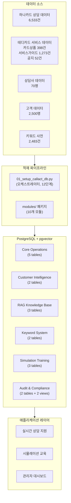
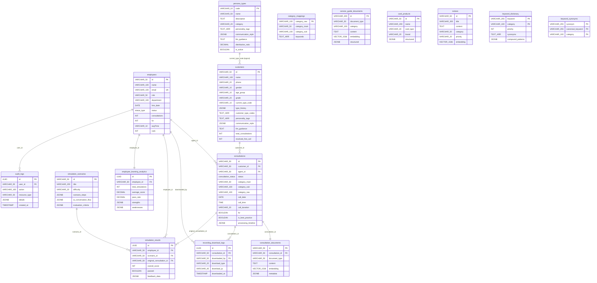

# CALL:ACT DB 설계 및 분석 종합 문서

## 메타데이터
- **작성일**: 2026-01-28
- **작성자**: CALL:ACT Team
- **버전**: v1.0
- **상태**: 완료
- **관련 문서**:
  - [CALLACT_DB_종합_명세서.md](../../../backend_dev/docs/CALLACT_DB_종합_명세서.md) (테이블/필드 명세)
  - [통합_DB_설정_가이드_v3.0.md](../../../backend_dev/docs/통합_DB_설정_가이드_v3.0.md) (설치/실행)
  - [CALL_ACT_ERD_Diagram.png](./CALL_ACT_ERD_Diagram.png) (ERD 이미지)

---

## 목적

본 문서는 CALL:ACT 데이터베이스의 **설계 근거(WHY)** 와 **데이터 분포 분석(HOW)** 을 다룬다.

기존 문서와의 역할 분담:

| 문서 | 역할 |
|------|------|
| `CALLACT_DB_종합_명세서.md` | 테이블/필드 정의 (WHAT) |
| `통합_DB_설정_가이드_v3.0.md` | 설치 및 실행 방법 (HOW TO RUN) |
| **본 문서** | 설계 근거, 데이터 분포, 배분 알고리즘, 페르소나 전략, 활용 계획 (WHY / HOW) |

---

## 배경

### 프로젝트 개요
CALL:ACT는 **AI 기반 콜센터 상담 교육 시스템**이다. 실제 하나카드 상담 데이터를 기반으로, 상담사에게 실시간 RAG 지원과 시뮬레이션 교육을 제공한다.

### 데이터 출처
- **실데이터**: 하나카드 상담 6,533건 (익명화 후 테디카드 컨텍스트로 전환)
- **생성 데이터**: 고객 2,500명, 시뮬레이션 결과, 감사 로그 (결정적 시드 기반)

### 기술 스택
- **DBMS**: PostgreSQL 17 + pgvector 확장 (벡터 유사도 검색)
- **배포**: Docker 컨테이너 (`callact_db_container`, 호스트 포트 5555 -> 컨테이너 5432)
- **임베딩**: OpenAI `text-embedding-ada-002` (1536차원)

### 규모
- 16개 테이블, 3개 함수, 4개 뷰
- 총 약 20,000 레코드 (실데이터 + 참조 데이터 + Mock 데이터)

---

## 1. DB 아키텍처 개요

### 1.1 시스템 구성도



### 1.2 테이블 분류 체계 (16개 테이블)

| 그룹 | 테이블 | 건수 | 용도 |
|------|--------|------|------|
| **Core Operations** | employees, customers, consultations, consultation_documents, category_mappings | 70 / 2,500 / 6,533 / 6,533 / 55 | 실제 상담 업무 워크플로 |
| **Customer Intelligence** | persona_types, customers (페르소나 필드) | 12 / 2,500 | LLM 가이던스용 고객 성향 |
| **RAG Knowledge Base** | service_guide_documents, card_products, notices | 1,273 / 398 / 52 | 벡터 유사도 검색 기반 지식 |
| **Keyword System** | keyword_dictionary, keyword_synonyms | 2,483 / 450 | STT 키워드 추출 및 매칭 |
| **Simulation Training** | simulation_scenarios, simulation_results, employee_learning_analytics | 5 / Mock / Mock | 상담사 교육 시스템 |
| **Audit & Compliance** | recording_download_logs, audit_logs | Mock / Mock | 법적 준수, 이상 감지 |

### 1.3 설계 원칙

**1. RAG-First Design**
- 3개 테이블에 `vector(1536)` 임베딩 컬럼 + HNSW 인덱스 (cosine similarity)
- consultation_documents, service_guide_documents, notices

**2. LLM Guidance Architecture**
- 고객 페르소나 정보(`personality_tags`, `communication_style`, `llm_guidance`)가 LLM 프롬프트에 직접 주입됨
- `persona_types` 마스터 테이블 → `customers` 테이블로 연계

**3. 결정적 재현성 (Deterministic Reproducibility)**
- 모든 데이터 생성에 `random.seed(42)` 고정
- 해싱에 `hashlib.md5()` 사용 (Python `hash()`는 비결정적)
- `datetime.now()` 미사용, 고정 참조 날짜 사용

**4. 실데이터와 Mock 데이터 분리**
- 실데이터: 하나카드 상담 6,533건, 상담사 70명, 고객 2,500명
- Mock 데이터: 시뮬레이션 결과, 다운로드 로그, 감사 로그 (`seed=43` 별도 시드)

**5. 멱등성 (Idempotent Loading)**
- 모든 INSERT에 `ON CONFLICT DO UPDATE` 패턴 적용
- 스크립트 재실행 시 데이터 중복 없음

---

## 2. ERD (Entity Relationship Diagram)

### 2.1 Mermaid ERD 다이어그램



### 2.2 관계 상세 설명

| 관계 | FK 컬럼 | 카디널리티 | 제약조건 |
|------|---------|-----------|---------|
| employees -> consultations | agent_id | 1:N | FK 적용 |
| customers -> consultations | customer_id | 1:N | FK 적용 |
| consultations -> consultation_documents | consultation_id | 1:1 | FK 적용 |
| consultations -> recording_download_logs | consultation_id | 1:N | FK 적용 |
| employees -> recording_download_logs | downloaded_by | 1:N | FK 적용 |
| employees -> simulation_results | employee_id | 1:N | FK 적용 |
| simulation_scenarios -> simulation_results | scenario_id | 1:N | FK 적용 |
| employees -> employee_learning_analytics | employee_id | 1:1 | FK + UNIQUE |
| employees -> audit_logs | user_id | 1:N | FK 적용 |
| persona_types -> customers | current_type_code | 1:N | **논리적 참조 (FK 없음)** |

### 2.3 독립 테이블 설계 이유

아래 테이블은 FK 없이 독립적으로 운영된다:

| 테이블 | 이유 |
|--------|------|
| service_guide_documents (1,273건) | RAG 지식 베이스로 독립 로드. 테디카드 원본 데이터에서 직접 적재 |
| card_products (398건) | 카드 상품 카탈로그. keyword_dictionary에 카드명이 가중치 1.5로 등록 |
| notices (52건) | 시한성 공지. 임베딩 포함하여 RAG 검색 가능 |
| keyword_dictionary (2,483건) | STT 키워드 사전. 13개 카테고리별 독립 관리 |
| keyword_synonyms (450건) | 동의어 매핑. keyword_dictionary와 논리적 연결만 존재 |
| category_mappings (55건) | 57개 원시 카테고리 → 8대분류 + 15중분류 매핑 |

---

## 3. 페르소나 설계

### 3.1 12유형 체계 개요

고객 페르소나는 **Normal(일반)** 4유형 + **Special(특수)** 8유형 = 총 12유형으로 구성된다.

- **Normal (N1-N4)**: 일반적인 고객 성격 유형. 전체 고객의 약 50% 차지
- **Special (S1-S8)**: 특수 상황이나 행동 패턴을 보이는 고객 유형. 전체 고객의 약 50% 차지

### 3.2 유형별 상세

| 코드 | 유형명 | 카테고리 | 분포 | 설명 |
|------|--------|---------|------|------|
| N1 | 일반친절형 | normal | 20.0% (500명) | 일반적인 응대, 친절한 안내 선호 |
| N2 | 조용한내성형 | normal | 13.4% (335명) | 간결한 답변 선호, 불필요한 대화 최소화 |
| N3 | 실용주의형 | normal | 10.4% (259명) | 목적 지향적, 해결책 먼저 제시 |
| N4 | 친화적수다형 | normal | 7.3% (183명) | 대화를 즐기는 고객, 친근한 응대 |
| S1 | 급한성격형 | special | 6.7% (168명) | 빠른 답변 선호, 간결한 핵심 전달 |
| S2 | 꼼꼼상세형 | special | 5.2% (130명) | 상세한 설명 필요, 차근차근 안내 |
| S3 | 감정호소형 | special | 5.2% (131명) | 경청, 공감 후 해결책 제시 |
| S4 | 시니어친화형 | special | 18.7% (468명) | 쉬운 용어, 천천히 반복 안내 |
| S5 | 디지털네이티브 | special | 5.8% (144명) | 앱/웹 셀프서비스 경로 우선 안내 |
| S6 | VIP고객형 | special | 2.5% (62명) | 프리미엄 서비스, 신속 처리 |
| S7 | 반복민원형 | special | 3.0% (74명) | 이전 상담 이력 확인, 확실한 해결책 제시 |
| S8 | 불만항의형 | special | 1.8% (46명) | 차분하게 경청 후 해결 방안 제시 |

#### LLM 가이던스 필드 상세

각 유형에는 3개의 LLM 통합 필드가 정의되어 있다:

| 코드 | personality_tags | communication_style | llm_guidance |
|------|-----------------|--------------------|----|
| N1 | `['normal', 'polite']` | `{"speed": "moderate", "tone": "neutral"}` | 일반적인 응대로 친절하게 안내해주세요. |
| N2 | `['quiet', 'reserved']` | `{"speed": "moderate", "tone": "calm"}` | 간결한 답변을 선호합니다. 불필요한 대화는 최소화하세요. |
| N3 | `['practical', 'efficient']` | `{"speed": "fast", "tone": "direct"}` | 목적 지향적입니다. 해결책을 먼저 제시하세요. |
| N4 | `['friendly', 'talkative']` | `{"speed": "moderate", "tone": "warm"}` | 대화를 즐기는 고객입니다. 친근하게 응대해주세요. |
| S1 | `['impatient', 'direct', 'busy']` | `{"speed": "fast", "tone": "concise"}` | 빠른 답변을 선호합니다. 간결하게 핵심만 전달하세요. |
| S2 | `['detailed', 'analytical']` | `{"speed": "slow", "tone": "thorough"}` | 상세한 설명이 필요합니다. 차근차근 안내해주세요. |
| S3 | `['emotional', 'expressive']` | `{"speed": "moderate", "tone": "empathetic"}` | 경청하고 공감한 후 해결책을 제시해주세요. |
| S4 | `['elderly', 'patient', 'needs_repetition']` | `{"speed": "slow", "tone": "respectful"}` | 천천히 쉬운 용어로 반복 안내해주세요. |
| S5 | `['tech_savvy', 'self_service']` | `{"speed": "fast", "tone": "casual"}` | 앱/웹 셀프서비스 경로를 먼저 안내해주세요. |
| S6 | `['high_value', 'premium', 'loyal']` | `{"speed": "moderate", "tone": "premium"}` | 프리미엄 서비스로 신속하게 처리해주세요. |
| S7 | `['frequent_caller', 'frustrated']` | `{"speed": "moderate", "tone": "solution_focused"}` | 이전 상담 이력을 확인하고, 확실한 해결책을 제시하세요. |
| S8 | `['complaining', 'demanding']` | `{"speed": "moderate", "tone": "calm_professional"}` | 차분하게 경청한 후 해결 방안을 제시해주세요. |

### 3.3 is_active 운용 전략

`persona_types` 테이블의 `is_active BOOLEAN DEFAULT TRUE` 필드는 **런타임 설정 변경**을 위한 것이다.

12개 유형 모두 DB에 저장하되, `is_active` 플래그로 실제 운용할 유형을 선택한다:

| 모드 | 활성 유형 | 용도 |
|------|----------|------|
| **Full (12개)** | N1~N4, S1~S8 전부 | 전체 페르소나 기반 종합 훈련 |
| **Basic (8개)** | N1~N4, S1~S4 | 저빈도 유형(S5~S8) 제외한 기본 훈련 |
| **Focused (6개)** | N1, N2, N3, S1, S4, S8 | 고빈도 유형 집중 초급 훈련 |

운용 방법:
```sql
-- Basic 모드 전환: S5~S8 비활성화
UPDATE persona_types SET is_active = FALSE WHERE code IN ('S5', 'S6', 'S7', 'S8');

-- 애플리케이션 쿼리: 활성 유형만 조회
SELECT * FROM persona_types WHERE is_active = TRUE;

-- Full 모드 복원
UPDATE persona_types SET is_active = TRUE;
```

데이터 삭제 없이 플래그만 변경하므로, 언제든 원래 상태로 복원 가능하다.

### 3.4 분포 분석 (실제 데이터 2,500명 기준)

```
N1 일반친절형    ████████████████████ 500명 (20.0%)
S4 시니어친화형  ██████████████████▋  468명 (18.7%)
N2 조용한내성형  █████████████▍       335명 (13.4%)
N3 실용주의형    ██████████▍          259명 (10.4%)
N4 친화적수다형  ███████▎             183명 ( 7.3%)
S1 급한성격형    ██████▋              168명 ( 6.7%)
S5 디지털네이티브 █████▊              144명 ( 5.8%)
S3 감정호소형    █████▎               131명 ( 5.2%)
S2 꼼꼼상세형    █████▎               130명 ( 5.2%)
S7 반복민원형    ███                   74명 ( 3.0%)
S6 VIP고객형     ██▌                   62명 ( 2.5%)
S8 불만항의형    █▊                    46명 ( 1.8%)
```

- Normal 유형 합계: 1,277명 (51.1%)
- Special 유형 합계: 1,223명 (48.9%)

### 3.5 연령대와 페르소나의 상관관계

S4(시니어친화형)가 18.7%로 가장 높은 Special 유형인 이유는 고객 연령 분포와 직결된다:

| 연령대 | 고객수 | 비율 |
|--------|--------|------|
| 50대 | 694명 | 27.8% |
| 40대 | 640명 | 25.6% |
| 60대 | 547명 | 21.9% |
| 30대 | 327명 | 13.1% |
| 70대 | 149명 | 6.0% |
| 20대 | 135명 | 5.4% |
| 10대 | 8명 | 0.3% |

**50대 이상이 전체의 55.7%** (1,390명)를 차지하며, 이 연령층이 시니어친화형(S4) 배정의 주요 대상이다. 카드 상담 특성상 중장년층 비중이 높은 실제 시장 데이터를 반영한 결과이다.

---

## 4. 원시 데이터 분포 분석

### 4.1 고객 데이터 분포 (2,500명)

**데이터 소스**: `backend_dev/app/db/data/customersData.json`

#### 등급 분포

| 등급 | 고객수 | 비율 |
|------|--------|------|
| GENERAL | 1,508 | 60.3% |
| SILVER | 601 | 24.0% |
| GOLD | 320 | 12.8% |
| VIP | 71 | 2.8% |

피라미드 구조: 상위 등급일수록 적은 인원. VIP 2.8%는 프리미엄 서비스 대상.

#### 성별 분포

| 성별 | 고객수 | 비율 |
|------|--------|------|
| 여성 | 1,369 | 54.8% |
| 남성 | 1,131 | 45.2% |

#### 카드 브랜드 분포

| 브랜드 | 고객수 | 비율 |
|--------|--------|------|
| Local | 861 | 34.4% |
| MasterCard | 847 | 33.9% |
| Visa | 792 | 31.7% |

3개 브랜드가 거의 균등하게 분포.

#### 고객 레코드 주요 필드

| 필드 | 타입 | 설명 |
|------|------|------|
| id | VARCHAR(50) | `CUST-TEDDY-00001` ~ `CUST-TEDDY-02500` |
| current_type_code | VARCHAR(10) | 현재 페르소나 코드 (N1~N4, S1~S8) |
| customer_type_codes | TEXT[] | 적용 가능한 전체 유형 코드 배열 |
| type_history | JSONB | 최근 3회 페르소나 할당 이력 |
| personality_tags | TEXT[] | LLM용 특성 태그 |
| communication_style | JSONB | `{"speed": "...", "tone": "..."}` |
| llm_guidance | TEXT | 고객별 맞춤 LLM 가이드 메시지 |
| total_consultations | INT | 상담 건수 (적재 후 자동 업데이트) |
| resolved_first_call | INT | FCR 해결 건수 (적재 후 자동 업데이트) |

### 4.2 직원 데이터 분포 (70명)

**데이터 소스**: `backend_dev/app/db/data/employeesData.json`

#### 팀 분포

| 팀 | 인원 | 역할 |
|----|------|------|
| 상담1팀 | 20명 | 상담 업무 (상담 배분 대상) |
| 상담2팀 | 20명 | 상담 업무 (상담 배분 대상) |
| 상담3팀 | 20명 | 상담 업무 (상담 배분 대상) |
| IT팀 | 5명 | 비상담 (배분 제외) |
| 관리팀 | 3명 | 비상담 (배분 제외) |
| 교육팀 | 2명 | 비상담 (배분 제외) |

**핵심 설계**: 60명 상담사만 상담 배분 대상. 적재 스크립트에서 `WHERE department ~ '^상담'` 조건으로 필터링.

#### 직급 분포

| 직급 | 인원 |
|------|------|
| 사원 | 41명 |
| 대리 | 13명 |
| 주임 | 10명 |
| 팀장 | 5명 |
| 과장 | 1명 |

#### 성과 지표 필드 (적재 후 자동 계산)

| 필드 | 설명 | 계산 방식 |
|------|------|----------|
| consultations | 담당 상담 건수 | `GROUP BY agent_id COUNT(*)` |
| fcr | FCR 비율 (%) | `COUNT(fcr=TRUE) / COUNT(*) * 100` |
| avgTime | 평균 통화시간 | `AVG(call_duration)` -> MM:SS 변환 |
| rank | 성과 순위 (1~60) | consultations DESC, fcr DESC, avgTime ASC |

### 4.3 상담 데이터 분포 (6,533건)

**데이터 소스**: `data-preprocessing/data/hana/hana_rdb_metadata.json`

#### 대분류 카테고리 분포

| 대분류 | 건수 | 비율 | 전문 풀 |
|--------|------|------|---------|
| 결제/승인 | ~1,559 | 23.9% | 12명 |
| 기타 | ~1,538 | 23.5% | 60명 (전원) |
| 이용내역 | ~919 | 14.1% | 9명 |
| 한도 | ~564 | 8.6% | 7명 |
| 분실/도난 | ~400 | 6.1% | 6명 |
| 포인트/혜택 | ~223 | 3.4% | 4명 |
| 정부지원 | ~167 | 2.6% | 3명 |
| 수수료/연체 | ~163 | 2.5% | 4명 |

#### 원시 카테고리 상위 10개

| 카테고리 | 건수 |
|----------|------|
| 도난/분실 신청/해제 | 927 |
| 이용내역 안내 | 919 |
| 선불카드의 충전/처리 | 402 |
| 카드/신용 문의/신청 | 398 |
| 현금서비스 안내 | 331 |
| 해외결제/해외송금 안내 | 301 |
| 이벤트 안내 | 223 |
| 카드사용료 할인/현금 선할인 | 167 |
| 금액결정 문제내용 | 163 |
| 선불 안내 | 162 |

---

## 5. 데이터 배분 알고리즘

### 5.1 상담사별 상담 건수 배분 (Rank-Based 5-Tier)

60명 상담사에게 6,533건을 배분할 때 **성과 순위(rank) 기반 5단계 목표** 를 사용한다.

| Tier | Rank 범위 | 목표 건수 | 설명 |
|------|----------|----------|------|
| Tier 1 (Ace) | 1~5위 | 132~124건 | 최고 성과자 |
| Tier 2 (High) | 6~15위 | 122~108건 | 고성과자 |
| Tier 3 (Mid-High) | 16~35위 | 106~88건 | 중상위 |
| Tier 4 (Mid-Low) | 36~55위 | 87~79건 | 중하위 |
| Tier 5 (Lower) | 56~60위 | 78~75건 | 하위 |

목표 건수 공식: `target = high - (high - low) * index / (group_count - 1)`

전체 합계가 정확히 6,533건이 되도록 중간 Tier 상담사의 목표를 +-1 조정한다.

#### 배분 알고리즘 (Hybrid 95/5)

```
각 상담 건에 대해:
  1. 해당 카테고리의 전문 상담사 풀에서 후보 선정
  2. 완료율(current_assigned / target) 기준으로 정렬
  3. 최소 완료율 상담사 선택 (허용 오차: ±5%)
  4. 95% 확률: 순차 배분 (최소 완료율 상담사)
  5. 5% 확률: 풀 내 랜덤 선택 (다양성 확보)
  6. 시간 충돌 확인 (동일 분 중복 방지)
```

### 5.2 고객별 상담 건수 배분

2,500명 고객에게 6,533건 상담을 배분하는 패턴:

| 상담 건수 | 목표 비율 | 고객수 (약) |
|----------|----------|------------|
| 1건 (단발) | 40% | ~1,000명 |
| 2~3건 (경량) | 35% | ~875명 |
| 4~6건 (일반) | 18% | ~450명 |
| 7건 이상 (고빈도) | 7% | ~175명 |

배분 절차:
1. 각 고객에게 상담 건수 슬롯 할당
2. 총합이 6,533이 되도록 중간 구간 고객에서 +-1 조정
3. 상담 건을 순차적으로 고객에게 할당
4. 순서 셔플 (랜덤성 확보)

#### 재상담 시나리오 (15%)

2건 이상 상담을 가진 고객의 15% 에 대해:
- 두 번째 상담의 카테고리를 첫 번째와 동일하게 교체
- 다른 고객의 동일 카테고리 상담과 swap
- 이를 통해 FCR 실패 패턴(7일 내 동일 카테고리 재상담)이 자연스럽게 생성됨

### 5.3 대분류별 전문 상담사 풀

각 대분류 카테고리에 전문 상담사 풀을 구성한다:

| 대분류 | 풀 크기 | 구성 방식 |
|--------|---------|----------|
| 결제/승인 | 12명 | 고빈도 카테고리부터 우선 배정 |
| 이용내역 | 9명 | 중복 최소화 (타 카테고리 미배정자 우선) |
| 한도 | 7명 | 동일 |
| 분실/도난 | 6명 | 동일 |
| 수수료/연체 | 4명 | 동일 |
| 포인트/혜택 | 4명 | 동일 |
| 정부지원 | 3명 | 동일 |
| 기타 | 60명 | 전원 참여 (라운드 로빈) |

풀 구성은 `MAIN_CATEGORY_POOL_SIZES` 딕셔너리에 정의되어 있으며, 고빈도 카테고리부터 상담사를 배정하는 Greedy 방식이다.

### 5.4 시간 충돌 방지

동일 상담사가 동일 분(minute)에 두 건 이상의 상담을 가질 수 없다:

- 각 상담사별 할당된 타임스탬프(`YYYYMMDDHHMM`) 집합 관리
- 충돌 감지 시 T+1분, T+2분, ..., T+60분까지 순차 이동
- 영업일: 2026-01-19(월) ~ 2026-01-23(금)
- 영업시간: 09:00 ~ 17:59

### 5.5 FCR 산출 (7일 재상담 감지)

```sql
-- FCR = FALSE 조건:
-- 동일 고객이 동일 category_raw로 7일 이내 재상담한 경우 -> 원래 상담의 fcr = FALSE
UPDATE consultations c1
SET fcr = FALSE
WHERE EXISTS (
    SELECT 1 FROM consultations c2
    WHERE c2.customer_id = c1.customer_id
      AND c2.category_raw = c1.category_raw
      AND c2.call_date > c1.call_date
      AND c2.call_date <= c1.call_date + INTERVAL '7 days'
);
```

이외의 상담은 기본값 `fcr = TRUE`를 유지한다. 결과적으로 약 85% FCR 비율이 달성된다.

---

## 6. 주요 테이블 설계 근거

### 6.1 consultations 테이블

**ID 형식**: `CS-{EMP_ID_숫자}-{YYYYMMDDHHMM}`
- 예: `CS-EMP001-202601191432`
- 사람이 읽을 수 있도록 상담사 ID와 시각 정보를 인코딩

**3단계 카테고리 시스템**:

| 레벨 | 필드 | 개수 | 예시 |
|------|------|------|------|
| Raw | category_raw | 57개 | 도난/분실 신청/해제 |
| Main | category_main | 8개 | 분실/도난 |
| Sub | category_sub | 15개 | 신청/등록 |

- `handled_categories TEXT[]`: 복합 상담 시 관련 카테고리 추가 (7% 확률)
- `processing_timeline JSONB`: 카테고리별 전형적 처리 단계를 시간과 함께 기록

**processing_timeline 예시** (분실/도난):
```json
[
    {"time": "09:15:30", "action": "본인확인", "category": null},
    {"time": "09:17:45", "action": "분실신고 접수", "category": "분실/도난"},
    {"time": "09:20:10", "action": "카드 즉시 정지", "category": "분실/도난"},
    {"time": "09:22:30", "action": "재발급 안내", "category": "분실/도난"},
    {"time": "09:24:00", "action": "상담 종료", "category": null}
]
```

### 6.2 customers 테이블

**이중 페르소나 아키텍처**:
- `current_type_code`: 현재 활성 페르소나 (단일 값)
- `customer_type_codes TEXT[]`: 적용 가능한 전체 유형 코드 배열 (복수 페르소나 지원)
- `type_history JSONB`: 최근 3회 페르소나 할당 이력 (날짜, 상담 ID 포함)

**LLM 직접 통합 필드**:
- `personality_tags TEXT[]`: 고객 특성 태그 -> LLM 프롬프트에 삽입
- `communication_style JSONB`: 속도/톤 설정 -> LLM 응답 스타일 조절
- `llm_guidance TEXT`: 고객 이름 포함 맞춤 가이드 -> LLM 시스템 프롬프트에 삽입

**통계 필드**: `total_consultations`, `resolved_first_call`, `last_consultation_date`는 상담 데이터 적재 후 `update_stats.py` 모듈이 자동 계산하여 업데이트한다.

### 6.3 persona_types 테이블

**마스터-디테일 패턴**:
- `persona_types`가 마스터 (12행 고정)
- `customers`가 디테일 (`current_type_code`로 참조)
- FK 제약조건 없음 (의도적): 페르소나 변경 유연성 확보, 비활성 유형 참조 허용

**distribution_ratio 필드**:
- 데이터 생성 시 참고용 비율 (정규화 합계 = 1.00)
- 실제 데이터에서의 분포와 일치하도록 수정 완료 (v1.0 기준)

### 6.4 RAG 벡터 테이블

3개 테이블이 `vector(1536)` 컬럼을 가진다:

| 테이블 | 문서수 | 용도 |
|--------|--------|------|
| consultation_documents | 6,533 | 과거 상담 기록 기반 유사 사례 검색 |
| service_guide_documents | 1,273 | 테디카드 서비스 가이드 검색 |
| notices | 52 | 공지사항 관련 상담 시 참조 |

**HNSW 인덱스 설정**:
```sql
CREATE INDEX ON consultation_documents
USING hnsw (embedding vector_cosine_ops)
WITH (m = 16, ef_construction = 64);
```

- `m = 16`: 각 노드의 최대 연결 수
- `ef_construction = 64`: 인덱스 구축 시 탐색 범위
- `vector_cosine_ops`: 코사인 유사도 기반 검색

---

## 7. 카테고리 매핑 체계

### 7.1 3단계 구조

```
57개 원시 카테고리 (하나카드)
    ↓ 정규화 (normalize_category)
    ↓ 매핑 (CATEGORY_MAPPINGS 딕셔너리)
8개 대분류 × 15개 중분류
```

**8개 대분류**: 결제/승인, 이용내역, 한도, 분실/도난, 수수료/연체, 포인트/혜택, 정부지원, 기타

**15개 중분류**: 조회/안내, 신청/등록, 변경, 취소/해지, 처리/실행, 발급, 확인서, 배송, 즉시출금, 상향/증액, 이체/전환, 환급/반환, 정지/해제, 결제일, 기타

### 7.2 정규화 로직

원시 카테고리를 매핑하기 전에 3단계 정규화를 수행한다:

1. **띄어쓰기 통일**: `"가상 계좌"` → `"가상계좌"`
2. **순서 통일**: `"도난/분실"` → `"분실/도난"` (가나다순)
3. **마스킹 태그 제거**: `"[카드사명#1]"` → `"테디카드"`

정확 매핑이 실패하면 키워드 기반 추론으로 Fallback한다.

### 7.3 매핑 테이블 (category_mappings)

`category_mappings` 테이블(55행)에 SQL 레벨에서도 매핑 정보를 유지한다:

| 필드 | 설명 |
|------|------|
| category_raw | 정규화된 원시 카테고리 (PK, UNIQUE) |
| category_main | 매핑된 대분류 |
| category_sub | 매핑된 중분류 |
| keywords | 카테고리명에서 추출한 검색 키워드 배열 |

---

## 8. 로그 저장 설계

### 8.1 녹취 다운로드 이력 (recording_download_logs)

**법적 요건**: 상담 녹취 접근 이력 5년 보관

| 필드 | 설명 |
|------|------|
| consultation_id | 대상 상담 (FK) |
| downloaded_by | 다운로드한 직원 (FK) |
| download_type | txt, wav, mp3 |
| download_ip | IPv4/IPv6 (VARCHAR(45)) |
| download_user_agent | 브라우저 정보 |
| file_name, file_path, file_size | 파일 메타데이터 |
| downloaded_at | 다운로드 시각 (NOT NULL) |

**인덱스 전략**:
- `(consultation_id, downloaded_at DESC)`: 특정 상담의 다운로드 이력 조회
- `(downloaded_by, downloaded_at DESC)`: 특정 직원의 다운로드 이력 조회

### 8.2 시스템 감사 로그 (audit_logs)

범용 감사 추적 테이블. 11개 액션 유형을 지원한다:

| 액션 | 설명 |
|------|------|
| RECORDING_DOWNLOAD | 녹취 파일 다운로드 |
| RECORDING_PLAY | 녹취 재생 |
| CUSTOMER_VIEW | 고객 정보 조회 |
| CUSTOMER_EDIT | 고객 정보 수정 |
| CONSULTATION_VIEW | 상담 내역 조회 |
| CONSULTATION_EDIT | 상담 내역 수정 |
| DATA_EXPORT | 데이터 내보내기 |
| REPORT_GENERATE | 보고서 생성 |
| LOGIN / LOGOUT | 시스템 접속/종료 |
| PASSWORD_CHANGE | 비밀번호 변경 |
| PERMISSION_CHANGE | 권한 변경 |

`details JSONB` 필드로 액션별 추가 메타데이터를 유연하게 저장한다.

### 8.3 이상 감지 뷰

**v_suspicious_downloads**: 1시간 내 10건 이상 다운로드한 직원 감지
```sql
-- 탐지 조건: 1시간 내 10건 이상
-- 출력: user_id, employee_name, download_count, last_download, consultation_ids
```

**v_daily_download_stats**: 최근 30일 일별 다운로드 통계
- 총 다운로드 수, 유니크 사용자 수, 유니크 상담 수

### 8.4 Mock 데이터

현재 로그 테이블에는 Mock 데이터가 적재된다:
- 다운로드 로그: 100건 (`random.seed(43)`)
- 감사 로그: 50건 (`random.seed(43)`)
- 메인 데이터와 별도 시드 사용으로 재현성 보장

---

## 9. 시뮬레이션 교육 시스템

### 9.1 시나리오 구조 (5개)

| ID | 제목 | 난이도 | 예상시간 | AI 고객 페르소나 |
|----|------|--------|---------|--------------|
| SIM-001 | 카드 분실 신고 및 재발급 | 초급 | 300초 | 급한성격형 (S1) |
| SIM-002 | 해외 결제 차단 해제 | 중급 | 420초 | 급한성격형 (S1) |
| SIM-003 | 포인트 적립 누락 문의 | 초급 | 240초 | 꼼꼼상세형 (S2) |
| SIM-004 | 분할결제 취소 요청 | 중급 | 360초 | 실용주의형 (N3) |
| SIM-005 | 이중결제 환불 요청 | 고급 | 480초 | 불만항의형 (S8) |

SIM-005는 `locked = TRUE`이며, 이전 시나리오 완료 후 해제된다.

### 9.2 AI 고객 대화 흐름

각 시나리오에 `ai_conversation_flow JSONB` 필드가 정의되어 있다:

```json
{
    "initial": {
        "message": "안녕하세요, 카드를 분실했어요! 빨리 정지시켜주세요!",
        "emotion": "urgent",
        "tts_settings": {"pitch": 1.1, "rate": 1.2}
    },
    "responses": {
        "empathy_high": {
            "trigger": ["걱정", "안심", "빠르게"],
            "message": "네, 빨리 처리해주셔서 감사합니다.",
            "emotion": "calm"
        }
    },
    "triggers": {
        "card_stopped": {
            "condition": "카드 정지 처리 완료",
            "message": "카드가 정지되었나요? 확인 부탁드려요.",
            "emotion": "anxious"
        }
    }
}
```

- `initial`: 시뮬레이션 시작 시 AI 고객의 첫 발화
- `responses`: 상담사 키워드에 반응하는 분기 응답
- `triggers`: 특정 조건 충족 시 발동되는 대화

### 9.3 평가 체계

4개 항목의 가중 점수:

| 항목 | 가중치 | 설명 |
|------|--------|------|
| document_usage | 25~30% | 관련 문서 활용도 |
| keyword_coverage | 20~25% | 핵심 키워드 사용 비율 |
| sequence_correctness | 25% | 처리 순서 정확도 |
| customer_satisfaction | 20~30% | AI 고객 만족도 |

합격 기준: 70~75점 (시나리오별 상이)

### 9.4 학습 분석 (employee_learning_analytics)

직원당 1행으로 누적 학습 통계를 관리한다:

| 필드 | 설명 |
|------|------|
| total_simulations | 총 시뮬레이션 횟수 |
| average_score | 평균 점수 |
| pass_rate | 합격률 |
| improvement_rate | 향상도 (최근 5회 vs 초기 5회 평균 차이) |
| strengths JSONB | 강점 분석 `[{"skill": "문서활용", "score": 85}]` |
| weaknesses JSONB | 약점 분석 `[{"skill": "고객공감", "score": 62}]` |
| category_performance JSONB | 카테고리별 성과 |
| completed_scenarios TEXT[] | 완료 시나리오 목록 |

---

## 10. 데이터 활용 계획

### 10.1 실시간 상담 지원 (RAG + 페르소나 가이던스)

상담 접수 시 시스템의 데이터 활용 흐름:

```
1. 고객 식별 → customers 테이블에서 페르소나 정보 로드
2. llm_guidance, personality_tags, communication_style → LLM 프롬프트 주입
3. fn_get_consultation_relevance() → 최근 상담 이력 + 유의미성 점수
4. fn_find_similar_recent_consultations() → 7일 내 동일 카테고리 재상담 감지
5. STT 키워드 추출 → keyword_dictionary 매칭 → service_guide_documents 벡터 검색
6. 유사 문서 추천 → 상담사 화면에 표시
```

### 10.2 상담사 교육

| 교육 유형 | DB 활용 |
|----------|--------|
| Best Practice 학습 | `consultations WHERE is_best_practice = TRUE` → 모범 상담 재현 |
| 시나리오 훈련 | simulation_scenarios → AI 고객과 대화 → simulation_results 기록 |
| 성과 추적 | employee_learning_analytics → 강점/약점/향상도 분석 |
| 시나리오 잠금 해제 | `completed_scenarios` 배열 기반 진급 시스템 |

### 10.3 관리자 대시보드

| 대시보드 항목 | 데이터 소스 |
|--------------|-----------|
| 상담사 성과 순위 | employees.rank, consultations, fcr, avgTime |
| 카테고리별 상담 현황 | category_mappings + consultations 집계 |
| 고객 분포 분석 | customers 등급/연령/페르소나 분포 |
| FCR 추이 | consultations.fcr 기간별 집계 |
| 이상 다운로드 감지 | v_suspicious_downloads 뷰 |
| 일별 다운로드 통계 | v_daily_download_stats 뷰 |

---

## 11. 데이터 품질 보장

### 11.1 재현성 (Reproducibility)

| 기법 | 적용 위치 | 목적 |
|------|----------|------|
| `random.seed(42)` | 모든 데이터 모듈 | 동일 입력 → 동일 출력 보장 |
| `random.seed(43)` | generate_mock.py | 감사 데이터 별도 시드 |
| `hashlib.md5()` | load_consultations.py | 결정적 해싱 (Python `hash()` 대체) |
| 고정 참조 날짜 | 모든 모듈 | `datetime.now()` 미사용 |
| `ON CONFLICT DO UPDATE` | 모든 INSERT SQL | 멱등성 보장 (재실행 안전) |

### 11.2 적재 순서 의존성 (12단계)

```
[1/12] 기본 DB 스키마 (employees, consultations, consultation_documents)
[2/12] 테디카드 테이블 (service_guide_documents, card_products, notices)
[3/12] 키워드 사전 테이블 (keyword_dictionary, keyword_synonyms)
  ├── [3-1] 페르소나 유형 테이블 (persona_types)
  ├── [3-2] 고객 테이블 (customers)
  ├── [3-3] 시뮬레이션 테이블 (simulation_scenarios, simulation_results, ...)
  ├── [3-4] 감사 로그 테이블 (recording_download_logs, audit_logs)
  ├── [3-5] 상담 이력 유의미성 함수/뷰
  └── [3-6] 카테고리 매핑 데이터
[4/12] 상담사 데이터 적재 (employeesData.json → employees)
  └── [4-1] 고객 데이터 적재 (customersData.json → customers)
[5/12] 하나카드 데이터 적재 ← 핵심 단계
  ├── 카테고리 정규화 + 매핑
  ├── 고객 배분 (2,500명)
  ├── 상담사 배분 (60명, Rank-Based)
  ├── processing_timeline 생성
  ├── FCR 계산
  └── consultation_documents 적재
[6/12] 상담사 성과 지표 업데이트
  └── [6-1] 고객별 상담 통계 업데이트
[7/12] 키워드 사전 데이터 적재
[8/12] 테디카드 데이터 적재
[9/12] 시뮬레이션 Mock 데이터 생성
[12/12] 데이터 적재 검증
```

의존 관계: 스키마 → 상담사/고객 → 상담 데이터 → 성과 지표 → 검증

### 11.3 검증 체크리스트 (verify.py)

`verify.py` 모듈(443줄)이 다음을 검증한다:

| 검증 항목 | 기대값 |
|----------|--------|
| 필수 테이블 존재 | 16개 전부 |
| employees 건수 | >= 10 (DEFAULT 제외) |
| consultations 건수 | >= 1 (일반 6,533) |
| customers 건수 | >= 1 (일반 2,500) |
| persona_types 건수 | 정확히 12 |
| simulation_scenarios 건수 | >= 5 |
| pgvector 확장 | 설치 확인 |
| HNSW 인덱스 | 3개 확인 |
| 상담사 배분 균등도 | 분포 검증 |
| 카테고리 매핑 완전성 | 누락 없음 확인 |

---

## 결론 / 다음 단계

### 요약

CALL:ACT DB는 16개 테이블, 3개 함수, 4개 뷰로 구성된 PostgreSQL 기반 시스템이다. 하나카드 실데이터 6,533건을 기반으로, Rank-Based 배분 알고리즘으로 60명 상담사와 2,500명 고객에게 분배하고, 12개 페르소나 유형에 따른 LLM 가이던스를 제공한다.

### 강점
- **결정적 재현성**: seed 고정 + 멱등성으로 어디서든 동일 결과 재현
- **RAG 통합**: pgvector HNSW 인덱스로 밀리초 단위 유사 문서 검색
- **유연한 페르소나**: `is_active` 플래그로 운용 모드 전환 (12/8/6)
- **법적 준수**: 녹취 다운로드 이력 + 이상 감지 뷰

### 다음 단계
1. 실시간 STT 키워드 추출 파이프라인 구현
2. 시뮬레이션 시나리오 확장 (현재 5개 → 목표 20개 이상)
3. 고객 만족도 예측 모델 연동
4. A/B 테스트 기반 페르소나 가이던스 효과 측정
