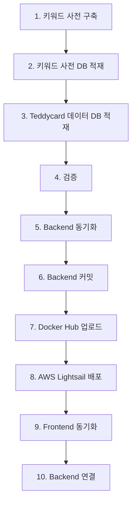

# DB 적재 및 배포 통합 작업

**작성일**: 2026-01-13  
**작성자**: CALL:ACT Team  
**버전**: v1.0

---

## 개요

키워드 사전 구축부터 DB 적재, Docker Hub/AWS Lightsail 배포, Frontend/Backend 동기화까지 전체 파이프라인을 완료하고 문서화합니다.

## 작업 흐름



## 문서 목록

### 완료된 작업

1. **[07_Backend_구조_비교_분석.md](./07_Backend_구조_비교_분석.md)** ✅
   - Backend와 Backend_dev 구조 비교
   - 동기화 전략 수립

2. **[08_Teddycard_데이터_검증.md](./08_Teddycard_데이터_검증.md)** ✅
   - 검증 스크립트 작성 및 사용법
   - 검증 항목 및 결과 해석

3. **[09_Backend_동기화_가이드.md](./09_Backend_동기화_가이드.md)** ✅
   - Backend 최신 파일 복사 과정
   - 구조 병합 및 충돌 해결

4. **[10_Backend_커밋_가이드.md](./10_Backend_커밋_가이드.md)** ✅
   - Backend 브랜치 커밋 과정
   - Git 서브모듈 관리

### 진행 중인 작업

5. **[01_DBeaver_테이블_확인_방법.md](./01_DBeaver_테이블_확인_방법.md)**
   - DBeaver를 사용한 테이블 확인 방법

6. **[02_팀레포_커밋_및_DB_적재_순서.md](./02_팀레포_커밋_및_DB_적재_순서.md)**
   - 팀 레포 커밋 및 DB 적재 순서

7. **[03_DB_스키마_문서번호_정보_점검.md](./03_DB_스키마_문서번호_정보_점검.md)**
   - DB 스키마 문서번호 정보 점검

8. **[04_최종_정리_요약.md](./04_최종_정리_요약.md)**
   - 최종 정리 요약

9. **[05_ERD_업데이트_내용.md](./05_ERD_업데이트_내용.md)**
   - ERD 업데이트 내용

10. **[06_DB_스키마_에러_해결_가이드.md](./06_DB_스키마_에러_해결_가이드.md)**
    - DB 스키마 에러 해결 가이드

## 빠른 시작

### 1. DB 적재 검증

```bash
conda activate final_env
cd backend_dev/app/db/scripts
python 06_verify_teddycard_load.py
```

### 2. Backend 동기화 확인

```bash
# Backend_dev와 Backend 구조 비교
# 참고: [07_Backend_구조_비교_분석.md](./07_Backend_구조_비교_분석.md)
```

### 3. Backend 커밋

```bash
cd backend
git checkout -b feat/teddycard-db-loading
git add app/db/scripts/02_*.sql app/db/scripts/03_*.sql app/db/scripts/04_*.py app/db/scripts/05_*.py app/db/scripts/06_*.py
git commit -m "feat: Add Teddycard data DB loading scripts"
git push origin feat/teddycard-db-loading
```

## 체크리스트

### Phase 1: 키워드 사전 구축 및 DB 적재
- [x] 키워드 사전 우선순위 계산 로직 개선
- [x] 키워드 사전 구축 실행
- [x] 키워드 사전 DB 스키마 생성
- [x] 키워드 사전 DB 적재

### Phase 2: Teddycard 데이터 DB 적재
- [x] DB 스키마 확인
- [x] Teddycard 데이터 DB 적재 스크립트 작성
- [x] Teddycard 데이터 DB 적재 실행
- [x] 검증 스크립트 작성
- [x] 검증 실행

### Phase 3: Backend 동기화
- [x] Backend와 Backend_dev 구조 비교
- [x] Backend 최신 파일 복사
- [x] 구조 병합 및 충돌 확인
- [x] Backend 브랜치 커밋

### Phase 4: Docker Hub 업로드 및 AWS Lightsail 배포
- [ ] Docker 이미지 빌드 및 업로드
- [ ] AWS Lightsail 배포

### Phase 5: Frontend 동기화
- [ ] Frontend_dev와 Frontend 비교 분석
- [ ] STT 연결 부분 반영
- [ ] Frontend 동기화

### Phase 6: Backend 연결
- [ ] 팀원 작업 반영
- [ ] 새 DB 연결
- [ ] JSON 구조 반영

## 참고 문서

- [개발 룰](../00_rules/01_dev_rules.md)
- [서브모듈 관리 가이드](../00_git/서브모듈_관리_가이드.md)
- [테디카드 전처리 데이터 커밋 가이드](../00_git/테디카드_전처리_데이터_커밋_가이드.md)

---

## 다음 단계

1. **Backend 커밋 완료**: `feat/teddycard-db-loading` 브랜치에 커밋 완료
2. **Pull Request 생성**: GitHub에서 PR 생성 및 리뷰 요청
3. **Docker Hub 업로드**: PostgreSQL + pgvector 이미지 빌드 및 업로드
4. **AWS Lightsail 배포**: 클라우드 환경에 배포
