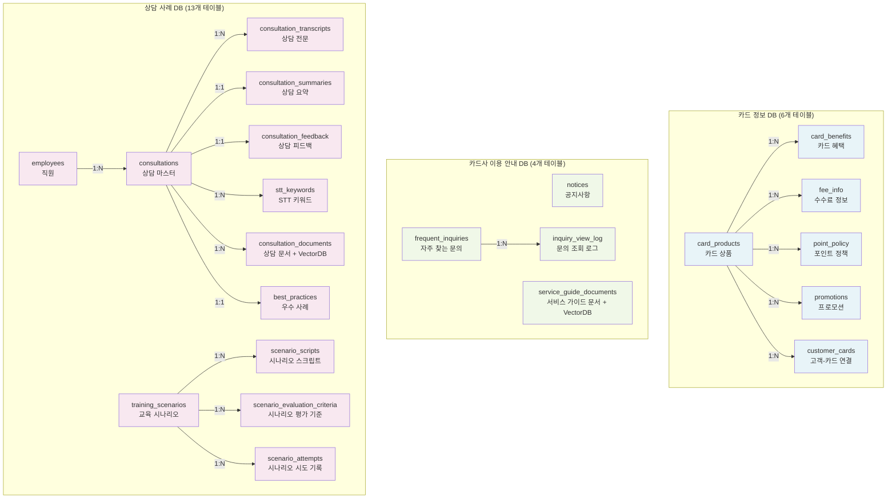
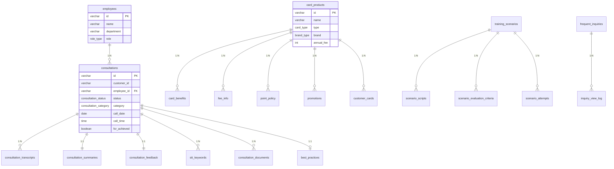
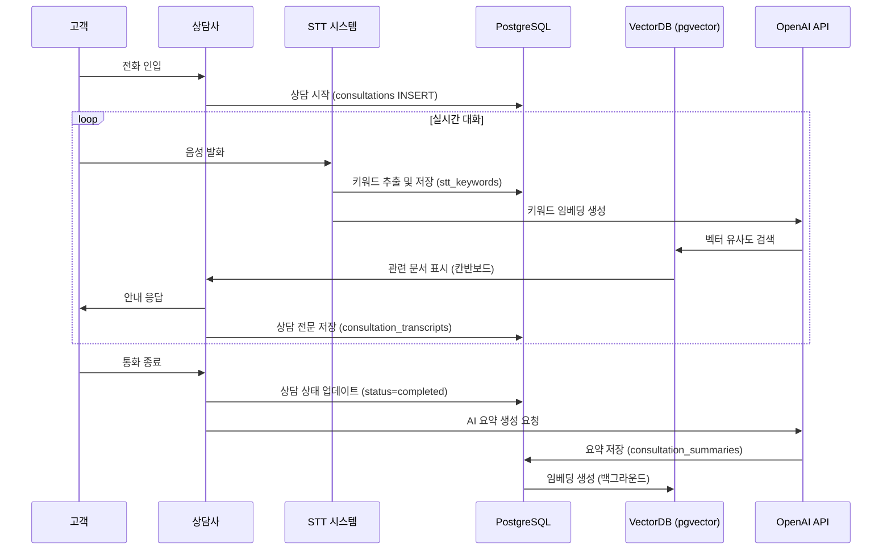

# CALL:ACT 데이터베이스 설계 문서


## 목차

1. [목적 및 배경](#1-목적-및-배경)
2. [프로젝트 개요](#2-프로젝트-개요)
3. [데이터베이스 전체 개요](#3-데이터베이스-전체-개요)
4. [ERD (Entity-Relationship Diagram)](#4-erd-entity-relationship-diagram)
5. [관계 도출 근거](#5-관계-도출-근거)
6. [Entity 간 관계 및 연결 조건](#6-entity-간-관계-및-연결-조건)
7. [정규화 및 데이터 중복 방지 설계](#7-정규화-및-데이터-중복-방지-설계)
8. [테이블 정의](#8-테이블-정의)
9. [Enum 타입 정의](#9-enum-타입-정의)
10. [제약조건](#10-제약조건)
11. [인덱스 전략](#11-인덱스-전략)
12. [데이터 파티셔닝 전략](#12-데이터-파티셔닝-전략)
13. [보안 및 권한 관리](#13-보안-및-권한-관리)

---

## 1. 목적 및 배경

### 1.1 문서 목적

본 문서는 **CALL:ACT (카드사 상담 지원 시스템)** 데이터베이스의 ERD 스키마 설계를 체계적으로 정리한 최종 산출물입니다. 단순히 테이블 구조를 나열하는 것을 넘어, **왜 이러한 설계를 선택했는지**, **어떤 논리적 근거로 데이터를 구조화했는지**를 명확하게 제시합니다.

이 문서를 통해:
- 개발팀은 데이터베이스 설계의 의도를 명확히 이해할 수 있습니다
- 향후 확장이나 수정 시에도 일관된 설계 철학을 유지할 수 있습니다
- 데이터베이스 구현 시 참조할 수 있는 완전한 가이드를 제공합니다

### 1.2 설계 배경

CALL:ACT는 카드사 상담사를 지원하는 AI 기반 실시간 상담 시스템입니다. 이 시스템은 다음과 같은 핵심 요구사항을 가지고 있습니다:

1. **실시간 상담 지원**: STT(Speech-to-Text) 기반 키워드 추출과 RAG(Retrieval-Augmented Generation) 검색을 통한 즉각적인 정보 제공
2. **상담 후처리 자동화**: AI를 활용한 상담 요약, 유사 사례 참고, 품질 평가
3. **교육 시스템 통합**: 신입 상담사 교육을 위한 시뮬레이션 및 평가 기능
4. **개인정보 보호**: 고객 개인정보에 대한 엄격한 보안 및 법적 compliance

이러한 요구사항을 충족하기 위해 데이터베이스 설계 단계에서 다음과 같은 핵심 과제를 해결했습니다:

- **도메인 분리**: 카드 정보, 서비스 가이드, 상담 사례라는 서로 다른 성격의 데이터를 논리적으로 분리
- **개인정보 보호**: 고객 개인정보를 안전하게 관리하면서도 상담 업무를 지원
- **AI 통합**: RAG 시스템을 위한 VectorDB와 기존 RDB를 통합

---

## 2. 프로젝트 개요

### 2.1 서비스명
**CALL:ACT** (Call + Correct + Collect = Act)

### 2.2 서비스 슬로건
"CALL:ACT는 카드 상담사가 흩어진 약관과 정책을 한눈에 확인하고 즉시 정확한 처리를 할 수 있도록 돕는 상담 지원 서비스입니다."

### 2.3 시스템 아키텍처
- **Frontend**: React + TypeScript, Tailwind CSS
- **Backend**: FastAPI + Python
- **Database**: PostgreSQL 16+ with pgvector extension
- **AI**: OpenAI GPT-4 (상담 요약), OpenAI Embedding API (RAG 검색)
- **STT**: Speech-to-Text 시스템 (음성 인식 및 키워드 추출)
- **Cache**: Redis (자주 조회되는 데이터 캐싱)

---

## 3. 데이터베이스 전체 개요

### 3.1 전체 구조

본 ERD 스키마는 **23개의 테이블**과 **16개의 Enum 타입**으로 구성되며, 3개의 논리적 데이터베이스로 분리됩니다.

| 데이터베이스 | 설명 | 테이블 수 | 주요 역할 |
|--------------|------|-----------|-----------|
| **카드 정보 DB** | 카드 상품, 혜택, 수수료 정보 | 6개 | 카드 정보 관리 및 RAG 검색 지원 |
| **카드사 이용 안내 DB** | 공지사항, 자주 찾는 문의, 가이드 문서 | 4개 | 서비스 안내 관리 및 RAG 검색 지원 |
| **상담 사례 DB** | 상담 내역, 교육 시나리오, 직원 정보 | 13개 | 상담 및 교육 관리, RAG 검색 지원 |

### 3.2 주요 통계
- **DBMS**: PostgreSQL 16+ with pgvector extension
- **전체 테이블 수**: 23개
- **Enum 타입**: 16개
- **Foreign Key 관계**: 22개
- **VectorDB 통합**: pgvector (OpenAI embedding 1536차원)

### 3.3 설계 원칙
1. **개인정보 보호 우선**: customers 테이블 제외, customer_id를 외부 참조로만 사용
2. **도메인 주도 설계 (DDD)**: 3개 논리적 DB로 명확한 경계 설정
3. **정규화 수준**: 제3정규형(3NF) 기본, 선택적 비정규화 허용
4. **VectorDB 통합**: pgvector 확장 사용 (RAG 시스템 구축)
5. **성능 최적화**: 인덱스 전략, 벡터 검색 인덱스 (IVFFlat, HNSW)

### 3.4 아키텍처 다이어그램

#### 3.4.1 3개 논리적 데이터베이스 구조



#### 3.4.2 주요 테이블 관계도



#### 3.4.3 실시간 상담 데이터 흐름



---

## 4. ERD (Entity-Relationship Diagram)

### 4.1 ERD 다이어그램

다음 DBML 스키마를 https://dbdiagram.io/d 에 붙여넣어 ERD 다이어그램을 생성할 수 있습니다.


### 4.2 DBML 스키마 전체 코드

```dbml
// ==================================================
// CALL:ACT Database Schema (DBML)
// ==================================================
// Description: CALL:ACT 카드사 상담 지원 시스템 데이터베이스 스키마
// Author: CALL:ACT Team
// Date: 2026-01-07
// Database: PostgreSQL with pgvector extension
// ==================================================

// ==================================================
// ENUMS
// ==================================================

Enum consultation_status {
  completed        [note: '완료']
  in_progress      [note: '진행중']
  incomplete       [note: '미완료']
}

Enum card_type {
  credit          [note: '신용카드']
  debit           [note: '체크카드']
}

Enum brand_type {
  visa
  mastercard
  amex
  unionpay
}

Enum consultation_category {
  card_loss        [note: '카드분실']
  overseas_payment [note: '해외결제']
  fee_inquiry      [note: '수수료문의']
  points           [note: '포인트']
  limit_inquiry    [note: '한도조회']
  other            [note: '기타']
}

Enum benefit_type {
  discount         [note: '할인']
  points_accrual   [note: '포인트적립']
  cashback         [note: '캐시백']
}

Enum fee_type {
  overseas_fee           [note: '해외수수료']
  cash_service_fee       [note: '현금서비스수수료']
  annual_fee             [note: '연회비']
}

Enum emotion_type {
  positive        [note: '긍정적']
  neutral         [note: '중립']
  negative        [note: '부정적']
}

Enum quality_rating {
  high           [note: '상']
  medium         [note: '중']
  low            [note: '하']
}

Enum speaker_type {
  customer
  agent
}

Enum difficulty_level {
  beginner       [note: '초급']
  intermediate   [note: '중급']
  advanced       [note: '고급']
}

Enum scenario_type {
  real_case       [note: '실제 사례']
  llm_generated   [note: 'LLM 생성']
}

Enum notice_priority {
  normal         [note: '일반']
  important      [note: '중요']
  urgent         [note: '긴급']
}

Enum notice_category {
  system         [note: '시스템']
  service        [note: '서비스']
  emergency      [note: '긴급']
}

Enum status {
  active
  inactive
  suspended
}

Enum promotion_status {
  ongoing        [note: '진행중']
  ended          [note: '종료']
}

Enum card_status {
  active         [note: '정상']
  suspended      [note: '정지']
  lost           [note: '분실']
  terminated     [note: '해지']
}

// ==================================================
// TABLE GROUP 1: 카드 정보 DB (Card Information Database)
// ==================================================

Table card_products {
  id varchar(50) [pk, note: 'CARD-001']
  name varchar(200) [not null, note: '하나카드 원큐 VIVA 체크카드']
  card_type card_type [not null]
  brand brand_type
  annual_fee_domestic int [note: '국내전용 연회비']
  annual_fee_global int [note: '해외겸용 연회비']
  performance_condition text [note: '실적 조건']
  main_benefits text [note: '주요 혜택 (간략)']
  status status [default: 'active']
  created_at timestamp [default: `now()`]
  updated_at timestamp

  note: '카드 상품 마스터 테이블'
}

Table card_benefits {
  id serial [pk]
  card_id varchar(50) [not null, ref: > card_products.id]
  category varchar(100) [note: '주유, 커피, 편의점, 통신비']
  benefit_type benefit_type [not null]
  benefit_rate decimal(5,2) [note: '5.00 = 5% 할인']
  benefit_limit int [note: '월 한도 (원)']
  condition_text text [note: '월 30만원 이상 이용시']
  partner_name varchar(200) [note: '제휴사명 (SK에너지, 스타벅스 등)']
  created_at timestamp [default: `now()`]

  indexes {
    card_id
    category
    benefit_type
  }

  note: '카드 혜택 상세 테이블'
}

Table fee_info {
  id serial [pk]
  fee_type fee_type [not null]
  card_id varchar(50) [ref: > card_products.id]
  fee_rate decimal(5,2) [note: '1.50 = 1.5%']
  fixed_fee int [note: '고정 수수료 (원)']
  description text
  exemption_condition text [note: '면제 조건']
  created_at timestamp [default: `now()`]

  indexes {
    card_id
    fee_type
  }

  note: '수수료 정보 테이블'
}

Table point_policy {
  id serial [pk]
  card_id varchar(50) [not null, ref: > card_products.id]
  category varchar(100) [note: '일반가맹점, 해외가맹점']
  point_rate decimal(5,2) [note: '0.50 = 0.5% 적립']
  point_unit int [note: '적립 단위 (1000원당)']
  expiry_months int [note: '포인트 유효기간 (개월)']
  created_at timestamp [default: `now()`]

  indexes {
    card_id
  }

  note: '포인트 정책 테이블'
}

Table promotions {
  id varchar(50) [pk, note: 'PROMO-2025-001']
  title varchar(200) [not null, note: '하나카드x메가커피 프로모션']
  card_id varchar(50) [ref: > card_products.id]
  start_date date [not null]
  end_date date [not null]
  benefit_description text
  conditions text
  target_customer varchar(50) [note: '신규고객, 전체, 우수고객']
  status promotion_status [default: 'ongoing']
  created_at timestamp [default: `now()`]

  indexes {
    card_id
    (start_date, end_date)
    status
  }

  note: '프로모션 정보 테이블'
}

Table customer_cards {
  id serial [pk]
  customer_id varchar(50) [not null, note: '외부 시스템 고객 ID (FK 없음)']
  card_id varchar(50) [not null, ref: > card_products.id]
  issued_date date [not null, note: '발급일']
  card_number_hash varchar(64) [note: '카드번호 해시 (보안)']
  card_status card_status [default: 'active']
  is_primary boolean [default: false, note: '주 카드 여부']
  created_at timestamp [default: `now()`]
  updated_at timestamp

  indexes {
    customer_id
    card_id
    (customer_id, card_id) [unique]
  }

  note: '고객-카드 연결 테이블 (customer_id는 외부 시스템 참조)'
}

// ==================================================
// TABLE GROUP 2: 카드사 이용 안내 DB (Service Guide Database)
// ==================================================

Table notices {
  id varchar(50) [pk, note: 'NOTICE-2025-001']
  title varchar(300) [not null]
  content text [not null]
  category notice_category [not null]
  priority notice_priority [default: 'normal']
  is_pinned boolean [default: false, note: '상단 고정 여부']
  start_date date [not null]
  end_date date
  status status [default: 'active']
  created_by varchar(50) [note: '작성자 ID']
  created_at timestamp [default: `now()`]
  updated_at timestamp

  indexes {
    category
    priority
    is_pinned
    (start_date, end_date)
  }

  note: '공지사항 테이블'
}

Table frequent_inquiries {
  id serial [pk]
  category consultation_category [not null]
  question text [not null, note: '연회비는 언제 청구되나요?']
  answer text [not null, note: '카드 발급일 기준 1년 후...']
  view_count int [default: 0, note: '조회수']
  is_active boolean [default: true]
  display_order int [note: '표시 순서']
  created_at timestamp [default: `now()`]
  updated_at timestamp

  indexes {
    category
    display_order
    view_count
  }

  note: '자주 찾는 문의 테이블'
}

Table inquiry_view_log {
  id serial [pk]
  inquiry_id int [not null, ref: > frequent_inquiries.id]
  viewed_by varchar(50) [note: '조회한 사용자 ID']
  viewed_at timestamp [default: `now()`]

  indexes {
    inquiry_id
    viewed_by
    viewed_at
  }

  note: '문의 조회 로그 테이블'
}

Table service_guide_documents {
  id varchar(50) [pk, note: 'DOC-GUIDE-001']
  document_type varchar(50) [note: 'usage_guide, consumer_alert, financial_guide']
  category varchar(100) [note: '신용카드사용가이드, 소비자주의경보']
  title varchar(300) [not null]
  content text [not null]
  keywords text[] [note: '검색 키워드 배열']
  embedding vector(1536) [note: 'OpenAI embedding vector for RAG']
  metadata jsonb [note: '추가 메타데이터 (JSON)']
  document_source varchar(200) [note: '출처: 금융감독원 가이드라인']
  priority varchar(20) [default: 'normal']
  usage_count int [default: 0]
  last_used timestamp
  created_at timestamp [default: `now()`]
  updated_at timestamp

  indexes {
    document_type
    category
    usage_count
  }

  note: '카드사 이용 안내 문서 + VectorDB 메타데이터'
}

// ==================================================
// TABLE GROUP 3: 상담 사례 DB (Consultation Cases Database)
// ==================================================

// --------------------------------------------------
// 3-1. 기본 상담 테이블
// --------------------------------------------------

Table employees {
  id varchar(50) [pk, note: 'EMP-001']
  name varchar(100) [not null]
  email varchar(100) [unique]
  role varchar(50) [note: '상담사, 매니저, 관리자']
  department varchar(100) [note: '상담팀, 카드발급팀']
  hire_date date
  status status [default: 'active']
  created_at timestamp [default: `now()`]
  updated_at timestamp

  indexes {
    role
    department
    status
  }

  note: '직원(상담사) 정보 테이블'
}

Table consultations {
  id varchar(50) [pk, note: 'CS-20250105-1432']
  customer_id varchar(50) [not null, note: '외부 시스템 고객 ID (FK 없음)']
  agent_id varchar(50) [not null, ref: > employees.id]
  status consultation_status [default: 'in_progress']
  category consultation_category [not null]
  title text [note: '카드 분실 신고 및 재발급 요청']
  call_date date [not null]
  call_time time [not null]
  call_duration varchar(20) [note: '5:23']
  fcr boolean [note: 'First Call Resolution']
  is_best_practice boolean [default: false, note: '우수 사례 여부']
  quality_score int [note: '품질 점수 (0-100)']
  created_at timestamp [default: `now()`]
  updated_at timestamp

  indexes {
    customer_id
    agent_id
    status
    category
    call_date
    fcr
    is_best_practice
  }

  note: '상담 마스터 테이블 (customer_id는 외부 시스템 참조)'
}

Table consultation_transcripts {
  id serial [pk]
  consultation_id varchar(50) [not null, ref: > consultations.id]
  speaker speaker_type [not null]
  message text [not null]
  timestamp time [not null]
  sentiment emotion_type [note: '감정 분석 결과']
  created_at timestamp [default: `now()`]

  indexes {
    consultation_id
    speaker
    timestamp
  }

  note: '상담 전문 (STT 결과) 테이블'
}

Table consultation_summaries {
  id serial [pk]
  consultation_id varchar(50) [not null, unique, ref: > consultations.id]
  ai_summary text [note: 'AI가 생성한 요약']
  memo text [note: '상담사 메모']
  follow_up_tasks text [note: '후속 일정']
  handoff_department varchar(100) [note: '이관 부서']
  handoff_notes text [note: '이관 사항']
  created_at timestamp [default: `now()`]

  indexes {
    consultation_id
  }

  note: '상담 요약 및 후처리 테이블'
}

Table consultation_feedback {
  id serial [pk]
  consultation_id varchar(50) [not null, unique, ref: > consultations.id]
  emotion_start emotion_type [note: '초반 감정']
  emotion_middle emotion_type [note: '중반 감정']
  emotion_end emotion_type [note: '후반 감정']
  quality_score quality_rating [note: '품질 평가: 상/중/하']
  processing_time_score int [note: '후처리 소요 시간 점수 (0-100)']
  gratitude_score int [note: '감사 표현 비율 점수']
  emotion_shift_score int [note: '감정 전환 점수']
  manual_compliance_score int [note: '매뉴얼 준수 점수']
  created_at timestamp [default: `now()`]

  indexes {
    consultation_id
  }

  note: '감정 분석 및 피드백 테이블'
}

Table stt_keywords {
  id serial [pk]
  consultation_id varchar(50) [not null, ref: > consultations.id]
  keyword varchar(100) [not null, note: '카드분실, 해외결제']
  confidence float [note: '신뢰도 (0-1)']
  created_at timestamp [default: `now()`]

  indexes {
    consultation_id
    keyword
  }

  note: 'STT 키워드 추출 테이블'
}

// --------------------------------------------------
// 3-2. 교육 관련 테이블
// --------------------------------------------------

Table training_scenarios {
  id varchar(50) [pk, note: 'SIM-001']
  title varchar(200) [not null, note: '카드 분실 신고 및 재발급']
  description text [note: '시나리오 설명']
  difficulty difficulty_level [not null]
  estimated_duration varchar(20) [note: '5분, 10분']
  category consultation_category [not null]
  tags text[] [note: '검색 태그 배열']
  scenario_type scenario_type [not null]
  source_consultation_id varchar(50) [note: '실제 사례 기반인 경우 원본 상담 ID', ref: > consultations.id]
  is_locked boolean [default: false, note: '잠금 여부']
  unlock_condition text [note: '잠금 해제 조건']
  pass_score int [default: 80, note: '합격 점수']
  created_at timestamp [default: `now()`]
  updated_at timestamp

  indexes {
    difficulty
    category
    scenario_type
    is_locked
  }

  note: '교육 시나리오 테이블'
}

Table scenario_scripts {
  id serial [pk]
  scenario_id varchar(50) [not null, ref: > training_scenarios.id]
  step_order int [not null, note: '대화 순서']
  speaker speaker_type [not null]
  message text [note: '대화 내용 (상담사는 null)']
  expected_keywords text[] [note: '상담사가 말해야 할 키워드 (평가용)']
  created_at timestamp [default: `now()`]

  indexes {
    scenario_id
    step_order
  }

  note: '시나리오 대화 스크립트 테이블'
}

Table scenario_evaluation_criteria {
  id serial [pk]
  scenario_id varchar(50) [not null, ref: > training_scenarios.id]
  criteria_name varchar(200) [not null, note: '고객 인사, 분실 확인, 재발급 안내']
  max_score int [not null, note: '최대 점수']
  keywords text[] [note: '필수 키워드']
  created_at timestamp [default: `now()`]

  indexes {
    scenario_id
  }

  note: '시나리오 평가 기준 테이블'
}

Table scenario_attempts {
  id serial [pk]
  scenario_id varchar(50) [not null, ref: > training_scenarios.id]
  agent_id varchar(50) [not null, ref: > employees.id]
  score int [note: '획득 점수']
  duration varchar(20) [note: '소요 시간']
  completed_at timestamp [not null]
  evaluation_detail jsonb [note: '평가 상세 내역 (JSON)']
  created_at timestamp [default: `now()`]

  indexes {
    scenario_id
    agent_id
    completed_at
    score
  }

  note: '시나리오 시도 기록 테이블'
}

Table best_practices {
  id serial [pk]
  consultation_id varchar(50) [not null, unique, ref: > consultations.id]
  title varchar(200) [not null, note: '진상 고객 대응 우수 사례']
  category consultation_category [not null]
  key_takeaway text [note: '핵심 포인트']
  recommended_for text[] [note: '추천 대상: 신입, 중급']
  views int [default: 0, note: '조회수']
  created_at timestamp [default: `now()`]

  indexes {
    consultation_id
    category
    views
  }

  note: '우수 상담 사례 테이블'
}

// --------------------------------------------------
// 3-3. VectorDB 메타데이터 테이블
// --------------------------------------------------

Table consultation_documents {
  id varchar(50) [pk, note: 'DOC-CONSULT-001']
  consultation_id varchar(50) [ref: > consultations.id]
  document_type varchar(50) [note: 'past_consultation, training_scenario']
  category consultation_category [not null]
  title varchar(300) [not null]
  content text [not null, note: '상담 요약 또는 시나리오 내용']
  keywords text[] [note: '검색 키워드 배열']
  embedding vector(1536) [note: 'OpenAI embedding vector for RAG']
  metadata jsonb [note: '추가 메타데이터 (agent_id, fcr, quality_score 등)']
  usage_count int [default: 0]
  effectiveness_score decimal(3,2) [note: '효과성 점수 (0-1)']
  last_used timestamp
  created_at timestamp [default: `now()`]

  indexes {
    consultation_id
    document_type
    category
    usage_count
  }

  note: '상담 사례 문서 + VectorDB 메타데이터 테이블'
}

// ==================================================
// TABLE GROUPS
// ==================================================

TableGroup card_info_db {
  card_products
  card_benefits
  fee_info
  point_policy
  promotions
  customer_cards
}

TableGroup service_guide_db {
  notices
  frequent_inquiries
  inquiry_view_log
  service_guide_documents
}

TableGroup consultation_cases_db {
  employees
  consultations
  consultation_transcripts
  consultation_summaries
  consultation_feedback
  stt_keywords
  training_scenarios
  scenario_scripts
  scenario_evaluation_criteria
  scenario_attempts
  best_practices
  consultation_documents
}
```


---

## 5. 관계 도출 근거

### 5.1 설계 원칙

#### 5.1.1 개인정보 보호 우선 원칙

**원칙**: 고객 개인정보는 데이터베이스에 직접 저장하지 않는다.

**근거**:
- **보안 위험 최소화**: 상담 시스템이 해킹당하더라도 개인정보 노출을 방지
- **법적 책임 분리**: 개인정보보호법 compliance 책임을 별도 CRM 시스템에 위임
- **아키텍처 단순화**: 암호화/복호화 로직 제거, 개인정보 접근 로그 관리 간소화

**구현**:
- `customers` 테이블을 생성하지 않음
- `customer_id`를 외부 시스템 참조용 VARCHAR로만 사용 (Foreign Key 없음)
- 프로젝트에서는 Mock data를 활용하여 고객 정보를 관리합니다

#### 5.1.2 도메인 주도 설계 원칙

**원칙**: 3개의 논리적 데이터베이스로 명확한 도메인 경계를 설정한다.

**근거**:

1. **변경 주기의 차이**
   - 카드 정보 DB: 월 1-2회 (신규 카드 출시, 혜택 변경)
   - 카드사 이용 안내 DB: 주 1-2회 (공지사항, FAQ 업데이트)
   - 상담 사례 DB: 실시간 (매 상담마다 데이터 생성)

2. **접근 권한 분리**
   - 카드 상품 기획팀: 카드 정보 DB 수정 권한
   - 고객센터 관리자: 카드사 이용 안내 DB 수정 권한
   - 상담사: 상담 사례 DB 읽기/쓰기 권한 (자신의 상담만)

3. **유지보수성**
   - 도메인별 명확한 경계로 인한 충돌 방지
   - 각 도메인별로 독립적인 개발 및 관리 가능

**장점**:

| 장점 | 설명 |
|------|------|
| **유지보수성 향상** | 카드 정보 변경이 상담 데이터에 영향을 주지 않음 |
| **성능 최적화** | 각 도메인별로 독립적인 인덱스 및 쿼리 최적화 가능 |
| **보안 강화** | 도메인별 접근 제어를 통해 권한 관리 간소화 |

#### 5.1.3 정규화 및 데이터 무결성 원칙

**원칙**: 제3정규형(3NF)을 기본으로 하되, 성능 최적화가 필요한 경우 선택적 비정규화를 허용한다.

**근거**:
- **데이터 중복 최소화**: 카드 상품 정보는 `card_products`에 한 번만 저장
- **업데이트 이상 방지**: 카드 혜택 변경 시 `card_benefits` 테이블만 수정
- **참조 무결성 보장**: Foreign Key 제약을 통해 고아 레코드(orphan records) 방지

**예외 사례**:
- `consultation_summaries.ai_summary`: AI 생성 요약을 별도 컬럼으로 저장 (재생성 비용 고려)
- `service_guide_documents.embedding`: 벡터 임베딩을 RDB에 저장 (검색 성능 최적화)

#### 5.1.4 VectorDB 통합 원칙

**원칙**: RDB와 VectorDB를 하나의 PostgreSQL 데이터베이스에서 관리한다.

**근거**:
1. **데이터 일관성**: RDB와 VectorDB가 동일한 PostgreSQL에 있어 트랜잭션 보장
2. **운영 복잡도 감소**: 별도 VectorDB 인프라 불필요, 백업/복구 절차 간소화
3. **적정 규모**: 초기 단계에서는 수만~수십만 건의 문서로 pgvector 성능 충분
4. **비용 효율**: 추가 라이선스 비용 없음

**구현**:
- pgvector 확장 사용
- `embedding vector(1536)` 컬럼 추가 (OpenAI embedding 1536차원)
- IVFFlat 또는 HNSW 인덱스로 유사도 검색 최적화

### 5.2 도메인별 관계 근거

#### 5.2.1 카드 정보 DB 관계

**핵심 관계**:
- `card_products (1) ──< (N) card_benefits`
- `card_products (1) ──< (N) fee_info`
- `card_products (1) ──< (N) point_policy`
- `card_products (1) ──< (N) promotions`
- `card_products (1) ──< (N) customer_cards`

**논리적 근거**:
- 하나의 카드 상품은 여러 개의 혜택을 가질 수 있음 (예: 커피 할인, 주유 할인)
- 하나의 카드 상품은 여러 종류의 수수료를 가질 수 있음 (예: 해외 수수료, 현금서비스 수수료)
- 하나의 카드 상품은 여러 고객에게 발급될 수 있음 (고객-카드 다대다 관계)

#### 5.2.2 카드사 이용 안내 DB 관계

**핵심 관계**:
- `frequent_inquiries (1) ──< (N) inquiry_view_log`

**논리적 근거**:
- 하나의 FAQ는 여러 번 조회될 수 있음
- 조회 로그를 통해 인기 FAQ 분석 가능

#### 5.2.3 상담 사례 DB 관계

**핵심 관계**:
- `employees (1) ──< (N) consultations`
- `consultations (1) ──< (N) consultation_transcripts`
- `consultations (1) ──── (1) consultation_summaries` (1:1)
- `consultations (1) ──── (1) consultation_feedback` (1:1)
- `consultations (1) ──< (N) stt_keywords`
- `consultations (1) ──< (N) consultation_documents`
- `consultations (1) ──── (1) best_practices` (1:1)
- `training_scenarios` 관련 관계 (5개)

**논리적 근거**:
- 하나의 상담은 여러 개의 전문(transcript) 메시지를 가짐 (대화 내용)
- 하나의 상담은 하나의 요약만 가짐 (1:1 관계, unique 제약)
- 하나의 상담은 하나의 피드백만 가짐 (1:1 관계, unique 제약)
- 하나의 시나리오는 여러 상담사가 여러 번 시도할 수 있음 (N:M 관계)

---

## 6. Entity 간 관계 및 연결 조건

### 6.1 카드 정보 DB 관계

#### 6.1.1 card_products → card_benefits (1:N)

**관계 설명**: 하나의 카드 상품은 여러 혜택을 가질 수 있음

**Foreign Key**:
```sql
card_benefits.card_id → card_products.id
```

**ON DELETE**: CASCADE (카드 상품 삭제 시 관련 혜택도 삭제)
**ON UPDATE**: CASCADE (카드 ID 변경 시 자동 반영)

**예시**:
- 카드 상품: "하나카드 원큐 VIVA 체크카드" (CARD-001)
- 혜택 1: 주유 5% 할인
- 혜택 2: 커피 30% 할인
- 혜택 3: 통신비 7% 할인

#### 6.1.2 card_products → fee_info (1:N)

**관계 설명**: 하나의 카드 상품은 여러 종류의 수수료를 가질 수 있음

**Foreign Key**:
```sql
fee_info.card_id → card_products.id
```

**ON DELETE**: CASCADE
**ON UPDATE**: CASCADE

**예시**:
- 카드 상품: "신한카드 Deep Dream" (CARD-002)
- 수수료 1: 해외 수수료 1.5%
- 수수료 2: 현금서비스 수수료 고정 3,000원
- 수수료 3: 연회비 국내전용 10,000원

#### 6.1.3 card_products → point_policy (1:N)

**관계 설명**: 하나의 카드 상품은 여러 포인트 정책을 가질 수 있음

**Foreign Key**:
```sql
point_policy.card_id → card_products.id
```

**ON DELETE**: CASCADE
**ON UPDATE**: CASCADE

**예시**:
- 카드 상품: "KB국민 노리체크카드" (CARD-003)
- 정책 1: 일반가맹점 0.3% 적립
- 정책 2: 해외가맹점 0.5% 적립

#### 6.1.4 card_products → promotions (1:N)

**관계 설명**: 하나의 카드 상품은 여러 프로모션을 가질 수 있음

**Foreign Key**:
```sql
promotions.card_id → card_products.id
```

**ON DELETE**: SET NULL (카드 삭제 시 프로모션은 유지하되 card_id만 NULL)
**ON UPDATE**: CASCADE

#### 6.1.5 card_products → customer_cards (1:N)

**관계 설명**: 하나의 카드 상품은 여러 고객에게 발급될 수 있음

**Foreign Key**:
```sql
customer_cards.card_id → card_products.id
```

**ON DELETE**: RESTRICT (고객이 보유 중인 카드 상품은 삭제 불가)
**ON UPDATE**: CASCADE

**Unique 제약**:
```sql
(customer_id, card_id) UNIQUE
```
동일한 고객이 동일한 카드 상품을 중복 발급받는 것을 방지

### 6.2 카드사 이용 안내 DB 관계

#### 6.2.1 frequent_inquiries → inquiry_view_log (1:N)

**관계 설명**: 하나의 FAQ는 여러 번 조회될 수 있음

**Foreign Key**:
```sql
inquiry_view_log.inquiry_id → frequent_inquiries.id
```

**ON DELETE**: CASCADE (FAQ 삭제 시 조회 로그도 삭제)
**ON UPDATE**: CASCADE

### 6.3 상담 사례 DB 관계

#### 6.3.1 employees → consultations (1:N)

**관계 설명**: 한 상담사는 여러 상담을 수행할 수 있음

**Foreign Key**:
```sql
consultations.agent_id → employees.id
```

**ON DELETE**: RESTRICT (상담 내역이 있는 직원은 삭제 불가)
**ON UPDATE**: CASCADE

#### 6.3.2 consultations → consultation_transcripts (1:N)

**관계 설명**: 하나의 상담은 여러 개의 대화 메시지를 가짐

**Foreign Key**:
```sql
consultation_transcripts.consultation_id → consultations.id
```

**ON DELETE**: CASCADE
**ON UPDATE**: CASCADE

#### 6.3.3 consultations → consultation_summaries (1:1)

**관계 설명**: 하나의 상담은 하나의 요약만 가짐

**Foreign Key**:
```sql
consultation_summaries.consultation_id → consultations.id
```

**Unique 제약**: `consultation_id UNIQUE`

**ON DELETE**: CASCADE
**ON UPDATE**: CASCADE

#### 6.3.4 consultations → consultation_feedback (1:1)

**관계 설명**: 하나의 상담은 하나의 피드백만 가짐

**Foreign Key**:
```sql
consultation_feedback.consultation_id → consultations.id
```

**Unique 제약**: `consultation_id UNIQUE`

**ON DELETE**: CASCADE
**ON UPDATE**: CASCADE

#### 6.3.5 consultations → stt_keywords (1:N)

**관계 설명**: 하나의 상담은 여러 키워드를 가짐

**Foreign Key**:
```sql
stt_keywords.consultation_id → consultations.id
```

**ON DELETE**: CASCADE
**ON UPDATE**: CASCADE

#### 6.3.6 consultations → consultation_documents (1:N)

**관계 설명**: 하나의 상담은 여러 문서를 생성할 수 있음 (요약, 시나리오 등)

**Foreign Key**:
```sql
consultation_documents.consultation_id → consultations.id
```

**ON DELETE**: SET NULL (상담 삭제 시 문서는 유지)
**ON UPDATE**: CASCADE

#### 6.3.7 consultations → best_practices (1:1)

**관계 설명**: 하나의 상담은 하나의 우수 사례로 지정될 수 있음

**Foreign Key**:
```sql
best_practices.consultation_id → consultations.id
```

**Unique 제약**: `consultation_id UNIQUE`

**ON DELETE**: CASCADE
**ON UPDATE**: CASCADE

#### 6.3.8 training_scenarios 관련 관계

**training_scenarios → scenario_scripts (1:N)**:
```sql
scenario_scripts.scenario_id → training_scenarios.id
ON DELETE: CASCADE
```

**training_scenarios → scenario_evaluation_criteria (1:N)**:
```sql
scenario_evaluation_criteria.scenario_id → training_scenarios.id
ON DELETE: CASCADE
```

**training_scenarios → scenario_attempts (1:N)**:
```sql
scenario_attempts.scenario_id → training_scenarios.id
ON DELETE: RESTRICT (시도 기록이 있는 시나리오는 삭제 불가)
```

**employees → scenario_attempts (1:N)**:
```sql
scenario_attempts.agent_id → employees.id
ON DELETE: RESTRICT
```

**consultations → training_scenarios (1:N)**:
```sql
training_scenarios.source_consultation_id → consultations.id
ON DELETE: SET NULL (원본 상담 삭제 시 시나리오는 유지)
```

---

## 7. 정규화 및 데이터 중복 방지 설계

### 7.1 정규화 수준: 제3정규형(3NF)

본 ERD는 기본적으로 제3정규형(3NF)을 만족합니다.

#### 7.1.1 제1정규형(1NF)

**정의**: 모든 속성은 원자값(Atomic Value)이어야 함

**충족 사항**:
- 모든 컬럼은 원자값을 가짐
- 배열 타입(`text[]`)은 PostgreSQL의 네이티브 지원을 활용

**예시**:
```sql
-- 1NF 위반 예시 (잘못된 설계)
keywords: "카드분실,재발급,해외여행" (쉼표로 구분된 문자열)

-- 1NF 충족 (올바른 설계)
keywords text[] -- PostgreSQL 배열 타입
```

#### 7.1.2 제2정규형(2NF)

**정의**: 모든 비키 속성이 기본키 전체에 완전 함수 종속

**충족 사항**:
- 모든 테이블은 단일 기본키 또는 복합키를 가짐
- 부분 함수 종속 없음

**예시**:
```sql
-- 2NF 위반 예시 (잘못된 설계)
Table card_benefits {
  card_id varchar(50) [pk]
  category varchar(100) [pk]
  card_name varchar(200) -- card_id에만 종속 (부분 함수 종속)
}

-- 2NF 충족 (올바른 설계)
Table card_benefits {
  id serial [pk]
  card_id varchar(50) [ref: > card_products.id]
  category varchar(100)
}

Table card_products {
  id varchar(50) [pk]
  name varchar(200)
}
```

#### 7.1.3 제3정규형(3NF)

**정의**: 모든 비키 속성이 기본키에만 종속 (이행적 함수 종속 제거)

**충족 사항**:
- 이행적 함수 종속 제거
- 비키 속성 간 종속 관계 없음

**예시**:
```sql
-- 3NF 위반 예시 (잘못된 설계)
Table consultations {
  id varchar(50) [pk]
  agent_id varchar(50)
  agent_name varchar(100) -- agent_id → agent_name (이행적 종속)
  agent_department varchar(100) -- agent_id → agent_department
}

-- 3NF 충족 (올바른 설계)
Table consultations {
  id varchar(50) [pk]
  agent_id varchar(50) [ref: > employees.id]
}

Table employees {
  id varchar(50) [pk]
  name varchar(100)
  department varchar(100)
}
```

### 7.2 선택적 비정규화

성능 최적화를 위해 다음과 같은 경우 선택적 비정규화를 허용합니다.

#### 7.2.1 consultation_summaries.ai_summary

**정규화 시**:
- AI 요약을 매번 재생성
- OpenAI API 호출 비용 발생

**비정규화**:
- 생성된 요약을 저장
- 재생성 없이 즉시 조회 가능

**근거**: AI API 호출 비용 절감, 응답 속도 향상

#### 7.2.2 service_guide_documents.embedding

**정규화 시**:
- embedding을 별도 테이블에 저장
- 문서와 벡터를 JOIN으로 조회

**비정규화**:
- 문서 테이블에 embedding 컬럼 추가
- 단일 테이블 조회로 성능 향상

**근거**: 문서와 벡터가 항상 함께 조회됨, JOIN 비용 절감

#### 7.2.3 consultations.quality_score

**정규화 시**:
- consultation_feedback 테이블에서 계산
- 매번 JOIN 필요

**비정규화**:
- consultations 테이블에 저장
- 상담 목록 조회 시 빠른 정렬/필터링

**근거**: 상담 목록 조회 시 품질 점수로 정렬/필터링 빈번

### 7.3 중복 방지 전략

#### 7.3.1 Unique 제약조건

**customer_cards**:
```sql
(customer_id, card_id) UNIQUE
```
동일한 고객이 동일한 카드 상품을 중복 발급받는 것을 방지

**consultation_summaries**:
```sql
consultation_id UNIQUE
```
하나의 상담은 하나의 요약만 가짐 (1:1 관계)

**consultation_feedback**:
```sql
consultation_id UNIQUE
```
하나의 상담은 하나의 피드백만 가짐 (1:1 관계)

**best_practices**:
```sql
consultation_id UNIQUE
```
하나의 상담은 하나의 우수 사례로만 지정됨

#### 7.3.2 MD5 해시 기반 중복 검증

전처리 단계에서 텍스트 중복 검증:

```python
import hashlib

def check_duplicate(text, existing_hashes):
    text_hash = hashlib.md5(text.encode()).hexdigest()
    if text_hash in existing_hashes:
        return True  # 중복
    existing_hashes.add(text_hash)
    return False  # 유일
```

**적용 대상**:
- `service_guide_documents.content`
- `consultation_documents.content`

---

## 8. 테이블 정의

### 8.1 카드 정보 DB (Card Information Database)

#### 8.1.1 card_products (카드 상품)

**DB명**: Card Information Database
**DBMS**: PostgreSQL 16+
**설명**: 카드 상품 마스터 정보를 관리하는 테이블

##### 컬럼 정의

| 컬럼명 | 데이터 타입 | 제약조건 | 설명 |
|--------|------------|---------|------|
| id | varchar(50) | PRIMARY KEY | 카드 상품 ID (예: CARD-001) |
| name | varchar(200) | NOT NULL | 카드 상품명 (예: 하나카드 원큐 VIVA 체크카드) |
| card_type | card_type (enum) | NOT NULL | 카드 종류 (credit, debit) |
| brand | brand_type (enum) | | 브랜드 (visa, mastercard, amex, unionpay) |
| annual_fee_domestic | int | | 국내전용 연회비 (원) |
| annual_fee_global | int | | 해외겸용 연회비 (원) |
| performance_condition | text | | 실적 조건 (예: 월 30만원 이상) |
| main_benefits | text | | 주요 혜택 간략 설명 |
| status | status (enum) | DEFAULT 'active' | 활성 상태 (active, inactive, suspended) |
| created_at | timestamp | DEFAULT CURRENT_TIMESTAMP | 생성일시 |
| updated_at | timestamp | | 수정일시 |

##### Foreign Keys
- 없음 (마스터 테이블)

##### Indexes
- PRIMARY KEY: id
- INDEX: status

##### 관련 테이블
- card_benefits (1:N)
- fee_info (1:N)
- point_policy (1:N)
- promotions (1:N)
- customer_cards (1:N)

---

#### 8.1.2 card_benefits (카드 혜택)

**DB명**: Card Information Database
**DBMS**: PostgreSQL 16+
**설명**: 카드 혜택 상세 정보를 관리하는 테이블

##### 컬럼 정의

| 컬럼명 | 데이터 타입 | 제약조건 | 설명 |
|--------|------------|---------|------|
| id | serial | PRIMARY KEY | 자동 증가 ID |
| card_id | varchar(50) | NOT NULL, FK | 카드 상품 ID → card_products.id |
| category | varchar(100) | | 혜택 카테고리 (주유, 커피, 편의점, 통신비) |
| benefit_type | benefit_type (enum) | NOT NULL | 혜택 종류 (discount, points_accrual, cashback) |
| benefit_rate | decimal(5,2) | | 혜택 비율 (5.00 = 5% 할인) |
| benefit_limit | int | | 월 한도 (원) |
| condition_text | text | | 조건 (예: 월 30만원 이상 이용시) |
| partner_name | varchar(200) | | 제휴사명 (SK에너지, 스타벅스 등) |
| created_at | timestamp | DEFAULT CURRENT_TIMESTAMP | 생성일시 |

##### Foreign Keys
- card_id → card_products.id (ON DELETE CASCADE, ON UPDATE CASCADE)

##### Indexes
- PRIMARY KEY: id
- INDEX: card_id
- INDEX: category
- INDEX: benefit_type

##### 관련 테이블
- card_products (N:1)

---

#### 8.1.3 fee_info (수수료 정보)

**DB명**: Card Information Database
**DBMS**: PostgreSQL 16+
**설명**: 카드 수수료 정보를 관리하는 테이블

##### 컬럼 정의

| 컬럼명 | 데이터 타입 | 제약조건 | 설명 |
|--------|------------|---------|------|
| id | serial | PRIMARY KEY | 자동 증가 ID |
| fee_type | fee_type (enum) | NOT NULL | 수수료 종류 (overseas_fee, cash_service_fee, annual_fee) |
| card_id | varchar(50) | FK | 카드 상품 ID → card_products.id |
| fee_rate | decimal(5,2) | | 수수료 비율 (1.50 = 1.5%) |
| fixed_fee | int | | 고정 수수료 (원) |
| description | text | | 수수료 설명 |
| exemption_condition | text | | 면제 조건 |
| created_at | timestamp | DEFAULT CURRENT_TIMESTAMP | 생성일시 |

##### Foreign Keys
- card_id → card_products.id (ON DELETE CASCADE, ON UPDATE CASCADE)

##### Indexes
- PRIMARY KEY: id
- INDEX: card_id
- INDEX: fee_type

##### 관련 테이블
- card_products (N:1)

---

#### 8.1.4 point_policy (포인트 정책)

**DB명**: Card Information Database
**DBMS**: PostgreSQL 16+
**설명**: 카드 포인트 적립 정책을 관리하는 테이블

##### 컬럼 정의

| 컬럼명 | 데이터 타입 | 제약조건 | 설명 |
|--------|------------|---------|------|
| id | serial | PRIMARY KEY | 자동 증가 ID |
| card_id | varchar(50) | NOT NULL, FK | 카드 상품 ID → card_products.id |
| category | varchar(100) | | 적립 카테고리 (일반가맹점, 해외가맹점) |
| point_rate | decimal(5,2) | | 포인트 적립률 (0.50 = 0.5% 적립) |
| point_unit | int | | 적립 단위 (1000원당) |
| expiry_months | int | | 포인트 유효기간 (개월) |
| created_at | timestamp | DEFAULT CURRENT_TIMESTAMP | 생성일시 |

##### Foreign Keys
- card_id → card_products.id (ON DELETE CASCADE, ON UPDATE CASCADE)

##### Indexes
- PRIMARY KEY: id
- INDEX: card_id

##### 관련 테이블
- card_products (N:1)

---

#### 8.1.5 promotions (프로모션 정보)

**DB명**: Card Information Database
**DBMS**: PostgreSQL 16+
**설명**: 카드 프로모션 정보를 관리하는 테이블

##### 컬럼 정의

| 컬럼명 | 데이터 타입 | 제약조건 | 설명 |
|--------|------------|---------|------|
| id | varchar(50) | PRIMARY KEY | 프로모션 ID (예: PROMO-2025-001) |
| title | varchar(200) | NOT NULL | 프로모션 제목 (예: 하나카드x메가커피 프로모션) |
| card_id | varchar(50) | FK | 카드 상품 ID → card_products.id |
| start_date | date | NOT NULL | 시작일 |
| end_date | date | NOT NULL | 종료일 |
| benefit_description | text | | 혜택 설명 |
| conditions | text | | 조건 |
| target_customer | varchar(50) | | 대상 고객 (신규고객, 전체, 우수고객) |
| status | promotion_status (enum) | DEFAULT 'ongoing' | 상태 (ongoing, ended) |
| created_at | timestamp | DEFAULT CURRENT_TIMESTAMP | 생성일시 |

##### Foreign Keys
- card_id → card_products.id (ON DELETE SET NULL, ON UPDATE CASCADE)

##### Indexes
- PRIMARY KEY: id
- INDEX: card_id
- INDEX: (start_date, end_date)
- INDEX: status

##### 관련 테이블
- card_products (N:1)

---

#### 8.1.6 customer_cards (고객-카드 연결)

**DB명**: Card Information Database
**DBMS**: PostgreSQL 16+
**설명**: 고객-카드 연결 테이블 (customer_id는 외부 시스템 참조)

##### 컬럼 정의

| 컬럼명 | 데이터 타입 | 제약조건 | 설명 |
|--------|------------|---------|------|
| id | serial | PRIMARY KEY | 자동 증가 ID |
| customer_id | varchar(50) | NOT NULL | 외부 시스템 고객 ID (FK 없음) |
| card_id | varchar(50) | NOT NULL, FK | 카드 상품 ID → card_products.id |
| issued_date | date | NOT NULL | 발급일 |
| card_number_hash | varchar(64) | | 카드번호 해시 (보안) |
| card_status | card_status (enum) | DEFAULT 'active' | 카드 상태 (active, suspended, lost, terminated) |
| is_primary | boolean | DEFAULT false | 주 카드 여부 |
| created_at | timestamp | DEFAULT CURRENT_TIMESTAMP | 생성일시 |
| updated_at | timestamp | | 수정일시 |

##### Foreign Keys
- card_id → card_products.id (ON DELETE RESTRICT, ON UPDATE CASCADE)

##### Indexes
- PRIMARY KEY: id
- INDEX: customer_id
- INDEX: card_id
- UNIQUE INDEX: (customer_id, card_id)

##### 관련 테이블
- card_products (N:1)

---

### 8.2 카드사 이용 안내 DB (Service Guide Database)

#### 8.2.1 notices (공지사항)

**DB명**: Service Guide Database
**DBMS**: PostgreSQL 16+
**설명**: 공지사항을 관리하는 테이블

##### 컬럼 정의

| 컬럼명 | 데이터 타입 | 제약조건 | 설명 |
|--------|------------|---------|------|
| id | varchar(50) | PRIMARY KEY | 공지사항 ID (예: NOTICE-2025-001) |
| title | varchar(300) | NOT NULL | 공지사항 제목 |
| content | text | NOT NULL | 공지사항 내용 |
| category | notice_category (enum) | NOT NULL | 카테고리 (system, service, emergency) |
| priority | notice_priority (enum) | DEFAULT 'normal' | 우선순위 (normal, important, urgent) |
| is_pinned | boolean | DEFAULT false | 상단 고정 여부 |
| start_date | date | NOT NULL | 게시 시작일 |
| end_date | date | | 게시 종료일 |
| status | status (enum) | DEFAULT 'active' | 상태 (active, inactive, suspended) |
| created_by | varchar(50) | | 작성자 ID |
| created_at | timestamp | DEFAULT CURRENT_TIMESTAMP | 생성일시 |
| updated_at | timestamp | | 수정일시 |

##### Foreign Keys
- 없음

##### Indexes
- PRIMARY KEY: id
- INDEX: category
- INDEX: priority
- INDEX: is_pinned
- INDEX: (start_date, end_date)

##### 관련 테이블
- 없음

---

#### 8.2.2 frequent_inquiries (자주 찾는 문의)

**DB명**: Service Guide Database
**DBMS**: PostgreSQL 16+
**설명**: 자주 찾는 문의 (FAQ)를 관리하는 테이블

##### 컬럼 정의

| 컬럼명 | 데이터 타입 | 제약조건 | 설명 |
|--------|------------|---------|------|
| id | serial | PRIMARY KEY | 자동 증가 ID |
| category | consultation_category (enum) | NOT NULL | 카테고리 (card_loss, overseas_payment, fee_inquiry, etc.) |
| question | text | NOT NULL | 질문 (예: 연회비는 언제 청구되나요?) |
| answer | text | NOT NULL | 답변 (예: 카드 발급일 기준 1년 후...) |
| view_count | int | DEFAULT 0 | 조회수 |
| is_active | boolean | DEFAULT true | 활성 상태 |
| display_order | int | | 표시 순서 |
| created_at | timestamp | DEFAULT CURRENT_TIMESTAMP | 생성일시 |
| updated_at | timestamp | | 수정일시 |

##### Foreign Keys
- 없음

##### Indexes
- PRIMARY KEY: id
- INDEX: category
- INDEX: display_order
- INDEX: view_count

##### 관련 테이블
- inquiry_view_log (1:N)

---

#### 8.2.3 inquiry_view_log (문의 조회 로그)

**DB명**: Service Guide Database
**DBMS**: PostgreSQL 16+
**설명**: 문의 조회 로그를 관리하는 테이블

##### 컬럼 정의

| 컬럼명 | 데이터 타입 | 제약조건 | 설명 |
|--------|------------|---------|------|
| id | serial | PRIMARY KEY | 자동 증가 ID |
| inquiry_id | int | NOT NULL, FK | 문의 ID → frequent_inquiries.id |
| viewed_by | varchar(50) | | 조회한 사용자 ID |
| viewed_at | timestamp | DEFAULT CURRENT_TIMESTAMP | 조회일시 |

##### Foreign Keys
- inquiry_id → frequent_inquiries.id (ON DELETE CASCADE, ON UPDATE CASCADE)

##### Indexes
- PRIMARY KEY: id
- INDEX: inquiry_id
- INDEX: viewed_by
- INDEX: viewed_at

##### 관련 테이블
- frequent_inquiries (N:1)

---

#### 8.2.4 service_guide_documents (서비스 가이드 문서)

**DB명**: Service Guide Database
**DBMS**: PostgreSQL 16+ with pgvector
**설명**: 카드사 이용 안내 문서 + VectorDB 메타데이터

##### 컬럼 정의

| 컬럼명 | 데이터 타입 | 제약조건 | 설명 |
|--------|------------|---------|------|
| id | varchar(50) | PRIMARY KEY | 문서 ID (예: DOC-GUIDE-001) |
| document_type | varchar(50) | | 문서 타입 (usage_guide, consumer_alert, financial_guide) |
| category | varchar(100) | | 카테고리 (신용카드사용가이드, 소비자주의경보) |
| title | varchar(300) | NOT NULL | 문서 제목 |
| content | text | NOT NULL | 문서 내용 |
| keywords | text[] | | 검색 키워드 배열 |
| embedding | vector(1536) | | OpenAI embedding vector for RAG |
| metadata | jsonb | | 추가 메타데이터 (JSON) |
| document_source | varchar(200) | | 출처 (예: 금융감독원 가이드라인) |
| priority | varchar(20) | DEFAULT 'normal' | 우선순위 |
| usage_count | int | DEFAULT 0 | 사용 횟수 |
| last_used | timestamp | | 마지막 사용일시 |
| created_at | timestamp | DEFAULT CURRENT_TIMESTAMP | 생성일시 |
| updated_at | timestamp | | 수정일시 |

##### Foreign Keys
- 없음

##### Indexes
- PRIMARY KEY: id
- INDEX: document_type
- INDEX: category
- INDEX: usage_count
- VECTOR INDEX: embedding (IVFFlat or HNSW)

##### 관련 테이블
- 없음

---

### 8.3 상담 사례 DB (Consultation Cases Database)

#### 8.3.1 employees (직원 정보)

**DB명**: Consultation Cases Database
**DBMS**: PostgreSQL 16+
**설명**: 직원(상담사) 정보를 관리하는 테이블

##### 컬럼 정의

| 컬럼명 | 데이터 타입 | 제약조건 | 설명 |
|--------|------------|---------|------|
| id | varchar(50) | PRIMARY KEY | 직원 ID (예: EMP-001) |
| name | varchar(100) | NOT NULL | 이름 |
| email | varchar(100) | UNIQUE | 이메일 |
| role | varchar(50) | | 역할 (상담사, 매니저, 관리자) |
| department | varchar(100) | | 부서 (상담팀, 카드발급팀) |
| hire_date | date | | 입사일 |
| status | status (enum) | DEFAULT 'active' | 상태 (active, inactive, suspended) |
| created_at | timestamp | DEFAULT CURRENT_TIMESTAMP | 생성일시 |
| updated_at | timestamp | | 수정일시 |

##### Foreign Keys
- 없음

##### Indexes
- PRIMARY KEY: id
- UNIQUE INDEX: email
- INDEX: role
- INDEX: department
- INDEX: status

##### 관련 테이블
- consultations (1:N)
- scenario_attempts (1:N)

---

#### 8.3.2 consultations (상담 마스터)

**DB명**: Consultation Cases Database
**DBMS**: PostgreSQL 16+
**설명**: 상담 마스터 테이블 (customer_id는 외부 시스템 참조)

##### 컬럼 정의

| 컬럼명(한글) | 컬럼명(영문) | 데이터 타입 | 제약조건 | DEFAULT | 인덱스 | 설명 |
|-----------|-----------|-----------|---------|---------|--------|------|
| 상담 ID | id | varchar(50) | PRIMARY KEY | - | PK | 상담 고유 식별자 (예: CS-20250105-1432) |
| 고객 ID | customer_id | varchar(50) | NOT NULL | - | INDEX | 외부 시스템 고객 ID (Mock data 활용) |
| 상담사 ID | employee_id | varchar(50) | NOT NULL, FK | - | INDEX | 상담사 ID → employees.id |
| 상담 상태 | consultation_status | enum | NOT NULL | 'in_progress' | INDEX | 상태 (completed, in_progress, incomplete) |
| 상담 카테고리 | consultation_category | enum | NOT NULL | - | INDEX | 카테고리 (card_loss, overseas_payment, fee_inquiry, etc.) |
| 상담 제목 | title | text | | - | - | 상담 제목 (예: 카드 분실 신고 및 재발급 요청) |
| 상담 날짜 | call_date | date | NOT NULL | - | INDEX | 상담 날짜 (YYYY-MM-DD) |
| 상담 시간 | call_time | time | NOT NULL | - | - | 상담 시작 시간 (HH:MM:SS) |
| 통화 시간 | call_duration | varchar(20) | | - | - | 통화 시간 (예: 5:23) |
| FCR 달성 여부 | fcr_achieved | boolean | | false | INDEX | First Call Resolution (한 번에 해결) |
| 우수 사례 여부 | is_best_practice | boolean | | false | INDEX | 우수 상담 사례로 지정되었는지 여부 |
| 품질 점수 | quality_score | int | CHECK (0-100) | - | - | 상담 품질 점수 (0-100점) |
| 생성일시 | created_at | timestamp | | CURRENT_TIMESTAMP | - | 레코드 생성일시 |
| 수정일시 | updated_at | timestamp | | - | - | 레코드 최종 수정일시 |

##### Foreign Keys
- agent_id → employees.id (ON DELETE RESTRICT, ON UPDATE CASCADE)

##### Indexes
- PRIMARY KEY: id
- INDEX: customer_id
- INDEX: agent_id
- INDEX: status
- INDEX: category
- INDEX: call_date
- INDEX: fcr
- INDEX: is_best_practice

##### 관련 테이블
- employees (N:1)
- consultation_transcripts (1:N)
- consultation_summaries (1:1)
- consultation_feedback (1:1)
- stt_keywords (1:N)
- consultation_documents (1:N)
- best_practices (1:1)
- training_scenarios (1:N)

---

#### 8.3.3 consultation_transcripts (상담 전문)

**DB명**: Consultation Cases Database
**DBMS**: PostgreSQL 16+
**설명**: 상담 전문 (STT 결과)를 관리하는 테이블

##### 컬럼 정의

| 컬럼명 | 데이터 타입 | 제약조건 | 설명 |
|--------|------------|---------|------|
| id | serial | PRIMARY KEY | 자동 증가 ID |
| consultation_id | varchar(50) | NOT NULL, FK | 상담 ID → consultations.id |
| speaker | speaker_type (enum) | NOT NULL | 화자 (customer, agent) |
| message | text | NOT NULL | 대화 내용 |
| timestamp | time | NOT NULL | 대화 시간 |
| sentiment | emotion_type (enum) | | 감정 분석 결과 (positive, neutral, negative) |
| created_at | timestamp | DEFAULT CURRENT_TIMESTAMP | 생성일시 |

##### Foreign Keys
- consultation_id → consultations.id (ON DELETE CASCADE, ON UPDATE CASCADE)

##### Indexes
- PRIMARY KEY: id
- INDEX: consultation_id
- INDEX: speaker
- INDEX: timestamp

##### 관련 테이블
- consultations (N:1)

---

#### 8.3.4 consultation_summaries (상담 요약 및 후처리)

**DB명**: Consultation Cases Database
**DBMS**: PostgreSQL 16+
**설명**: 상담 요약 및 후처리 정보를 관리하는 테이블

##### 컬럼 정의

| 컬럼명 | 데이터 타입 | 제약조건 | 설명 |
|--------|------------|---------|------|
| id | serial | PRIMARY KEY | 자동 증가 ID |
| consultation_id | varchar(50) | NOT NULL, UNIQUE, FK | 상담 ID → consultations.id |
| ai_summary | text | | AI가 생성한 요약 |
| memo | text | | 상담사 메모 |
| follow_up_tasks | text | | 후속 일정 |
| handoff_department | varchar(100) | | 이관 부서 |
| handoff_notes | text | | 이관 사항 |
| created_at | timestamp | DEFAULT CURRENT_TIMESTAMP | 생성일시 |

##### Foreign Keys
- consultation_id → consultations.id (ON DELETE CASCADE, ON UPDATE CASCADE)

##### Indexes
- PRIMARY KEY: id
- UNIQUE INDEX: consultation_id

##### 관련 테이블
- consultations (1:1)

---

#### 8.3.5 consultation_feedback (감정 분석 및 피드백)

**DB명**: Consultation Cases Database
**DBMS**: PostgreSQL 16+
**설명**: 감정 분석 및 피드백 정보를 관리하는 테이블

##### 컬럼 정의

| 컬럼명 | 데이터 타입 | 제약조건 | 설명 |
|--------|------------|---------|------|
| id | serial | PRIMARY KEY | 자동 증가 ID |
| consultation_id | varchar(50) | NOT NULL, UNIQUE, FK | 상담 ID → consultations.id |
| emotion_start | emotion_type (enum) | | 초반 감정 (positive, neutral, negative) |
| emotion_middle | emotion_type (enum) | | 중반 감정 |
| emotion_end | emotion_type (enum) | | 후반 감정 |
| quality_score | quality_rating (enum) | | 품질 평가 (high, medium, low) |
| processing_time_score | int | | 후처리 소요 시간 점수 (0-100) |
| gratitude_score | int | | 감사 표현 비율 점수 (0-100) |
| emotion_shift_score | int | | 감정 전환 점수 (0-100) |
| manual_compliance_score | int | | 매뉴얼 준수 점수 (0-100) |
| created_at | timestamp | DEFAULT CURRENT_TIMESTAMP | 생성일시 |

##### Foreign Keys
- consultation_id → consultations.id (ON DELETE CASCADE, ON UPDATE CASCADE)

##### Indexes
- PRIMARY KEY: id
- UNIQUE INDEX: consultation_id

##### 관련 테이블
- consultations (1:1)

---

#### 8.3.6 stt_keywords (STT 키워드 추출)

**DB명**: Consultation Cases Database
**DBMS**: PostgreSQL 16+
**설명**: STT 키워드 추출 결과를 관리하는 테이블

##### 컬럼 정의

| 컬럼명 | 데이터 타입 | 제약조건 | 설명 |
|--------|------------|---------|------|
| id | serial | PRIMARY KEY | 자동 증가 ID |
| consultation_id | varchar(50) | NOT NULL, FK | 상담 ID → consultations.id |
| keyword | varchar(100) | NOT NULL | 키워드 (예: 카드분실, 해외결제) |
| confidence | float | | 신뢰도 (0-1) |
| created_at | timestamp | DEFAULT CURRENT_TIMESTAMP | 생성일시 |

##### Foreign Keys
- consultation_id → consultations.id (ON DELETE CASCADE, ON UPDATE CASCADE)

##### Indexes
- PRIMARY KEY: id
- INDEX: consultation_id
- INDEX: keyword

##### 관련 테이블
- consultations (N:1)

---

#### 8.3.7 training_scenarios (교육 시나리오)

**DB명**: Consultation Cases Database
**DBMS**: PostgreSQL 16+
**설명**: 교육 시나리오를 관리하는 테이블

##### 컬럼 정의

| 컬럼명 | 데이터 타입 | 제약조건 | 설명 |
|--------|------------|---------|------|
| id | varchar(50) | PRIMARY KEY | 시나리오 ID (예: SIM-001) |
| title | varchar(200) | NOT NULL | 시나리오 제목 (예: 카드 분실 신고 및 재발급) |
| description | text | | 시나리오 설명 |
| difficulty | difficulty_level (enum) | NOT NULL | 난이도 (beginner, intermediate, advanced) |
| estimated_duration | varchar(20) | | 예상 소요 시간 (예: 5분, 10분) |
| category | consultation_category (enum) | NOT NULL | 카테고리 |
| tags | text[] | | 검색 태그 배열 |
| scenario_type | scenario_type (enum) | NOT NULL | 시나리오 종류 (real_case, llm_generated) |
| source_consultation_id | varchar(50) | FK | 실제 사례 기반인 경우 원본 상담 ID → consultations.id |
| is_locked | boolean | DEFAULT false | 잠금 여부 |
| unlock_condition | text | | 잠금 해제 조건 |
| pass_score | int | DEFAULT 80 | 합격 점수 |
| created_at | timestamp | DEFAULT CURRENT_TIMESTAMP | 생성일시 |
| updated_at | timestamp | | 수정일시 |

##### Foreign Keys
- source_consultation_id → consultations.id (ON DELETE SET NULL, ON UPDATE CASCADE)

##### Indexes
- PRIMARY KEY: id
- INDEX: difficulty
- INDEX: category
- INDEX: scenario_type
- INDEX: is_locked

##### 관련 테이블
- consultations (N:1)
- scenario_scripts (1:N)
- scenario_evaluation_criteria (1:N)
- scenario_attempts (1:N)

---

#### 8.3.8 scenario_scripts (시나리오 대화 스크립트)

**DB명**: Consultation Cases Database
**DBMS**: PostgreSQL 16+
**설명**: 시나리오 대화 스크립트를 관리하는 테이블

##### 컬럼 정의

| 컬럼명 | 데이터 타입 | 제약조건 | 설명 |
|--------|------------|---------|------|
| id | serial | PRIMARY KEY | 자동 증가 ID |
| scenario_id | varchar(50) | NOT NULL, FK | 시나리오 ID → training_scenarios.id |
| step_order | int | NOT NULL | 대화 순서 |
| speaker | speaker_type (enum) | NOT NULL | 화자 (customer, agent) |
| message | text | | 대화 내용 (상담사는 null) |
| expected_keywords | text[] | | 상담사가 말해야 할 키워드 (평가용) |
| created_at | timestamp | DEFAULT CURRENT_TIMESTAMP | 생성일시 |

##### Foreign Keys
- scenario_id → training_scenarios.id (ON DELETE CASCADE, ON UPDATE CASCADE)

##### Indexes
- PRIMARY KEY: id
- INDEX: scenario_id
- INDEX: step_order

##### 관련 테이블
- training_scenarios (N:1)

---

#### 8.3.9 scenario_evaluation_criteria (시나리오 평가 기준)

**DB명**: Consultation Cases Database
**DBMS**: PostgreSQL 16+
**설명**: 시나리오 평가 기준을 관리하는 테이블

##### 컬럼 정의

| 컬럼명 | 데이터 타입 | 제약조건 | 설명 |
|--------|------------|---------|------|
| id | serial | PRIMARY KEY | 자동 증가 ID |
| scenario_id | varchar(50) | NOT NULL, FK | 시나리오 ID → training_scenarios.id |
| criteria_name | varchar(200) | NOT NULL | 평가 항목 (예: 고객 인사, 분실 확인, 재발급 안내) |
| max_score | int | NOT NULL | 최대 점수 |
| keywords | text[] | | 필수 키워드 |
| created_at | timestamp | DEFAULT CURRENT_TIMESTAMP | 생성일시 |

##### Foreign Keys
- scenario_id → training_scenarios.id (ON DELETE CASCADE, ON UPDATE CASCADE)

##### Indexes
- PRIMARY KEY: id
- INDEX: scenario_id

##### 관련 테이블
- training_scenarios (N:1)

---

#### 8.3.10 scenario_attempts (시나리오 시도 기록)

**DB명**: Consultation Cases Database
**DBMS**: PostgreSQL 16+
**설명**: 시나리오 시도 기록을 관리하는 테이블

##### 컬럼 정의

| 컬럼명 | 데이터 타입 | 제약조건 | 설명 |
|--------|------------|---------|------|
| id | serial | PRIMARY KEY | 자동 증가 ID |
| scenario_id | varchar(50) | NOT NULL, FK | 시나리오 ID → training_scenarios.id |
| agent_id | varchar(50) | NOT NULL, FK | 상담사 ID → employees.id |
| score | int | | 획득 점수 |
| duration | varchar(20) | | 소요 시간 (예: 5:23) |
| completed_at | timestamp | NOT NULL | 완료일시 |
| evaluation_detail | jsonb | | 평가 상세 내역 (JSON) |
| created_at | timestamp | DEFAULT CURRENT_TIMESTAMP | 생성일시 |

##### Foreign Keys
- scenario_id → training_scenarios.id (ON DELETE RESTRICT, ON UPDATE CASCADE)
- agent_id → employees.id (ON DELETE RESTRICT, ON UPDATE CASCADE)

##### Indexes
- PRIMARY KEY: id
- INDEX: scenario_id
- INDEX: agent_id
- INDEX: completed_at
- INDEX: score

##### 관련 테이블
- training_scenarios (N:1)
- employees (N:1)

---

#### 8.3.11 best_practices (우수 상담 사례)

**DB명**: Consultation Cases Database
**DBMS**: PostgreSQL 16+
**설명**: 우수 상담 사례를 관리하는 테이블

##### 컬럼 정의

| 컬럼명 | 데이터 타입 | 제약조건 | 설명 |
|--------|------------|---------|------|
| id | serial | PRIMARY KEY | 자동 증가 ID |
| consultation_id | varchar(50) | NOT NULL, UNIQUE, FK | 상담 ID → consultations.id |
| title | varchar(200) | NOT NULL | 우수 사례 제목 (예: 진상 고객 대응 우수 사례) |
| category | consultation_category (enum) | NOT NULL | 카테고리 |
| key_takeaway | text | | 핵심 포인트 |
| recommended_for | text[] | | 추천 대상 (예: 신입, 중급) |
| views | int | DEFAULT 0 | 조회수 |
| created_at | timestamp | DEFAULT CURRENT_TIMESTAMP | 생성일시 |

##### Foreign Keys
- consultation_id → consultations.id (ON DELETE CASCADE, ON UPDATE CASCADE)

##### Indexes
- PRIMARY KEY: id
- UNIQUE INDEX: consultation_id
- INDEX: category
- INDEX: views

##### 관련 테이블
- consultations (1:1)

---

#### 8.3.12 consultation_documents (상담 사례 문서)

**DB명**: Consultation Cases Database
**DBMS**: PostgreSQL 16+ with pgvector
**설명**: 상담 사례 문서 + VectorDB 메타데이터

##### 컬럼 정의

| 컬럼명 | 데이터 타입 | 제약조건 | 설명 |
|--------|------------|---------|------|
| id | varchar(50) | PRIMARY KEY | 문서 ID (예: DOC-CONSULT-001) |
| consultation_id | varchar(50) | FK | 상담 ID → consultations.id |
| document_type | varchar(50) | | 문서 타입 (past_consultation, training_scenario) |
| category | consultation_category (enum) | NOT NULL | 카테고리 |
| title | varchar(300) | NOT NULL | 문서 제목 |
| content | text | NOT NULL | 상담 요약 또는 시나리오 내용 |
| keywords | text[] | | 검색 키워드 배열 |
| embedding | vector(1536) | | OpenAI embedding vector for RAG |
| metadata | jsonb | | 추가 메타데이터 (agent_id, fcr, quality_score 등) |
| usage_count | int | DEFAULT 0 | 사용 횟수 |
| effectiveness_score | decimal(3,2) | | 효과성 점수 (0-1) |
| last_used | timestamp | | 마지막 사용일시 |
| created_at | timestamp | DEFAULT CURRENT_TIMESTAMP | 생성일시 |

##### Foreign Keys
- consultation_id → consultations.id (ON DELETE SET NULL, ON UPDATE CASCADE)

##### Indexes
- PRIMARY KEY: id
- INDEX: consultation_id
- INDEX: document_type
- INDEX: category
- INDEX: usage_count
- VECTOR INDEX: embedding (IVFFlat or HNSW)

##### 관련 테이블
- consultations (N:1)

---

## 9. Enum 타입 정의

### 9.1 consultation_status (상담 상태)

| 값 | 설명 |
|----|------|
| completed | 완료 |
| in_progress | 진행중 |
| incomplete | 미완료 |

---

### 9.2 card_type (카드 종류)

| 값 | 설명 |
|----|------|
| credit | 신용카드 |
| debit | 체크카드 |

---

### 9.3 brand_type (카드 브랜드)

| 값 | 설명 |
|----|------|
| visa | VISA |
| mastercard | Mastercard |
| amex | American Express |
| unionpay | UnionPay |

---

### 9.4 consultation_category (상담 카테고리)

| 값 | 설명 |
|----|------|
| card_loss | 카드분실 |
| overseas_payment | 해외결제 |
| fee_inquiry | 수수료문의 |
| points | 포인트 |
| limit_inquiry | 한도조회 |
| other | 기타 |

---

### 9.5 benefit_type (혜택 종류)

| 값 | 설명 |
|----|------|
| discount | 할인 |
| points_accrual | 포인트적립 |
| cashback | 캐시백 |

---

### 9.6 fee_type (수수료 종류)

| 값 | 설명 |
|----|------|
| overseas_fee | 해외수수료 |
| cash_service_fee | 현금서비스수수료 |
| annual_fee | 연회비 |

---

### 9.7 emotion_type (감정 종류)

| 값 | 설명 |
|----|------|
| positive | 긍정적 |
| neutral | 중립 |
| negative | 부정적 |

---

### 9.8 quality_rating (품질 평가)

| 값 | 설명 |
|----|------|
| high | 상 |
| medium | 중 |
| low | 하 |

---

### 9.9 speaker_type (화자 구분)

| 값 | 설명 |
|----|------|
| customer | 고객 |
| agent | 상담사 |

---

### 9.10 difficulty_level (난이도)

| 값 | 설명 |
|----|------|
| beginner | 초급 |
| intermediate | 중급 |
| advanced | 고급 |

---

### 9.11 scenario_type (시나리오 종류)

| 값 | 설명 |
|----|------|
| real_case | 실제 사례 |
| llm_generated | LLM 생성 |

---

### 9.12 notice_priority (공지사항 우선순위)

| 값 | 설명 |
|----|------|
| normal | 일반 |
| important | 중요 |
| urgent | 긴급 |

---

### 9.13 notice_category (공지사항 카테고리)

| 값 | 설명 |
|----|------|
| system | 시스템 |
| service | 서비스 |
| emergency | 긴급 |

---

### 9.14 status (일반 상태)

| 값 | 설명 |
|----|------|
| active | 활성 |
| inactive | 비활성 |
| suspended | 정지 |

---

### 9.15 promotion_status (프로모션 상태)

| 값 | 설명 |
|----|------|
| ongoing | 진행중 |
| ended | 종료 |

---

### 9.16 card_status (카드 상태)

| 값 | 설명 |
|----|------|
| active | 정상 |
| suspended | 정지 |
| lost | 분실 |
| terminated | 해지 |

---

## 10. 제약조건

### 10.1 Primary Key 제약

모든 테이블은 다음 중 하나의 기본키를 가집니다:
- **VARCHAR 타입**: 의미있는 ID (예: CARD-001, CS-20250105-1432)
- **SERIAL 타입**: 자동 증가 ID

### 10.2 Foreign Key 제약

총 **22개의 Foreign Key 관계**가 정의되어 있습니다.

#### 카드 정보 DB (5개)
```sql
card_benefits.card_id → card_products.id
fee_info.card_id → card_products.id
point_policy.card_id → card_products.id
promotions.card_id → card_products.id
customer_cards.card_id → card_products.id
```

#### 카드사 이용 안내 DB (1개)
```sql
inquiry_view_log.inquiry_id → frequent_inquiries.id
```

#### 상담 사례 DB (16개)
```sql
consultations.agent_id → employees.id
consultation_transcripts.consultation_id → consultations.id
consultation_summaries.consultation_id → consultations.id
consultation_feedback.consultation_id → consultations.id
stt_keywords.consultation_id → consultations.id
training_scenarios.source_consultation_id → consultations.id
scenario_scripts.scenario_id → training_scenarios.id
scenario_evaluation_criteria.scenario_id → training_scenarios.id
scenario_attempts.scenario_id → training_scenarios.id
scenario_attempts.agent_id → employees.id
best_practices.consultation_id → consultations.id
consultation_documents.consultation_id → consultations.id
```

### 10.3 Unique 제약

다음 컬럼에 Unique 제약이 적용됩니다:

**customer_cards**:
```sql
(customer_id, card_id) UNIQUE
```

**consultation_summaries**:
```sql
consultation_id UNIQUE
```

**consultation_feedback**:
```sql
consultation_id UNIQUE
```

**best_practices**:
```sql
consultation_id UNIQUE
```

**employees**:
```sql
email UNIQUE
```

### 10.4 Check 제약

다음 데이터 타입에 암묵적 Check 제약이 적용됩니다:
- **Enum 타입**: 정의된 값만 허용
- **Decimal(5,2)**: 최대 999.99 범위
- **Boolean**: true/false만 허용

---

## 11. 인덱스 전략

### 11.1 단일 컬럼 인덱스

자주 조회되는 단일 컬럼에 인덱스 생성:

```sql
-- consultations 테이블
CREATE INDEX idx_consultations_call_date ON consultations(call_date);
CREATE INDEX idx_consultations_category ON consultations(consultation_category);
CREATE INDEX idx_consultations_status ON consultations(status);
CREATE INDEX idx_consultations_agent_id ON consultations(agent_id);

-- employees 테이블
CREATE INDEX idx_employees_role ON employees(role);
CREATE INDEX idx_employees_department ON employees(department);

-- card_products 테이블
CREATE INDEX idx_card_products_status ON card_products(status);
```

### 11.2 복합 인덱스

자주 함께 조회되는 컬럼 조합에 복합 인덱스 생성:

```sql
-- customer_cards 테이블
CREATE UNIQUE INDEX idx_customer_cards_unique ON customer_cards(customer_id, card_id);

-- promotions 테이블
CREATE INDEX idx_promotions_dates ON promotions(start_date, end_date);

-- consultations 테이블
CREATE INDEX idx_consultations_agent_date ON consultations(agent_id, call_date);
```

### 11.3 벡터 인덱스 (pgvector)

RAG 검색을 위한 벡터 인덱스:

#### IVFFlat 인덱스 (중소 규모 데이터셋)

```sql
-- service_guide_documents 테이블
CREATE INDEX idx_service_guide_embedding ON service_guide_documents
USING ivfflat (embedding vector_cosine_ops)
WITH (lists = 100);

-- consultation_documents 테이블
CREATE INDEX idx_consultation_embedding ON consultation_documents
USING ivfflat (embedding vector_cosine_ops)
WITH (lists = 100);
```

**특징**:
- 10만 건 이하 데이터셋에 적합
- 인덱스 생성 빠름
- 검색 속도 중간

#### HNSW 인덱스 (대규모 데이터셋)

```sql
-- service_guide_documents 테이블 (대규모)
CREATE INDEX idx_service_guide_embedding_hnsw ON service_guide_documents
USING hnsw (embedding vector_cosine_ops)
WITH (m = 16, ef_construction = 64);

-- consultation_documents 테이블 (대규모)
CREATE INDEX idx_consultation_embedding_hnsw ON consultation_documents
USING hnsw (embedding vector_cosine_ops)
WITH (m = 16, ef_construction = 64);
```

**특징**:
- 10만 건 이상 데이터셋에 적합
- 인덱스 생성 느림
- 검색 속도 매우 빠름

### 11.4 부분 인덱스

특정 조건을 만족하는 레코드만 인덱싱:

```sql
-- 활성 상태인 카드 상품만 인덱싱
CREATE INDEX idx_card_products_active ON card_products(id)
WHERE status = 'active';

-- 진행중인 프로모션만 인덱싱
CREATE INDEX idx_promotions_ongoing ON promotions(id)
WHERE status = 'ongoing';
```

---

## 12. 데이터 파티셔닝 전략

### 12.1 파티셔닝 대상 테이블

향후 데이터 증가 시 `consultations` 테이블을 파티셔닝할 수 있습니다.

### 12.2 파티셔닝 방식

**Range Partitioning by call_date**:

```sql
-- 파티션 테이블 생성
CREATE TABLE consultations (
  id varchar(50) PRIMARY KEY,
  customer_id varchar(50) NOT NULL,
  agent_id varchar(50) NOT NULL,
  ...
  call_date date NOT NULL
) PARTITION BY RANGE (call_date);

-- 월별 파티션 생성
CREATE TABLE consultations_2025_01 PARTITION OF consultations
FOR VALUES FROM ('2025-01-01') TO ('2025-02-01');

CREATE TABLE consultations_2025_02 PARTITION OF consultations
FOR VALUES FROM ('2025-02-01') TO ('2025-03-01');

-- ... (매월 파티션 추가)
```

### 12.3 파티셔닝 장점

- **쿼리 성능 향상**: 최근 1개월 데이터만 조회 시 해당 파티션만 스캔
- **유지보수 용이**: 오래된 데이터 아카이브 시 파티션 단위로 이동
- **인덱스 크기 감소**: 파티션별 인덱스로 메모리 효율 증가

---

## 13. 보안 및 권한 관리

### 13.1 Role-Based Access Control (RBAC)

#### Role 정의

```sql
-- 1. 상담사 (Agent)
CREATE ROLE agent;

-- 2. 매니저 (Manager)
CREATE ROLE manager;

-- 3. 관리자 (Admin)
CREATE ROLE admin;

-- 4. 카드 기획팀 (Card Planner)
CREATE ROLE card_planner;
```

#### 권한 부여

**상담사 (Agent)**:
```sql
-- 자신의 상담 데이터 조회/수정
GRANT SELECT, INSERT, UPDATE ON consultations TO agent;
GRANT SELECT, INSERT, UPDATE ON consultation_transcripts TO agent;
GRANT SELECT, INSERT, UPDATE ON consultation_summaries TO agent;

-- 카드 정보 조회만
GRANT SELECT ON card_products, card_benefits, fee_info TO agent;

-- 서비스 가이드 조회만
GRANT SELECT ON service_guide_documents, frequent_inquiries TO agent;
```

**매니저 (Manager)**:
```sql
-- 모든 상담 데이터 조회
GRANT SELECT ON ALL TABLES IN SCHEMA public TO manager;

-- 팀원 상담 데이터 수정
GRANT UPDATE ON consultations, consultation_summaries TO manager;
```

**관리자 (Admin)**:
```sql
-- 모든 테이블 전체 권한
GRANT ALL PRIVILEGES ON ALL TABLES IN SCHEMA public TO admin;
```

**카드 기획팀 (Card Planner)**:
```sql
-- 카드 정보 DB 전체 권한
GRANT ALL PRIVILEGES ON card_products, card_benefits, fee_info,
     point_policy, promotions TO card_planner;

-- 상담 데이터는 조회만
GRANT SELECT ON consultations TO card_planner;
```

### 13.2 Row-Level Security (RLS)

상담사가 자신의 상담만 조회/수정하도록 제한:

```sql
-- RLS 활성화
ALTER TABLE consultations ENABLE ROW LEVEL SECURITY;

-- Policy 생성: 상담사는 자신의 상담만 조회
CREATE POLICY agent_select_own_consultations ON consultations
FOR SELECT
TO agent
USING (agent_id = current_user);

-- Policy 생성: 상담사는 자신의 상담만 수정
CREATE POLICY agent_update_own_consultations ON consultations
FOR UPDATE
TO agent
USING (agent_id = current_user);
```

### 13.3 개인정보 보호

- **customers 테이블 제외**: 개인정보를 RDB에 저장하지 않음
- **CRM API 연동**: 필요시 외부 API를 통해 고객 정보 조회
- **카드번호 해시 저장**: `customer_cards.card_number_hash`에 해시만 저장
- **접근 로그**: 외부 CRM 시스템에서 개인정보 접근 로그 관리

---

## 결론

본 문서는 CALL:ACT 시스템의 데이터베이스 설계를 체계적으로 정리한 최종 산출물입니다. 3개의 논리적 데이터베이스, 23개의 테이블, 16개의 Enum 타입으로 구성된 ERD 스키마는 개인정보 보호, 도메인 주도 설계, VectorDB 통합, 성능 최적화라는 4가지 핵심 원칙을 기반으로 설계되었습니다.

이 문서를 통해 개발팀은 데이터베이스 구현 시 명확한 가이드를 얻을 수 있으며, 향후 확장이나 수정 시에도 일관된 설계 철학을 유지할 수 있습니다.

**다음 단계**: [데이터 활용 가이드](./20250109_02_데이터_활용_가이드.md)에서 화면별 데이터 활용 방식, API 엔드포인트, 전처리 데이터 스키마를 확인하실 수 있습니다.
